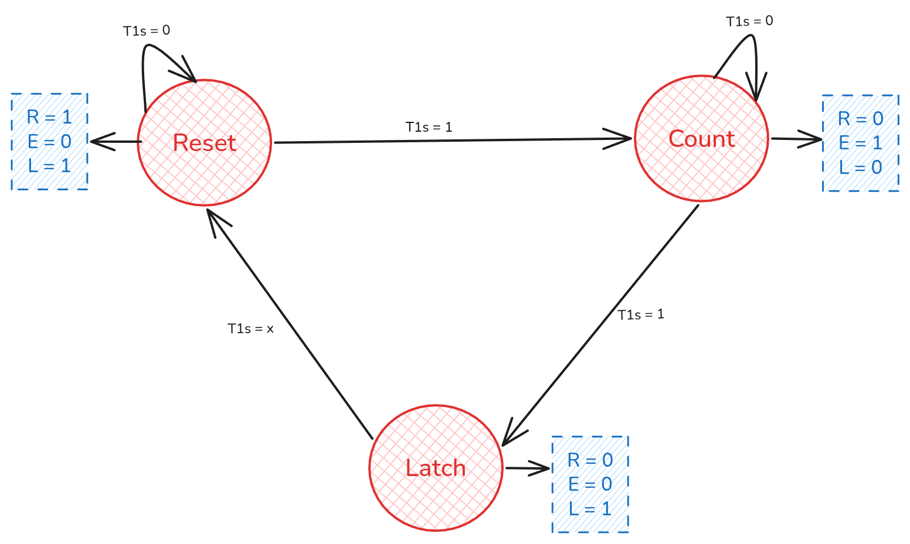
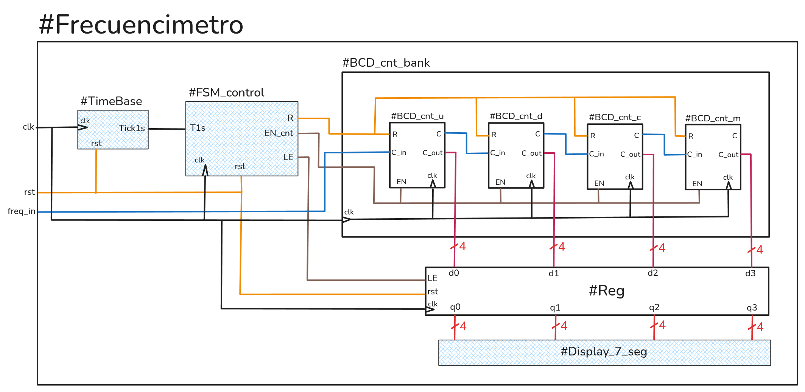
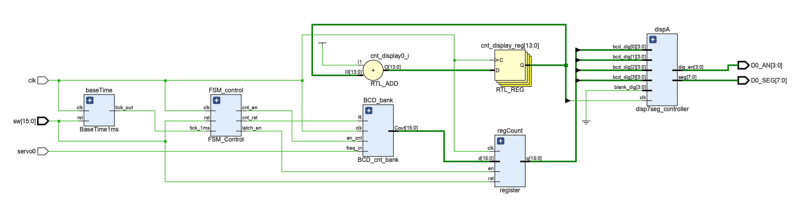
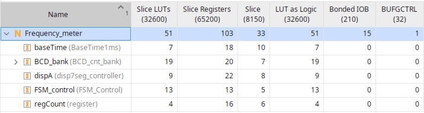

# Laboratorio 1: Frecuencimentro sobre FPGA

- Materia: Sistemas de instrumentalización - Famaf
- Alumno: José Lorenzo Canovas
- Año: 2026

---
## Introducción:
El sistema implementado es un frecuencímetro digital mediante el método de medición directa, donde para facilitar la implementación, se utiliza una ventana de tiempo de 1 segundo. Por lo cual, el conteo de los flancos ascendentes de una frecuencia equivale directamente a la frecuencia de la señal en Hertz (Hz).
La implementación fue realizada mediante el software Vivado, con el lenguaje de descripción de hardware SystemVerilog, sobre una FPGA *AMD Boolean - XC7S50CSG324A Spartan 7* prestada por la cátedra.

## Arquitectura del Diseño:
La arquitectura fue vista de forma general en la clase, la cual consta de 5 módulos descritos a continuación:

- **TimeBase**: Genera un tick cada 1 segundo, el cual servirá para generar la ventana de tiempo para contar los flancos ascendentes de la frecuencia.
- **FSM_control**: Se encarga de controlar el reset y el habilitar/deshabilitar los contadores, ademas, se encarga de habilitar/deshabilitar el registro. Para ello se utiliza un 3 estados:
    - *Medición*: habilita el conteo durante la ventana de 1 segundo.
    - *Captura*: guarda la cuenta actual en el latch para el display.
    - *Reinicio*: limpiar los contadores y reinicia su propio temporizador interno antes de volver a medir.

    

     
    

    > Diagrama de estados implementado en FSM del modulo.

- **BCD_cnt_bank**: Es el modulo que contiene los 4 contadores, para la unidad, decena, centena y millares de la frecuencia.
- **Reg**: Se encarga de guardar el conteo de la frecuencia, para luego pasar el valor guardado a el Display_7_seg.
- **Display_7_seg**: Encargado de controlar 4 displays de 7 segmentos para mostrar en estos el conteo de la frecuencia.

 

> Frecuencimetro diseñado en clase, los módulos con fondo celeste son proporcionados por el profesor.

Eso si, al final el diseño cambio un poco, ya que por un tema de comodidad a la hora de implementar la ventana de tiempo y el display de 7 segmentos (los cuales dependen de una cierta cantidad de tiempo), el modulo #TimeBase da un **tick de 1 ms** en vez de un tick de 1 segundo. Luego para obtener los tiempos necesarios, simplemente se realizo un contador de ticks de 1 ms. La siguiente imagen muestra el diagrama obtenido al implementar el frecuencimetro en Vivado.

> Se puede notar que no hay grandes diferencias con el diseño pensado en clases, salvo un contador que le pasa el tiempo deseado al display de 7 segmentos y un contador interno para el FSM_control.

Decisiones de diseño:
1. La base de tiempo es de 1ms en vez de 1s. Los tiempos necesitados son obtenidos mediante el conteo del tick de 1 ms.
2. No hay aviso en caso de overflow de los contadores.
3. A ultimo momento decidí modificar el diseño del BCD_cnt_bank para evitar contar multiple veces una frecuencia que sea de onda larga. Esto se realizo guardando un estado previo de la frecuencia de entrada.

## Resultados y Síntesis
No pude probar el funcionamiento del frecuencimetro que implemente en la FPGA. Pero como he asistido a todas las clases, dare algunos resultados interesantes del funcionamiento del fecuencimetro de mis compañeros, los cuales, asumo que se comportarían de forma similar al que implemente.
- Resultado 1: Si se pone la frecuencia a 1.234 Hz, entonces en los display se muestra 1234.
- Resultado 2: Si se pone una frecuencia mayor a 9.999 Hz, ocurre overflow, por lo que con la frecuencia de prueba de 10.000Hz, entonces el display muestra 0000.
- Resultado 3: Si se pone una frecuencia con decimal, como p.e.j. 1,5 Hz, entonces el numero en el display varia entre 1 y 2.

Como se puede observar en la siguiente imagen, el frecuencimero implementado en la FPGA apenas ocupa recursos de la misma. Por lo que, podemos intuir que como el frecuencimetro implementado consumaría poco hardware, entonces debería de costar poco en producirlo (hablando de producir grandes cantidades de hardware).

 

> Utilization Report extraído de Vivado

## Conclusion
En mi caso curse "Arquitectura del computador" el semestre pasado, y aun asi, la incomodidad de saber que uno no esta escribiendo un programa sino que esta describiendo el hardware todavía la tengo. Sobre todo teniendo en cuenta que los lenguajes y el software utilizado para la tarea son muy similares, lo cual hace que uno aborde y escriba las cosas de cierta forma por reflejo. Dándome problemas principalmente en temas de sincronismo. Ya que solo se utilize paralelismo o concurrencia en ciertas tareas de software, mientras en que a la hora de describir hardware, esto esta presente siempre. Por lo cual, uno tiene que estar pensando constantemente cuanto ciclos le podría llevar terminar una tarea cierto hardware para poder utilizar los resultados en otro. Ademas, teniendo en cuenta que para darle un uso dentro de todo util, la cantidad de hardware suele ser grande y los problemas de sincronismo se complejizan mucho.
