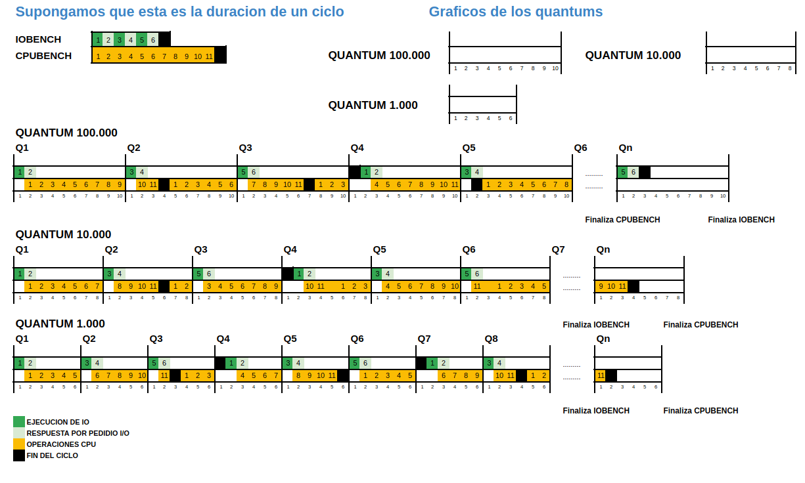

<h1 style="text-align: center;">Informe del lab03 (Planificador de
procesos)</h1>


### Resulucion del proyecto/laboratorio
> #### GRUPO: Bucle Infinito
> * Canovas, José Lorenzo
> * Carrozzo Sarnago, Imanol
> * Pastore, Ezequiel
> * Robledo Godoy, Mauro Gabriel

<br/>

# Indice a las respuestas
- [Primera Parte: Estudiando el planificador de xv6-riscv](#respuestas)
- Segunda Parte: Medir operaciones de cómputo y de entrada/salida
    * [Experimento 1: ¿Cómo son planificados los programas iobound y
    cpubound?](#respuestas-1)
    * [Experimento 2: ¿Qué sucede cuando cambiamos el largo del
    quantum?](#respuestas-2)
- [Tercera Parte: Asignar prioridad a los procesos](#como-lo-implementamos)
- Cuarta Parte: Implementar MLFQ
    * [Sobre la implementación](#como-lo-implementamos-1)
    * [Respuestas](#respuestas-3)
- [ANEXO con las tablas](#anexo)

[Google Sheets - Metricas](https://docs.google.com/spreadsheets/d/1Gfe-v96xNUKQEoxBpx-oSKZ84QH-EPP0xxCgFps6KOA/edit?usp=sharing)

<br/>

## Objetivos
El planificador apropiativo de `xv6-riscv` utiliza un algoritmo sencillo para
distribuir tiempo de procesador entre los procesos en ejecución, pero esto tiene
un costo aparejado. Los objetivos de este laboratorio son:
- Estudiar el funcionamiento del scheduler original de xv6-riscv.
- Analizar los procesos que se benefician/perjudican con esta decisión de
diseño.
- Desarrollar una implementación reemplazando la política de planificación por
una propia que deberá respetar ciertas condiciones.
- Analizar cómo la nueva política afecta a los procesos en comparación con el
planificador original.

<br/>

# Primera Parte: Estudiando el planificador de xv6-riscv
1. ¿Qué política de planificación utiliza `xv6-riscv` para elegir el próximo
proceso a ejecutarse?

2. ¿Cuales son los estados en los que un proceso puede permanecer en xv6-riscv y
qué los hace cambiar de estado?
3. ¿Qué es un *quantum*? ¿Dónde se define en el código? ¿Cuánto dura un
*quantum* en `xv6-riscv`?
Pista: Se puede empezar a buscar desde la system call `uptime` o leyendo la
documentación de xv6 en la sección de interrupciones.
4. ¿En qué parte del código ocurre el cambio de contexto en `xv6-riscv`? ¿En qué
funciones un proceso deja de ser ejecutado? ¿En qué funciones se elige el nuevo
proceso a ejecutar?
5. ¿El cambio de contexto consume tiempo de un *quantum*?

## Respuestas
1. ¿Qué política de planificación utiliza `xv6-riscv` para elegir el próximo
proceso a ejecutarse?

    El planificador usa la política llamada "Round-Robin", en la cual todos los
    procesos se ejecutan uno tras otro durante un "quantum" (una cierta unidad
    de tiempo), que no puede ser muy bajo porque, si no, tendría que pagar el
    costo constante del *context switch*, y tampoco puede ser muy alto porque
    eso generaría muy poca interactividad para el usuario. En el código no se
    indica que esta sea la política elegida, pero lo observamos al analizar su
    funcionamiento: la función scheduler toma el primer proceso que encuentra
    con un estado igual a "RUNNABLE", cambia su estado a "RUNNING" y lo ejecuta.
    Este es el comportamiento de una política de planificación Round Robin.

<br/>

2. ¿Cúales son los estados en los que un proceso puede permanecer en `xv6-riscv`
y qué los hace cambiar de estado?

Hay 6 Estados en los cuales se puede encontrar un proceso: **UNUSED**,
**USED**, **SLEEPING**, **RUNNABLE**, **RUNNING** y **ZOMBIE**.

* __Runnable__ : Los procesos suelen pasar a este estado al llamar a la función
`yield()`, que cede el control nuevamente al scheduler. Es decir, un proceso que
estaba en ejecución se auto desplanifica a sí mismo. Está listo para ejecutarse
y se queda esperando a que el scheduler lo asigne a alguna cpu.

* __Sleeping__ : Un proceso que cambia su estado de uno previo a sleeping, es
aquel que llama a la función `sleep()`. Este estado también se llama
'bloqueado' y puede suceder al tener que esperar una respuesta (un evento o
quizás un recurso) tras alguna petición I/O, por ejemplo que un usuario termine
de escribir en la terminal.

* __Unused__ : El proceso no está en uso. Se encuentran en este estado al
llamar a la función `procinit()`, que inicializa los procesos y los deja listos
para poder ser planificados y comenzar a ejecutarse.

* __Used__ : El proceso en este punto ya ha sido preparado para poder
ejecutarse, pero aún no ha sido planificado (ni ha comenzado a ejecutarse).

* __Zombie__ : Este Estado se da cuando un proceso ha terminado su ejecución,
pero el Sistema Operativo aún no ha tenido tiempo para limpiar los recursos
utilizados asociados a él.

<br/>

3. ¿Qué es un *quantum*? ¿Dónde se define en el código? ¿Cuánto dura un
*quantum* en `xv6-riscv`?
Pista: Se puede empezar a buscar desde la system call `uptime` o leyendo la
documentación de xv6 en la sección de interrupciones.

Un *quantum* es una constante que nos indicara el tiempo de ejecución de un
proceso, algo fundamental en los planificadores para multiprogramación, ya que
nos servirá para poder interrumpir la ejecución de un proceso y cambiar a otro
logrando un alta eficiencia a la hora de ejecutar muchos procesos.

Por otro lado, el *quantum* se encuentra definido en el código en la siguiente
ruta: `/kernel/start.c`. Una vez dentro, podemos ver que se lo define como
`interval` en la función llamada `timerinit`.

La duración que se le establece a *quantum* es de 1.000.000 ciclos,
aproximadamente 1/10 segundos de ejecución en qemu.

<br/>

4. ¿En qué parte del código ocurre el cambio de contexto en `xv6-riscv`? ¿En qué
funciones un proceso deja de ser ejecutado? ¿En qué funciones se elige el nuevo
proceso a ejecutar?

El cambio de contexto lo hace la función llamada `swtch` definida en el archivo
swtch.S. La función `swtch` es llamada directamente desde dos otras funciones:
`scheduler` y `sched`. La función `scheduler` es la que decide cuál proceso es
el que se debe ejecutar. Esta función corre continuamente, nunca termina. La
función `sched` se usa para seguir con la ejecución de `scheduler` luego de
interrumpirla (para correr otro proceso).

La función `scheduler` se llama desde main. Hay una instancia de esta función
corriendo continuamente en cada cpu. Esta función **nunca** termina, solo se
interrumpe su ejecución. En el código se hace referencia al contexto de la cpu
para referirse al contexto en el que se corre esta función (para diferenciarlo
de los contextos de otros procesos). Lo que hace scheduler es recorrer la lista
de procesos hasta encontrar un proceso con estado `RUNNABLE` para pasar a
ejecutarlo. Cuando lo encuentra, realiza el *context switch* llamando a `swtch`
y la ejecución de `scheduler` se interrumpe. Cuando el proceso al que cambiamos
termina su ejecución, se vuelve a `scheduler` (por medio de `sched`) y se sigue
recorriendo la lista de procesos. Si `scheduler` completa su ciclo por la tabla
de procesos, entonces comienza a recorrerla desde el principio otra vez.

La función `sched` hace un *context switch* para poder seguir con la ejecución
de `scheduler` y así poder elegir el siguiente proceso a ejecutar.

Hay tres funciones que llaman directamente a `sched` (entonces iniciando el
proceso del cambio de contexto). Estas son `yield`, `sleep` y `exit`, las tres
están definidas en el archivo kernel/proc.c. La función `wait` llama a `sleep`.
Las funciones `usertrap` y `kerneltrap` definidas en kernel/trap.c llaman a
`yield`. Estas son las funciones más básicas que se usan para iniciar el proceso
de un *context switch*. También, los `sleeplock` usan a la función `sleep`.

Un proceso cede la CPU cuando:

* LLega un timer interrupt y se ejecuta `usertrap` o `kerneltrap`, que llaman a
la función `yield`. Si el interrupt no es un *timer interrupt*, entonces no se
hace el *context switch* y el proceso va a retomar su ejecución luego de que se
haya manejado el interrupt.
* Se intenta adquirir un `sleeplock` que ya está tomado.
* Se espera a otro proceso usando la función `wait`.
* Se termina la ejecución del proceso y se llama a `exit`.

<br/>

5. ¿El cambio de contexto consume tiempo de un *quantum*?

    El cambio de contexto **SÍ** consume tiempo de *quantum*, ya que el tiempo
    del quantum comienza a correr en el momento en el cual se ejecuta la fun
    `intr_on` (`kernel/riscv.h`). Haciendo que el cambio de contexto consuma
    una parte del inicio de este.

    Esta se ejecuta en:
    - La fun `scheduler`, previo a buscar un proceso a ejecutar y hacer swtch.
    - La fun `usertrap`, previo a ejecutar una syscall.


<br/> <br/>

# Segunda Parte: Medir operaciones de cómputo y de entrada/salida
Para ver cómo el planificador de `xv6-riscv` afecta a los distintos tipos de
procesos en la práctica, deberán integrar a `xv6-riscv` los programas de espacio
de usuario `iobench` y `cpubench`. Estos
programas realizan mediciones de operaciones de escritura/lectura y operaciones
de cómputo, respectivamente.

Las funciones son:
- iobench(int N): Ejecuta N veces un experimento donde cuenta operaciones de
entrada/salida. Cada experimento abre un archivo para escritura y luego escribe
el contenido de un buffer, y repite las operaciones para lectura, es decir,
operaciones de entrada/salida.
- cpubench(int N): Ejecuta N veces un experimento donde cuenta operaciones de
cómputo. Cada ciclo de medición realiza varias multiplicaciones de matrices MxM,
es decir, operaciones de cómputo intensivo.


## Experimento 1: ¿Cómo son planificados los programas iobound y cpubound?
### Experimento
Utilizando el largo de quantum **10 veces más pequeño que el original** y un
valor de N constante, medir cuántas veces son planificados los procesos en los
siguientes escenarios:

```bash
a) xv6:~$ iobench N &
b) xv6:~$ iobench N &; iobench N &; iobench N &
c) xv6:~$ cpubench N &
d) xv6:~$ cpubench N &; cpubench N &; cpubench N &
e) xv6:~$ iobench N &; cpubench N &; cpubench N &; cpubench N &
f) xv6:~$ cpubench N &; iobench N &; iobench N &; iobench N &
```

### Criterios de los experimentos
El *largo del experimento* (o sea, cuántas veces se ejecutan las operaciones) y
*el tamaño de las operaciones* pueden cambiarlo en base a los siguientes
criterios:
1. Describa los parámetros de los programas cpubench e iobench para este
experimento (o sea, los definidos al principio y el valor de N. Tener en cuenta
que podrían cambiar en experimentos futuros, pero que si lo hacen los resultados
ya no serán comparables).
2. ¿Los procesos se ejecutan en paralelo? ¿En promedio, qué proceso o procesos
se ejecutan primero? Hacer una observación cualitativa.
3. Que compile: si las operaciones son demasiado grandes, podemos quedarnos sin
memoria en el al ejecutar muchos procesos iobench o que el conteo de la cantidad
de operaciones de cpu de overflow.
4. Que las mediciones no sean menores que ni cercanas a 1 en la mayoría de los
casos, ya que son casteadas a enteros y se pierde mucha información en el
redondeo.

<br/>

### Ejercicios
**A.**  Se tendrá que completar los programas iobench y cpubench con una métrica
que permita comparar la cantidad de operaciones de cada tipo que se realizan a
medida que cambiemos el planificador del sistema operativo.

**B.**  Responder las siguientes preguntas utilizando gráficos y/o tablas para
justificar sus respuestas:
1. Describa los parámetros de los programas cpubench e iobench para este
experimento (o sea, los define al principio y el valor de N. Tener en cuenta que
podrían cambiar en experimentos futuros, pero que si lo hacen los resultados ya
no serán comparables).
2. ¿Los procesos se ejecutan en paralelo? ¿En promedio, qué proceso o procesos
se ejecutan primero? Hacer una observación cualitativa.
3. ¿Cambia el rendimiento de los procesos iobound con respecto a la cantidad y
tipo de procesos que se estén ejecutando en paralelo? ¿Por qué?
4. ¿Cambia el rendimiento de los procesos cpubound con respecto a la cantidad y
tipo de procesos que se estén ejecutando en paralelo? ¿Por qué?
5. ¿Es adecuado comparar la cantidad de operaciones de cpu con la cantidad de
operaciones iobound?


## Respuestas
**A.**
La métrica utilizada en ambos programas es `metric = total_iops * 10000 /
elapsed_ticks`. Elegimos esta métrica porque nos parece útil comparar el
rendimiento de los programas viendo la cantidad de operaciones que realizan en
función de los ciclos de clock del qemu. También, multiplicamos por 10000 a
`total_iops` para conservar decimales de precision y obtener mejores resultados.
Luego, a esta métrica la dividimos por 10000 en la hoja de cálculo para obtener
el valor original.


**B.**
1. Describa los parámetros de los programas cpubench e iobench para este
experimento (o sea, los define al principio y el valor de N. Tener en cuenta que
podrían cambiar en experimentos futuros, pero que si lo hacen los resultados ya
no serán comparables).


    Para este experimento, **usaremos un N == 50** lo cual nos permitirá
    obtener una idea adecuada de los programas e inferir sus funcionamientos; y
    `IO_OPSIZE == 64`, `IO_EXPERIMENT_LEN == 32`, `CPU_MATRIX_SIZE == 128`,
    `CPU_EXPERIMENT_LEN == 32`, ya que creemos que es lo suficientemente largo
    como para permitir que el planificador entre en juego, pero lo
    suficientemente corto como para que los programas terminen en un tiempo
    razonable.

<br/>

2. ¿Los procesos se ejecutan en paralelo? ¿En promedio, qué proceso o procesos
se ejecutan primero? Hacer una observación cualitativa.

    Es claro que los procesos se ejecutan en 'paralelo', dado que sabemos que
    este sistema operativo utiliza la política de planificación llamada Round
    Robin, la cual irá ejecutando los diferentes procesos que se encuentran en
    un estado *RUNNABLE* durante un tiempo determinado por el 'quantum', lo que
    termina dando la impresión de un cierto paralelismo, en el sentido de que
    los programas reciben de manera alternada un cierto tiempo de uso del
    CPU.
    Para observar esto, analicemos con tablas los experimentos realizados
    con los comandos proporcionados por la cátedra.
    Nos resultó muy útil medir cómo se comportan los procesos iobound en
    combinación con procesos cpubound y viceversa para responder esta pregunta.
    Al hacer esto, notamos que el funcionamiento es el siguiente:
    El prompt lanzado en bash comienza a ejecutarse y se le otorga prioridad
    a los procesos que son cpubound, por lo cual, si lanzo una combinación de
    iobound y cpubound, los de primer tipo demorarán más en finalizar su
    ejecución. Es una decisión entendible, dado que cuando se lanzan pedidos de
    lectura/escritura, el tiempo de respuesta es bastante alto. Por lo tanto,
    se priorizan aquellos procesos que usen mucho la CPU porque suelen terminar
    antes (sobre todo en comparación con los pedidos de input/output) y cuyas
    interrupciones están dadas por el quantum y no por solicitudes de lectura o
    escritura.

3. ¿Cambia el rendimiento de los procesos iobound con respecto a la cantidad y
tipo de procesos que se estén ejecutando en paralelo? ¿Por qué?

    **Sí**, en el programa `iobench`, utilizamos la fun `uptime` para poder
    tener una "noción de tiempo" (que en realidad nos da los ticks transcurridos
    dentro del QEMU). Sin embargo, el valor es global, es decir, los ticks
    transcurridos funcionan de manera similar al **walltime** de un programa.
    Por lo tanto, al haber más procesos en ejecución, el planificador distribuye
    el tiempo de CPU entre ellos, incrementando el **walltime** y provocando que
    nuestro `elapsed_ticks = end_tick - start_tick` sea mayor. Debido a cómo
    definimos nuestra métrica (`metric = total_iops * 10000 / elapsed_ticks`),
    al aumentar el divisor (elapsed_ticks), el valor de la métrica disminuye.

    Como se puede ver, en la [tabla](#para-el-comando-a) del primer
    comando tenemos una media de 4,45 de métrica, mientras que en la
    [tabla](#para-el-comando-b) del segundo y la [tabla](#para-el-comando-e) del
    quinto comando tenemos una media de 3,47 y 1,13 de métrica, respectivamente.
    El gran decremento de la media de la métrica del tercer comando se debe a
    que hay un solo proceso iobound, el cual se bloquea al realizar una
    solicitud I/O. Entonces pasan más tiempo ejecutándose los 3 procesos
    cpubound, ya que son procesos de cómputo intensivo y sus únicas
    interrupciones serán las del 'quantum'. Luego, los `elapsed_ticks` de cada
    experimento serán más grandes y la cantidad de operaciones serán las mismas
    y, como nuestra métrica es (`metric = total_iops * 10000 / elapsed_ticks`),
    es razonable que esta decrezca.

<br/>

4. ¿Cambia el rendimiento de los procesos cpubound con respecto a la cantidad y
tipo de procesos que se estén ejecutando en paralelo? ¿Por qué?

    **Sí**, al igual que antes el rendimiento de los procesos cpubound también
    cambia según la cantidad y tipo de procesos ejecutándose en paralelo.
    Por lo tanto, el tiempo necesario para completar el trabajo de un proceso
    cpubound aumenta al compartir la CPU con otros procesos. Este incremento
    afecta negativamente la métrica de rendimiento de estos procesos porque debo
    emplear más ciclos de clock para finalizar de ejecutar las instrucciones
    necesarias, algo similar a lo que ocurre con los procesos iobound.

    Podemos observar que en la [tabla](#para-el-comando-c) del tercer
    comando tenemos una media de métrica de 3233,77, mientras que en la
    [tabla](#para-el-comando-d) del cuarto y la [tabla](#para-el-comando-f)
    del sexto comando tenemos una media de métrica de 2857,58 y 2971,19,
    respectivamente.
    En primer lugar, vemos que el promedio de la métrica del tercer comando es
    mayor que la del cuarto y la del sexto, y esto se debe a que en el primero
    que se menciona, un solo proceso dispone de la CPU, y al ser de cómputo
    intensivo, se ejecuta con rapidez, haciendo una gran cantidad de operaciones
    por ciclo.
    Además, podemos ver que el promedio de la métrica del sexto comando es mayor
    a la del quinto, y esto es por dos razones obvias:
    * Porque el quinto comando se ejecuta de manera intercalada con otros dos
      procesos de cómputo intensivo, por lo cual es de esperar que la cantidad
      de ciclos aumente y como nuestra métrica está definida como
      (`metric = total_iops * 10000 / elapsed_ticks`) entonces decrecerá.
    * Porque el sexto comando ejecuta de manera intercalada un solo proceso de
      cómputo intensivo con otros 3 procesos iobound. Estos últimos, al ejecutar
      muchísimas operaciones de I/O, pasarán la mayor parte del tiempo
      bloqueados y su tiempo de ejecución neta será muy pequeña. Luego, el
      proceso de cómputo intensivo anteriormente mencionado, se ejecutará un
      poquito más lerdo que en el tercer comando, pero un poquito más rápido
      que el quinto comando.

<br/>

5. ¿Es adecuado comparar la cantidad de operaciones de cpubound con la cantidad
de operaciones iobound?

    No es adecuada la comparación, ya que los programas cpubound e iobound
    tienen un uso de la CPU diferente. Un programa cpubound se caracteriza por
    realizar un uso intensivo del mismo, ejecutando operaciones de cálculo
    continuo sin interrupciones significativas. Por otro lado, un programa
    iobound se caracteriza por realizar frecuentes solicitudes de entrada/salida
    (I/O), lo cual implica varias "traps" al kernel para manejar dichas
    solicitudes.

    Esto significa que los programas cpubound tienden a involucrar una mayor
    cantidad de operaciones de cálculo puro en comparación con los iobound, que
    pasan gran parte del tiempo en espera de respuestas del file system.
    Comparar la cantidad de operaciones de ambos tipos no resulta apropiado, ya
    que se ignoran las diferencias en cuanto a cómo utilizan los recursos del
    sistema: **cpubound se enfoca en el uso del CPU**, **mientras que iobound se
    centra en la espera y manejo de las solicitudes de I/O**.

<br/> <br/>

## Experimento 2: ¿Qué sucede cuando cambiamos el largo del quantum?
Deben achicar el largo del quantum primero a 10000 y luego a 1000, y volver a
repetir los mismos experimentos.

> **Aclaración:** Es posible que necesiten cambiar también sus métricas de
> medición para que los resultados sean comparables, pero no deberían cambiar
> los parámetros del experimento (o sea, N, IO_OPSIZE, IO_EXPERIMENT_LEN, etc.)

Luego responder:
1. ¿Fue necesario modificar las métricas para que los resultados fueran
comparables? ¿Por qué?
2. ¿Qué cambios se observan con respecto al experimento anterior? ¿Qué
comportamientos se mantienen iguales?
3. ¿Con un quantum más pequeño, se ven beneficiados los procesos iobound o los
procesos cpubound?

## Respuestas
1. ¿Fue necesario modificar las métricas para que los resultados fueran
comparables? ¿Por qué?

    Sí, fue necesario. Aunque no ajustamos la métrica directamente en el código,
    realizamos modificaciones en una hoja de Google Sheets donde colocamos los
    datos obtenidos por las ejecuciones de los comandos dados, adaptando así las
    métricas de la forma en la que correspondía.

    La razón para hacer esto se debe a cómo la definimos inicialmente, es decir
    (`metric = total_iops * 10000 / elapsed_ticks`), donde `elapsed_ticks` es el
    divisor. Esto complica la comparación entre ejecuciones con diferentes
    valores de *quantum*, ya que reducir el *quantum* a 10 o 100 veces su valor
    original aumenta proporcionalmente la cantidad de *ticks*.
    Por ejemplo, un programa que tarda 20 *ticks* con un *quantum* de 100.000
    necesitará aproximadamente 200 *ticks* al reducir el *quantum* en un 10
    veces, y 2.000 *ticks* si el *quantum* se reduce 100 veces.

    Por lo tanto, aplicamos los siguientes ajustes en las métricas:
    - Para los datos obtenidos con un *quantum* de 100.000, dividimos la métrica
    por 10,000 (ya que originalmente multiplicamos por 10.000 para mantener
    cuatro decimales).
    - Para el *quantum* de 10,000, dividimos la métrica por 1.000, compensando
    la multiplicación inicial y la reducción del *quantum*.
    - Para el *quantum* de 1.000, dividimos la métrica por 100, siguiendo la
    misma lógica.

    Estos ajustes nos permiten una comparación entre las diferentes
    configuraciones de *quantum*.

<br/>

2. ¿Qué cambios se observan con respecto al experimento anterior? ¿Qué
comportamientos se mantienen iguales?

    Si, hay comportamientos que han cambiado y otros que no.

    De los comportamientos que no han cambiado, se puede observar cómo se
    comportan los procesos **iobench** y **cpubench** al ejecutare de forma
    independiente y con programas iguales de forma similar que con un quantum de
    100.000.

    De los comportamientos que han cambiado:
    - Se puede observar una ligera disminución en nuestra métrica (operaciones
    por tick), ya que el el cambio de contexto consume tiempo de **QUANTUM**,
    por lo que a un menor tiempo de *QUANTUM*, más interrupciones y con esto un
    mayor tiempo 'perdido' por el cambio de contexto, disminuyendo la cantidad
    de operaciones por tick.
    - Se puede observar que hubo un cambio de comportamiento a la hora de
    ejecutar los procesos **iobench** y **cpubench** al mismo tiempo, ya que a
    un **menor QUANTUM**, un proceso de tipo IObound puede volver a tomar
    posesión del CPU, y luego cederlo al hacer algún pedido IO. Esto terminó
    haciendo que los programas **iobench** terminaran antes que los **cpubench**
    tanto en el QUANTUM de 10.000 como de 1.000, cosa que no pasaba antes. Se
    puede observar a modo ilustrativo (porque no es perfecto) en la siguiente
    imagen cómo se da este cambio.

    

    - Si el QUANTUM es muy pequeño, de 1.000, todos los procesos se ven muy
    afectados, ya que no se les da mucho tiempo en la CPU y son interrumpidos
    muy seguido. El rendimiento en general baja cuando el QUANTUM es muy chico.

<br/>

3. ¿Con un quantum más pequeño, se ven beneficiados los procesos iobound o los
procesos cpubound?

    Se ven beneficiados los procesos iobound, ya que no tienen que esperar tanto
    tiempo como antes para que el scheduler vuelva a decidir ejecutarlos. Al ser
    el quantum más pequeño, el recorrido del scheduler por la tabla de procesos
    tarda menos tiempo. Tienen mucho mejor rendimiento en el caso en que
    comparten la CPU con procesos cpubound.

    Por otro lado, los procesos de tipo cpubound se ven muy perjudicados, ya que
    son interrumpidos más seguido y la CPU pasa más tiempo ejecutando el
    scheduler y menos tiempo ejecutando estos procesos cpubound en comparación
    con un quantum más grande. Es decir que el wall-time será mucho mayor que el
    user-time de cada uno de los procesos de tipo cpubound por si solos.

    Dicho esto, si el quantum es muy pequeño, el rendimiento en general, de
    todos los procesos es muy malo, ya que son interrumpidos muy seguido y
    la CPU pasa demasiado tiempo ejecutando el scheduler en lugar de estar
    ejecutando los procesos.


<br/> <br/>

# Tercera Parte: Asignar prioridad a los procesos
**A.**  Crear una rama en su repositorio con nombre `mlfq`.

**B.**  Se deberá mantener un registro de la prioridad de los procesos, sin que
esto afecte la planificación.
1. Agregue un campo en `struct proc` que guarde la prioridad del proceso (entre
`0` y `NPRIO-1` para `#define NPRIO 3` niveles en total siendo `0` el prioridad
minima y el `NPRIO-1` prioridad máxima) y manténgala actualizada según el
comportamiento del proceso, además agregue el campo en `struct proc` que
guarde la cantidad de veces que fue elegido ese proceso por el planificador para
ejecutarse y se mantenga actualizado:
    - **MLFQ regla 3:** Cuando un proceso se inicia, su prioridad será máxima.
    - **MLFQ regla 4:** Descender de prioridad cada vez que el proceso pasa todo
    un quantum realizando cómputo. Ascender de prioridad cada vez que el
    proceso se bloquea antes de terminar su quantum. Nota: Este
    comportamiento es distinto al del MLFQ del libro.
2. Para comprobar que estos cambios se hicieron correctamente, modifique la
función `procdump` (que se invoca con `CTRL-P`) para que imprima la prioridad
de los procesos. Así, al correr nuevamente `iobench` y `cpubench`, debería darse
que luego de un tiempo que los procesos `cpubench` tengan baja prioridad
mientras que los `iobench` tengan alta prioridad.

## Como lo implementamos

Se añado la macro NPRIO
```c
// kernel/param.h
#define NPROC        64  // maximum number of processes
#define NCPU          8  // maximum number of CPUs

// Modificación
#define NPRIO         3  // process priority
// ... code
```

Se añade los campos priority y times_selected al struct proc
```c
// kernel/proc.h

// ... code

struct proc {
  // ... code
  struct inode *cwd;
  char name[16];

  // Modificación
  uint16 priority;
  uint64 times_selected;       // number of times that process was chosen by the
                               // scheduler to be executed
};
```

Se le suma 1 al times_selected al proceso seleccionado por el scheduler. Se
disminuye la prioridad si hubo interrupt por quantum (fun `yield`). Se aumenta
la prioridad si el proceso cedió la CPU (fun `sleep`).
```c
// kernel/proc.c

// ... code

void
scheduler(void)
{
  struct proc *p;
  struct cpu *c = mycpu();

  c->proc = 0;
  for(;;){
    intr_on();

    for(p = proc; p < &proc[NPROC]; p++) {
      acquire(&p->lock);
      if(p->state == RUNNABLE) {
        p->state = RUNNING;
        p->times_selected++;
        c->proc = p;
        swtch(&c->context, &p->context);

        c->proc = 0;
      }
      release(&p->lock);
    }
  }
}

// ... code

void
yield(void)
{
  struct proc *p = myproc();
  acquire(&p->lock);
  p->state = RUNNABLE;

  if(p->priority > 0)                           // Modificación
    p->priority--;

  // ...code
}

// ...code

void
sleep(void *chan, struct spinlock *lk)
{
  // ... code

  p->chan = chan;
  p->state = SLEEPING;

  if (p->priority < NPRIO -1)                   // Modificación
    p->priority++;

  // ... code
}
```


# Cuarta Parte: Implementar MLFQ
Se buscara reemplazar el planificador actual con un planificador MLFQ de tres
niveles.

1. Modifique el planificador de manera que seleccione el próximo proceso a
planificar siguiendo las siguientes reglas:
    - **MLFQ regla 1:** Si el proceso A tiene mayor prioridad que el proceso B,
    corre A. (y no B)
    - **MLFQ regla 2:** Si dos procesos A y B tienen la misma prioridad, corre
    el que menos veces fue elegido por el planificador.
2. Repita las mediciones de la segunda parte para ver las propiedades del nuevo
planificador.
3. Para análisis responda: ¿Se puede producir starvation en el nuevo
planificador? Justifique su respuesta.

## Como lo implementamos
Básicamente modificamos la fun `scheduler` para buscar el proceso en estado
**RUNNABLE** con mayor prioridad recorriendo todos los procesos en la tabla y
luego ejecutar aquel con maxima prioridad. Aunque esto trajo algunos problemas
de rendimiento, debido a que se tarda por los locks a la hora de comparar la
prioridad y el numero de veces seleccionados. Por lo que, teniendo en cuenta que
estamos ejecutando xv6 con 1 CPU, decidimos crear otra rama llamada `mlfq_locks`
en el cual le quitamos los locks a la hora de comparar los procesos.

```c
// kernel/proc.c

void
scheduler(void)
{
  struct proc *p;
  struct proc *prio_p;
  struct cpu *c = mycpu();

  c->proc = 0;
  for(;;){
    intr_on();

    // Se busca algún proceso que sea RUNNABLE
    for (prio_p = proc; prio_p < &proc[NPROC]; prio_p++)
    {
      acquire(&prio_p->lock);
      if (prio_p->state == RUNNABLE) {
        break;
      }else{
        release(&prio_p->lock);
      }
    }

    // Comparo con los demas procesos y busco el que tenga mas prioridad, o
    // aquel que tenga igual prioridad y menor cantidad de veces seleccioada
    for (p = prio_p + 1; p < &proc[NPROC]; p++)
    {
      acquire(&p->lock);
      if (
        p->state == RUNNABLE
        && ( p->priority > prio_p->priority || (p->priority == prio_p->priority
            && p->times_selected < prio_p->times_selected))
      ) {
        // Se libera el anterior proceso, ya que el actual tiene mayorprioridad
        release(&prio_p->lock);
        prio_p = p;
      }else{
        // El proceso actual tiene menor prioridad que prio_p
        release(&p->lock);
      }
    }

    // Si no hay proceso RUNNABLE, entonces vuelvo a empezar
    if (prio_p >= &proc[NPROC]) {
      continue;
    }

    prio_p->state = RUNNING;
    prio_p->times_selected++;

    c->proc = prio_p;

    swtch(&c->context, &prio_p->context);

    c->proc = 0;
    release(&prio_p->lock);
  }
}
```

## Respuestas
2. Repita las mediciones de la segunda parte para ver las propiedades del nuevo
planificador.

Hemos hecho dos implementaciones de MLFQ: una usando locks para acceder a la
información de cada proceso, y otra sin usar esos locks. El motivo para hacer
esto es que el uso de locks en `scheduler` ralentiza considerablemente la
ejecución del mismo. Podemos hacer esto porque estamos usando una sola CPU y los
procesos que toquemos no deberían verse afectados por código externo mientras
permanezcamos en el scheduler.

### Con locks

Con MLFQ, para el caso de un quantum de 100.000, se comporta de manera similar
a Round Robin. La mayor diferencia se da cuando se lanzan varios procesos
IObound juntos o cuando se mezclan procesos CPUbound con
procesos IObound. Con MLFQ, los procesos IObound tienen mayor prioridad que los
procesos CPUbound, y su rendimiento incrementa considerablemente. También,
cuando sólo hay procesos IObound, MLFQ es más **justo** que Round Robin. (ref:
[tabla e de RR para 100.000](#para-el-comando-e) y
[tabla e de MLFQ para 100.000](#para-el-comando-e-3))

Para el caso de un quantum de 10.000 las diferencias son más notables. Al
ejecutar varios comandos IObound a la vez, el rendimiento, en general, mejora.
Esto sucede porque, en lugar de ejecutar el siguiente proceso disponible en la
lista, se ejecuta el proceso que ha sido ejecutado menos veces (asumo que, como
todos los procesos son iobound, tienen la misma prioridad), siendo más justo con
todos los procesos. Con Round Robin, podría suceder que algún proceso se ejecute
mucho más seguido que los demás y unos pocos procesos acaparen la CPU. (ref:
[tabla b de RR para 100.000](#para-el-comando-b) y
[tabla b de MLFQ para 100.000](#para-el-comando-b-3))

Al ejecutar solo comandos cpubound el rendimiento es un poco peor, probablemente
debido a que el scheduler de MLFQ consume más tiempo de la CPU. (ref:
[tabla c de RR para 100.000](#para-el-comando-c),
[tabla c de MLFQ para 100.000](#para-el-comando-c-3),
[tabla d de RR para 100.000](#para-el-comando-d) y
[tabla d de MLFQ para 100.000](#para-el-comando-d-3))

Al ejecutar comandos IObound junto a comandos cpubound, se nota una mejora en
el rendimiento de todos los procesos. Esto sucede porque MLFQ trata de ser
**justo** con todos los procesos y no suele suceder que unos pocos procesos
ocupen todo el tiempo de la CPU.

Para el caso de un quantum de 1.000, el rendimiento de todos los procesos es
**terrible**. Hemos comprobado que esto se debe al uso de los locks en
el scheduler. El scheduler tarda tanto tiempo en ejecutarse que los procesos
apenas pueden usar la CPU. Es muy difícil hacer comparaciones en esta situación.
Lo único que podemos concluir es que el quantum es muy pequeño para el tiempo
que tarda el scheduler en ejecutarse. (ref:
[Anexo de MFLQ con quantum de 1.000](#interval-1000-1))

### Sin locks

Al sacar los locks el rendimiento mejoró considerablemente. Esto nos permitió
realizar comparaciones con las métricas obtenidas con el scheduler Round Robin
cuando el quantum es muy pequeño.

Para un quantum de 100.000, los procesos IObound se ven muy beneficiados. Si se
lanzan **solo procesos IObound**, el rendimiento de todos es mucho mejor. Las
razones son las mismas que se dan más arriba, en la implementación con locks.
Si se lanzan **solo procesos CPUbound**, el rendimiento es similar al de Round
Robin.
Si se mezclan procesos IObound con procesos CPUbound, el rendimiento de los
procesos IObound es mucho mejor que antes, casi 10 veces mejor, y el rendimiento
de los procesos CPUbound no se ve muy afectado. Los CPUbound no se ven muy
afectados porque los IObound no ocupan mucho tiempo de la CPU, entonces no le
quitan demasiado tiempo a los CPUbound. Los IObound se ven beneficiados porque
suelen tener mayor prioridad, y esto hace que se ejecuten más seguido que antes.

Para un quantum de 10.000, los procesos CPUbound se ven más perjudicados en
comparación al quantum de 100.000. Entre la menor prioridad que se les asigna y
el mayor uso de la CPU por parte del scheduler, los procesos CPUbound tienen
menos tiempo de ejecución que antes.(ref:
[tabla c de MFLQ sin locks con quantum de 100.000](#para-el-comando-c-6),
[tabla c de MFLQ sin locks con quantum de 10.000](#para-el-comando-c-7),
[tabla d de MFLQ sin locks con quantum de 100.000](#para-el-comando-d-6),
[tabla d de MFLQ sin locks con quantum de 10.000](#para-el-comando-d-7),
[tabla f de MFLQ sin locks con quantum de 100.000](#para-el-comando-f-6),
[tabla f de MFLQ sin locks con quantum de 10.000](#para-el-comando-f-7))

En general, todos los procesos tienen peor rendimiento que con un quantum de
100.000. De todas maneras, MLFQ sigue dando un mejor rendimiento general que
Round Robin para todos los procesos, incluso para los CPUbound.

Para un quantum de 1.000, la métricas son muy parecidas a las de Round Robin.
La mayor diferencia que encontramos es cuando se ejecuta **un solo proceso
IObound**: su métrica es casi el doble en comparación con las de Round Robin.
<!-- por qué? En serio, por qué? suerte? xd  - La verdad, no tengo ni idea. Recién me fijo-->

Para todos los demás casos, las métricas de MLFQ suelen ser un poco mas altas
que las de Round Robin.
Si bien MLFQ hace que el scheduler se tome más tiempo en la CPU, este tiempo no
es demasiado grande, y no afecta tanto a los demás procesos. También, MLFQ
permite que los procesos que no ocupan mucho tiempo de la CPU se ejecuten antes
que los demás procesos, así no tienen que esperar muy seguido a que los
procesos mas intensivos hagan uso de la CPU, como sí pasaba con Round Robin.
Esto resulta en una distribución más justa de los recursos de la CPU.

### Conclusión

Lás métricas más altas son las de MLFQ con un quantum de 100.000. Esto quiere
decir que esa configuración es la más eficiente. También sabemos que, en
general, MLFQ es una política más justa que Round Robin, y sigue ofreciendo un
buen tiempo de respuesta.

<br/>

3. Para análisis responda: ¿Se puede producir starvation en el nuevo
planificador? Justifique su respuesta.

    Sí, con este nuevo *scheduler* es posible que se produzca *starvation*. Esto
    se debe a que, a diferencia de una implementación completa de una **MLFQ**,
    en la planificación realizada según las especificaciones de la cátedra no se
    actualiza la prioridad de cada proceso después de un cierto tiempo.

    Este comportamiento puede llevar a lo siguiente: si se tienen varios
    procesos *iobound* y algunos *cpubound*, los primeros tienden a ceder el CPU
    cuando realizan operaciones de E/S, lo que eleva su prioridad al nivel
    máximo. Dado que su *quantum* eventualmente se agotará, estos procesos solo
    podrían reducirse a una prioridad media, lo que permite que múltiples
    procesos *iobound* puedan monopolizar el CPU. En contraste, un proceso
    *cpubound* que consuma completamente su *quantum* rápidamente terminaría con
    la prioridad mínima, y el planificador podría evitar seleccionarlo. Esto
    implicaría que los procesos *cpubound* no tendrían acceso al CPU,
    produciéndose lo que se conoce como *starvation*.

<br/>
<br/>

# ANEXO
## Anexo Round Robin

### INTERVAL 100.000

#### Para el comando a

| LOOP_CYCLE | PID | TYPE      | START_TICK | ELAPSED_TICKS | OPERATIONS | METRIC |
|------------|-----|-----------|------------|---------------|------------|--------|
| 0          | 32  | [iobench] | 110968     | 17            | 64         | 3,7647 |
| 1          | 32  | [iobench] | 110986     | 14            | 64         | 4,5714 |
| 2          | 32  | [iobench] | 111001     | 14            | 64         | 4,5714 |
| 3          | 32  | [iobench] | 111016     | 14            | 64         | 4,5714 |
| 4          | 32  | [iobench] | 111031     | 15            | 64         | 4,2666 |
| 5          | 32  | [iobench] | 111046     | 15            | 64         | 4,2666 |
| 6          | 32  | [iobench] | 111062     | 15            | 64         | 4,2666 |
| 7          | 32  | [iobench] | 111077     | 15            | 64         | 4,2666 |
| 8          | 32  | [iobench] | 111093     | 14            | 64         | 4,5714 |
| 9          | 32  | [iobench] | 111108     | 14            | 64         | 4,5714 |
| 10         | 32  | [iobench] | 111123     | 14            | 64         | 4,5714 |
| 11         | 32  | [iobench] | 111138     | 16            | 64         | 4      |
| 12         | 32  | [iobench] | 111155     | 15            | 64         | 4,2666 |
| 13         | 32  | [iobench] | 111170     | 15            | 64         | 4,2666 |
| 14         | 32  | [iobench] | 111186     | 14            | 64         | 4,5714 |
| 15         | 32  | [iobench] | 111201     | 14            | 64         | 4,5714 |
| 16         | 32  | [iobench] | 111216     | 14            | 64         | 4,5714 |
| 17         | 32  | [iobench] | 111231     | 14            | 64         | 4,5714 |
| 18         | 32  | [iobench] | 111246     | 14            | 64         | 4,5714 |
| 19         | 32  | [iobench] | 111261     | 14            | 64         | 4,5714 |
| 20         | 32  | [iobench] | 111276     | 15            | 64         | 4,2666 |
| 21         | 32  | [iobench] | 111291     | 15            | 64         | 4,2666 |
| 22         | 32  | [iobench] | 111307     | 14            | 64         | 4,5714 |
| 23         | 32  | [iobench] | 111322     | 14            | 64         | 4,5714 |
| 24         | 32  | [iobench] | 111337     | 14            | 64         | 4,5714 |
| 25         | 32  | [iobench] | 111352     | 14            | 64         | 4,5714 |
| 26         | 32  | [iobench] | 111367     | 15            | 64         | 4,2666 |
| 27         | 32  | [iobench] | 111383     | 14            | 64         | 4,5714 |
| 28         | 32  | [iobench] | 111398     | 14            | 64         | 4,5714 |
| 29         | 32  | [iobench] | 111413     | 14            | 64         | 4,5714 |
| 30         | 32  | [iobench] | 111428     | 15            | 64         | 4,2666 |
| 31         | 32  | [iobench] | 111444     | 14            | 64         | 4,5714 |
| 32         | 32  | [iobench] | 111459     | 14            | 64         | 4,5714 |
| 33         | 32  | [iobench] | 111474     | 15            | 64         | 4,2666 |
| 34         | 32  | [iobench] | 111490     | 15            | 64         | 4,2666 |
| 35         | 32  | [iobench] | 111506     | 14            | 64         | 4,5714 |
| 36         | 32  | [iobench] | 111521     | 14            | 64         | 4,5714 |
| 37         | 32  | [iobench] | 111536     | 14            | 64         | 4,5714 |
| 38         | 32  | [iobench] | 111551     | 14            | 64         | 4,5714 |
| 39         | 32  | [iobench] | 111566     | 14            | 64         | 4,5714 |
| 40         | 32  | [iobench] | 111581     | 15            | 64         | 4,2666 |
| 41         | 32  | [iobench] | 111596     | 15            | 64         | 4,2666 |
| 42         | 32  | [iobench] | 111612     | 14            | 64         | 4,5714 |
| 43         | 32  | [iobench] | 111627     | 14            | 64         | 4,5714 |
| 44         | 32  | [iobench] | 111642     | 14            | 64         | 4,5714 |
| 45         | 32  | [iobench] | 111657     | 15            | 64         | 4,2666 |
| 46         | 32  | [iobench] | 111673     | 14            | 64         | 4,5714 |
| 47         | 32  | [iobench] | 111688     | 14            | 64         | 4,5714 |
| 48         | 32  | [iobench] | 111703     | 14            | 64         | 4,5714 |
| 49         | 32  | [iobench] | 111718     | 14            | 64         | 4,5714 |

* Promedio de la métrica: 4,452398

* Promedio de ticks: 14,4

<br/>
<br/>
<br/>


#### Para el comando b

| LOOP_CYCLE | PID | TYPE      | START_TICK | ELAPSED_TICKS | OPERATIONS | METRIC |
|------------|-----|-----------|------------|---------------|------------|--------|
| 0          | 27  | [iobench] | 103201     | 39            | 64         | 1,641  |
| 1          | 27  | [iobench] | 103240     | 39            | 64         | 1,641  |
| 2          | 27  | [iobench] | 103280     | 26            | 64         | 2,4615 |
| 3          | 27  | [iobench] | 103306     | 17            | 64         | 3,7647 |
| 4          | 27  | [iobench] | 103325     | 36            | 64         | 1,7777 |
| 5          | 27  | [iobench] | 103361     | 22            | 64         | 2,909  |
| 6          | 27  | [iobench] | 103383     | 9             | 64         | 7,1111 |
| 7          | 27  | [iobench] | 103392     | 20            | 64         | 3,2    |
| 8          | 27  | [iobench] | 103412     | 23            | 64         | 2,7826 |
| 9          | 27  | [iobench] | 103435     | 8             | 64         | 8      |
| 10         | 27  | [iobench] | 103443     | 10            | 64         | 6,4    |
| 11         | 27  | [iobench] | 103453     | 21            | 64         | 3,0476 |
| 12         | 27  | [iobench] | 103474     | 29            | 64         | 2,2068 |
| 13         | 27  | [iobench] | 103503     | 9             | 64         | 7,1111 |
| 14         | 27  | [iobench] | 103512     | 52            | 64         | 1,2307 |
| 15         | 27  | [iobench] | 103564     | 18            | 64         | 3,5555 |
| 16         | 27  | [iobench] | 103582     | 30            | 64         | 2,1333 |
| 17         | 27  | [iobench] | 103612     | 29            | 64         | 2,2068 |
| 18         | 27  | [iobench] | 103641     | 29            | 64         | 2,2068 |
| 19         | 27  | [iobench] | 103670     | 19            | 64         | 3,3684 |
| 20         | 27  | [iobench] | 103689     | 30            | 64         | 2,1333 |
| 21         | 27  | [iobench] | 103719     | 30            | 64         | 2,1333 |
| 22         | 27  | [iobench] | 103749     | 26            | 64         | 2,4615 |
| 23         | 27  | [iobench] | 103775     | 14            | 64         | 4,5714 |
| 24         | 27  | [iobench] | 103789     | 27            | 64         | 2,3703 |
| 25         | 27  | [iobench] | 103816     | 45            | 64         | 1,4222 |
| 26         | 27  | [iobench] | 103861     | 31            | 64         | 2,0645 |
| 27         | 27  | [iobench] | 103892     | 35            | 64         | 1,8285 |
| 28         | 27  | [iobench] | 103927     | 12            | 64         | 5,3333 |
| 29         | 27  | [iobench] | 103940     | 26            | 64         | 2,4615 |
| 30         | 27  | [iobench] | 103966     | 14            | 64         | 4,5714 |
| 31         | 27  | [iobench] | 103983     | 9             | 64         | 7,1111 |
| 32         | 27  | [iobench] | 103992     | 24            | 64         | 2,6666 |
| 33         | 27  | [iobench] | 104016     | 7             | 64         | 9,1428 |
| 34         | 27  | [iobench] | 104025     | 25            | 64         | 2,56   |
| 35         | 27  | [iobench] | 104050     | 15            | 64         | 4,2666 |
| 36         | 27  | [iobench] | 104067     | 25            | 64         | 2,56   |
| 37         | 27  | [iobench] | 104092     | 36            | 64         | 1,7777 |
| 38         | 27  | [iobench] | 104128     | 10            | 64         | 6,4    |
| 39         | 27  | [iobench] | 104138     | 14            | 64         | 4,5714 |
| 40         | 27  | [iobench] | 104154     | 27            | 64         | 2,3703 |
| 41         | 27  | [iobench] | 104181     | 19            | 64         | 3,3684 |
| 42         | 27  | [iobench] | 104200     | 31            | 64         | 2,0645 |
| 43         | 27  | [iobench] | 104231     | 20            | 64         | 3,2    |
| 44         | 27  | [iobench] | 104251     | 9             | 64         | 7,1111 |
| 45         | 27  | [iobench] | 104261     | 48            | 64         | 1,3333 |
| 46         | 27  | [iobench] | 104309     | 19            | 64         | 3,3684 |
| 47         | 27  | [iobench] | 104328     | 32            | 64         | 2      |
| 48         | 27  | [iobench] | 104360     | 13            | 64         | 4,923  |
| 49         | 27  | [iobench] | 104374     | 24            | 64         | 2,6666 |

* Promedio de la métrica: 3,471372

* Promedio de ticks: 23,64

<br/>
<br/>
<br/>

#### Para el comando c

| LOOP_CYCLE | PID | TYPE       | START_TICK | ELAPSED_TICKS | OPERATIONS | METRIC    |
|------------|-----|------------|------------|---------------|------------|-----------|
| 0          | 35  | [cpubench] | 140354     | 21            | 67104      | 3195,4285 |
| 1          | 35  | [cpubench] | 140376     | 21            | 67104      | 3195,4285 |
| 2          | 35  | [cpubench] | 140398     | 20            | 67104      | 3355,2    |
| 3          | 35  | [cpubench] | 140419     | 21            | 67104      | 3195,4285 |
| 4          | 35  | [cpubench] | 140441     | 21            | 67104      | 3195,4285 |
| 5          | 35  | [cpubench] | 140463     | 21            | 67104      | 3195,4285 |
| 6          | 35  | [cpubench] | 140484     | 21            | 67104      | 3195,4285 |
| 7          | 35  | [cpubench] | 140506     | 21            | 67104      | 3195,4285 |
| 8          | 35  | [cpubench] | 140528     | 21            | 67104      | 3195,4285 |
| 9          | 35  | [cpubench] | 140550     | 21            | 67104      | 3195,4285 |
| 10         | 35  | [cpubench] | 140572     | 20            | 67104      | 3355,2    |
| 11         | 35  | [cpubench] | 140593     | 21            | 67104      | 3195,4285 |
| 12         | 35  | [cpubench] | 140615     | 21            | 67104      | 3195,4285 |
| 13         | 35  | [cpubench] | 140637     | 21            | 67104      | 3195,4285 |
| 14         | 35  | [cpubench] | 140659     | 20            | 67104      | 3355,2    |
| 15         | 35  | [cpubench] | 140680     | 21            | 67104      | 3195,4285 |
| 16         | 35  | [cpubench] | 140702     | 21            | 67104      | 3195,4285 |
| 17         | 35  | [cpubench] | 140724     | 20            | 67104      | 3355,2    |
| 18         | 35  | [cpubench] | 140745     | 21            | 67104      | 3195,4285 |
| 19         | 35  | [cpubench] | 140767     | 21            | 67104      | 3195,4285 |
| 20         | 35  | [cpubench] | 140789     | 21            | 67104      | 3195,4285 |
| 21         | 35  | [cpubench] | 140811     | 21            | 67104      | 3195,4285 |
| 22         | 35  | [cpubench] | 140833     | 20            | 67104      | 3355,2    |
| 23         | 35  | [cpubench] | 140854     | 21            | 67104      | 3195,4285 |
| 24         | 35  | [cpubench] | 140876     | 21            | 67104      | 3195,4285 |
| 25         | 35  | [cpubench] | 140898     | 21            | 67104      | 3195,4285 |
| 26         | 35  | [cpubench] | 140920     | 20            | 67104      | 3355,2    |
| 27         | 35  | [cpubench] | 140942     | 21            | 67104      | 3195,4285 |
| 28         | 35  | [cpubench] | 140964     | 20            | 67104      | 3355,2    |
| 29         | 35  | [cpubench] | 140985     | 21            | 67104      | 3195,4285 |
| 30         | 35  | [cpubench] | 141007     | 21            | 67104      | 3195,4285 |
| 31         | 35  | [cpubench] | 141029     | 21            | 67104      | 3195,4285 |
| 32         | 35  | [cpubench] | 141051     | 21            | 67104      | 3195,4285 |
| 33         | 35  | [cpubench] | 141073     | 20            | 67104      | 3355,2    |
| 34         | 35  | [cpubench] | 141094     | 21            | 67104      | 3195,4285 |
| 35         | 35  | [cpubench] | 141116     | 21            | 67104      | 3195,4285 |
| 36         | 35  | [cpubench] | 141138     | 21            | 67104      | 3195,4285 |
| 37         | 35  | [cpubench] | 141160     | 21            | 67104      | 3195,4285 |
| 38         | 35  | [cpubench] | 141182     | 21            | 67104      | 3195,4285 |
| 39         | 35  | [cpubench] | 141204     | 20            | 67104      | 3355,2    |
| 40         | 35  | [cpubench] | 141226     | 20            | 67104      | 3355,2    |
| 41         | 35  | [cpubench] | 141247     | 21            | 67104      | 3195,4285 |
| 42         | 35  | [cpubench] | 141269     | 21            | 67104      | 3195,4285 |
| 43         | 35  | [cpubench] | 141291     | 21            | 67104      | 3195,4285 |
| 44         | 35  | [cpubench] | 141313     | 21            | 67104      | 3195,4285 |
| 45         | 35  | [cpubench] | 141335     | 20            | 67104      | 3355,2    |
| 46         | 35  | [cpubench] | 141356     | 21            | 67104      | 3195,4285 |
| 47         | 35  | [cpubench] | 141378     | 21            | 67104      | 3195,4285 |
| 48         | 35  | [cpubench] | 141400     | 21            | 67104      | 3195,4285 |
| 49         | 35  | [cpubench] | 141422     | 20            | 67104      | 3355,2    |

* Promedio de la métrica: 3233,77366

* Promedio de ticks: 20,76

<br/>
<br/>
<br/>

#### Para el comando d

| LOOP_CYCLE | PID | TYPE       | START_TICK | ELAPSED_TICKS | OPERATIONS | METRIC    |
|------------|-----|------------|------------|---------------|------------|-----------|
| 0          | 38  | [cpubench] | 161936     | 44            | 67104      | 1525,0909 |
| 1          | 38  | [cpubench] | 161982     | 24            | 67104      | 2796      |
| 2          | 38  | [cpubench] | 162007     | 23            | 67104      | 2917,5652 |
| 3          | 38  | [cpubench] | 162031     | 22            | 67104      | 3050,1818 |
| 4          | 38  | [cpubench] | 162054     | 22            | 67104      | 3050,1818 |
| 5          | 38  | [cpubench] | 162077     | 22            | 67104      | 3050,1818 |
| 6          | 38  | [cpubench] | 162100     | 22            | 67104      | 3050,1818 |
| 7          | 38  | [cpubench] | 162124     | 22            | 67104      | 3050,1818 |
| 8          | 38  | [cpubench] | 162147     | 24            | 67104      | 2796      |
| 9          | 38  | [cpubench] | 162171     | 23            | 67104      | 2917,5652 |
| 10         | 38  | [cpubench] | 162195     | 22            | 67104      | 3050,1818 |
| 11         | 38  | [cpubench] | 162218     | 22            | 67104      | 3050,1818 |
| 12         | 38  | [cpubench] | 162242     | 22            | 67104      | 3050,1818 |
| 13         | 38  | [cpubench] | 162265     | 22            | 67104      | 3050,1818 |
| 14         | 38  | [cpubench] | 162288     | 22            | 67104      | 3050,1818 |
| 15         | 38  | [cpubench] | 162312     | 22            | 67104      | 3050,1818 |
| 16         | 38  | [cpubench] | 162335     | 26            | 67104      | 2580,923  |
| 17         | 38  | [cpubench] | 162363     | 38            | 67104      | 1765,8947 |
| 18         | 38  | [cpubench] | 162402     | 22            | 67104      | 3050,1818 |
| 19         | 38  | [cpubench] | 162425     | 23            | 67104      | 2917,5652 |
| 20         | 38  | [cpubench] | 162449     | 22            | 67104      | 3050,1818 |
| 21         | 38  | [cpubench] | 162472     | 22            | 67104      | 3050,1818 |
| 22         | 38  | [cpubench] | 162495     | 22            | 67104      | 3050,1818 |
| 23         | 38  | [cpubench] | 162519     | 22            | 67104      | 3050,1818 |
| 24         | 38  | [cpubench] | 162542     | 22            | 67104      | 3050,1818 |
| 25         | 38  | [cpubench] | 162565     | 22            | 67104      | 3050,1818 |
| 26         | 38  | [cpubench] | 162589     | 22            | 67104      | 3050,1818 |
| 27         | 38  | [cpubench] | 162612     | 34            | 67104      | 1973,647  |
| 28         | 38  | [cpubench] | 162648     | 30            | 67104      | 2236,8    |
| 29         | 38  | [cpubench] | 162679     | 22            | 67104      | 3050,1818 |
| 30         | 38  | [cpubench] | 162703     | 22            | 67104      | 3050,1818 |
| 31         | 38  | [cpubench] | 162726     | 22            | 67104      | 3050,1818 |
| 32         | 38  | [cpubench] | 162749     | 22            | 67104      | 3050,1818 |
| 33         | 38  | [cpubench] | 162773     | 22            | 67104      | 3050,1818 |
| 34         | 38  | [cpubench] | 162796     | 22            | 67104      | 3050,1818 |
| 35         | 38  | [cpubench] | 162819     | 22            | 67104      | 3050,1818 |
| 36         | 38  | [cpubench] | 162843     | 22            | 67104      | 3050,1818 |
| 37         | 38  | [cpubench] | 162866     | 22            | 67104      | 3050,1818 |
| 38         | 38  | [cpubench] | 162890     | 42            | 67104      | 1597,7142 |
| 39         | 38  | [cpubench] | 162933     | 22            | 67104      | 3050,1818 |
| 40         | 38  | [cpubench] | 162956     | 22            | 67104      | 3050,1818 |
| 41         | 38  | [cpubench] | 162980     | 22            | 67104      | 3050,1818 |
| 42         | 38  | [cpubench] | 163003     | 22            | 67104      | 3050,1818 |
| 43         | 38  | [cpubench] | 163026     | 22            | 67104      | 3050,1818 |
| 44         | 38  | [cpubench] | 163049     | 23            | 67104      | 2917,5652 |
| 45         | 38  | [cpubench] | 163073     | 22            | 67104      | 3050,1818 |
| 46         | 38  | [cpubench] | 163096     | 22            | 67104      | 3050,1818 |
| 47         | 38  | [cpubench] | 163120     | 22            | 67104      | 3050,1818 |
| 48         | 38  | [cpubench] | 163143     | 32            | 67104      | 2097      |
| 49         | 38  | [cpubench] | 163177     | 33            | 67104      | 2033,4545 |

* Promedio de la métrica: 2857,586598

* Promedio de ticks: 24,22

<br/>
<br/>
<br/>

#### Para el comando e

| LOOP_CYCLE | PID | TYPE      | START_TICK | ELAPSED_TICKS | OPERATIONS | METRIC |
|------------|-----|-----------|------------|---------------|------------|--------|
| 0          | 44  | [iobench] | 183448     | 13            | 64         | 4,923  |
| 1          | 44  | [iobench] | 183464     | 100           | 64         | 0,64   |
| 2          | 44  | [iobench] | 183564     | 81            | 64         | 0,7901 |
| 3          | 44  | [iobench] | 183645     | 140           | 64         | 0,4571 |
| 4          | 44  | [iobench] | 183785     | 42            | 64         | 1,5238 |
| 5          | 44  | [iobench] | 183827     | 110           | 64         | 0,5818 |
| 6          | 44  | [iobench] | 183937     | 43            | 64         | 1,4883 |
| 7          | 44  | [iobench] | 183980     | 134           | 64         | 0,4776 |
| 8          | 44  | [iobench] | 184114     | 78            | 64         | 0,8205 |
| 9          | 44  | [iobench] | 184193     | 85            | 64         | 0,7529 |
| 10         | 44  | [iobench] | 184280     | 92            | 64         | 0,6956 |
| 11         | 44  | [iobench] | 184374     | 66            | 64         | 0,9696 |
| 12         | 44  | [iobench] | 184440     | 119           | 64         | 0,5378 |
| 13         | 44  | [iobench] | 184559     | 113           | 64         | 0,5663 |
| 14         | 44  | [iobench] | 184672     | 92            | 64         | 0,6956 |
| 15         | 44  | [iobench] | 184764     | 55            | 64         | 1,1636 |
| 16         | 44  | [iobench] | 184819     | 7             | 64         | 9,1428 |
| 17         | 44  | [iobench] | 184829     | 211           | 64         | 0,3033 |
| 18         | 44  | [iobench] | 185041     | 30            | 64         | 2,1333 |
| 19         | 44  | [iobench] | 185073     | 196           | 64         | 0,3265 |
| 20         | 44  | [iobench] | 185270     | 42            | 64         | 1,5238 |
| 21         | 44  | [iobench] | 185314     | 119           | 64         | 0,5378 |
| 22         | 44  | [iobench] | 185435     | 72            | 64         | 0,8888 |
| 23         | 44  | [iobench] | 185510     | 142           | 64         | 0,4507 |
| 24         | 44  | [iobench] | 185652     | 97            | 64         | 0,6597 |
| 25         | 44  | [iobench] | 185749     | 37            | 64         | 1,7297 |
| 26         | 44  | [iobench] | 185787     | 73            | 64         | 0,8767 |
| 27         | 44  | [iobench] | 185862     | 37            | 64         | 1,7297 |
| 28         | 44  | [iobench] | 185901     | 80            | 64         | 0,8    |
| 29         | 44  | [iobench] | 185982     | 141           | 64         | 0,4539 |
| 30         | 44  | [iobench] | 186123     | 84            | 64         | 0,7619 |
| 31         | 44  | [iobench] | 186207     | 33            | 64         | 1,9393 |
| 32         | 44  | [iobench] | 186242     | 55            | 64         | 1,1636 |
| 33         | 44  | [iobench] | 186300     | 155           | 64         | 0,4129 |
| 34         | 44  | [iobench] | 186456     | 128           | 64         | 0,5    |
| 35         | 44  | [iobench] | 186584     | 52            | 64         | 1,2307 |
| 36         | 44  | [iobench] | 186637     | 144           | 64         | 0,4444 |
| 37         | 44  | [iobench] | 186781     | 93            | 64         | 0,6881 |
| 38         | 44  | [iobench] | 186874     | 114           | 64         | 0,5614 |
| 39         | 44  | [iobench] | 186988     | 104           | 64         | 0,6153 |
| 40         | 44  | [iobench] | 187092     | 81            | 64         | 0,7901 |
| 41         | 44  | [iobench] | 187173     | 81            | 64         | 0,7901 |
| 42         | 44  | [iobench] | 187254     | 33            | 64         | 1,9393 |
| 43         | 44  | [iobench] | 187287     | 123           | 64         | 0,5203 |
| 44         | 44  | [iobench] | 187410     | 70            | 64         | 0,9142 |
| 45         | 44  | [iobench] | 187480     | 59            | 64         | 1,0847 |
| 46         | 44  | [iobench] | 187541     | 114           | 64         | 0,5614 |
| 47         | 44  | [iobench] | 187655     | 88            | 64         | 0,7272 |
| 48         | 44  | [iobench] | 187743     | 55            | 64         | 1,1636 |
| 49         | 44  | [iobench] | 187798     | 57            | 64         | 1,1228 |

* Promedio de la métrica: 1,131432

* Promedio de ticks: 87,4

<br/>
<br/>
<br/>

#### Para el comando f

| LOOP_CYCLE | PID | TYPE       | START_TICK | ELAPSED_TICKS | OPERATIONS | METRIC    |
|------------|-----|------------|------------|---------------|------------|-----------|
| 0          | 52  | [cpubench] | 203903     | 23            | 67104      | 2917,5652 |
| 1          | 52  | [cpubench] | 203927     | 22            | 67104      | 3050,1818 |
| 2          | 52  | [cpubench] | 203950     | 22            | 67104      | 3050,1818 |
| 3          | 52  | [cpubench] | 203973     | 22            | 67104      | 3050,1818 |
| 4          | 52  | [cpubench] | 203996     | 23            | 67104      | 2917,5652 |
| 5          | 52  | [cpubench] | 204020     | 22            | 67104      | 3050,1818 |
| 6          | 52  | [cpubench] | 204043     | 22            | 67104      | 3050,1818 |
| 7          | 52  | [cpubench] | 204066     | 22            | 67104      | 3050,1818 |
| 8          | 52  | [cpubench] | 204089     | 23            | 67104      | 2917,5652 |
| 9          | 52  | [cpubench] | 204113     | 22            | 67104      | 3050,1818 |
| 10         | 52  | [cpubench] | 204136     | 23            | 67104      | 2917,5652 |
| 11         | 52  | [cpubench] | 204160     | 23            | 67104      | 2917,5652 |
| 12         | 52  | [cpubench] | 204184     | 22            | 67104      | 3050,1818 |
| 13         | 52  | [cpubench] | 204207     | 22            | 67104      | 3050,1818 |
| 14         | 52  | [cpubench] | 204230     | 22            | 67104      | 3050,1818 |
| 15         | 52  | [cpubench] | 204254     | 22            | 67104      | 3050,1818 |
| 16         | 52  | [cpubench] | 204277     | 26            | 67104      | 2580,923  |
| 17         | 52  | [cpubench] | 204304     | 22            | 67104      | 3050,1818 |
| 18         | 52  | [cpubench] | 204327     | 22            | 67104      | 3050,1818 |
| 19         | 52  | [cpubench] | 204350     | 23            | 67104      | 2917,5652 |
| 20         | 52  | [cpubench] | 204374     | 22            | 67104      | 3050,1818 |
| 21         | 52  | [cpubench] | 204397     | 22            | 67104      | 3050,1818 |
| 22         | 52  | [cpubench] | 204420     | 22            | 67104      | 3050,1818 |
| 23         | 52  | [cpubench] | 204443     | 23            | 67104      | 2917,5652 |
| 24         | 52  | [cpubench] | 204467     | 22            | 67104      | 3050,1818 |
| 25         | 52  | [cpubench] | 204490     | 22            | 67104      | 3050,1818 |
| 26         | 52  | [cpubench] | 204513     | 22            | 67104      | 3050,1818 |
| 27         | 52  | [cpubench] | 204536     | 23            | 67104      | 2917,5652 |
| 28         | 52  | [cpubench] | 204560     | 22            | 67104      | 3050,1818 |
| 29         | 52  | [cpubench] | 204583     | 22            | 67104      | 3050,1818 |
| 30         | 52  | [cpubench] | 204606     | 23            | 67104      | 2917,5652 |
| 31         | 52  | [cpubench] | 204630     | 22            | 67104      | 3050,1818 |
| 32         | 52  | [cpubench] | 204653     | 26            | 67104      | 2580,923  |
| 33         | 52  | [cpubench] | 204680     | 22            | 67104      | 3050,1818 |
| 34         | 52  | [cpubench] | 204703     | 22            | 67104      | 3050,1818 |
| 35         | 52  | [cpubench] | 204726     | 22            | 67104      | 3050,1818 |
| 36         | 52  | [cpubench] | 204750     | 22            | 67104      | 3050,1818 |
| 37         | 52  | [cpubench] | 204773     | 36            | 67104      | 1864      |
| 38         | 52  | [cpubench] | 204810     | 22            | 67104      | 3050,1818 |
| 39         | 52  | [cpubench] | 204834     | 22            | 67104      | 3050,1818 |
| 40         | 52  | [cpubench] | 204857     | 22            | 67104      | 3050,1818 |
| 41         | 52  | [cpubench] | 204880     | 22            | 67104      | 3050,1818 |
| 42         | 52  | [cpubench] | 204903     | 25            | 67104      | 2684,16   |
| 43         | 52  | [cpubench] | 204929     | 22            | 67104      | 3050,1818 |
| 44         | 52  | [cpubench] | 204952     | 22            | 67104      | 3050,1818 |
| 45         | 52  | [cpubench] | 204975     | 23            | 67104      | 2917,5652 |
| 46         | 52  | [cpubench] | 204999     | 22            | 67104      | 3050,1818 |
| 47         | 52  | [cpubench] | 205022     | 23            | 67104      | 2917,5652 |
| 48         | 52  | [cpubench] | 205047     | 22            | 67104      | 3050,1818 |
| 49         | 52  | [cpubench] | 205070     | 22            | 67104      | 3050,1818 |

* Promedio de la métrica: 2971,191724

* Promedio de ticks: 22,72

<br/>
<br/>
<br/>

### INTERVAL 10.000

#### Para el comando a

| LOOP_CYCLE | PID | TYPE      | START_TICK | ELAPSED_TICKS | OPERATIONS | METRIC |
|------------|-----|-----------|------------|---------------|------------|--------|
| 0          | 4   | [iobench] | 2504       | 200           | 64         | 3,2    |
| 1          | 4   | [iobench] | 2717       | 178           | 64         | 3,595  |
| 2          | 4   | [iobench] | 2907       | 176           | 64         | 3,636  |
| 3          | 4   | [iobench] | 3091       | 172           | 64         | 3,72   |
| 4          | 4   | [iobench] | 3274       | 177           | 64         | 3,615  |
| 5          | 4   | [iobench] | 3463       | 173           | 64         | 3,699  |
| 6          | 4   | [iobench] | 3649       | 178           | 64         | 3,595  |
| 7          | 4   | [iobench] | 3838       | 173           | 64         | 3,699  |
| 8          | 4   | [iobench] | 4023       | 171           | 64         | 3,742  |
| 9          | 4   | [iobench] | 4204       | 176           | 64         | 3,636  |
| 10         | 4   | [iobench] | 4390       | 177           | 64         | 3,615  |
| 11         | 4   | [iobench] | 4579       | 176           | 64         | 3,636  |
| 12         | 4   | [iobench] | 4768       | 175           | 64         | 3,657  |
| 13         | 4   | [iobench] | 4954       | 176           | 64         | 3,636  |
| 14         | 4   | [iobench] | 5143       | 174           | 64         | 3,678  |
| 15         | 4   | [iobench] | 5328       | 176           | 64         | 3,636  |
| 16         | 4   | [iobench] | 5515       | 183           | 64         | 3,497  |
| 17         | 4   | [iobench] | 5710       | 178           | 64         | 3,595  |
| 18         | 4   | [iobench] | 5900       | 172           | 64         | 3,72   |
| 19         | 4   | [iobench] | 6083       | 171           | 64         | 3,742  |
| 20         | 4   | [iobench] | 6266       | 177           | 64         | 3,615  |
| 21         | 4   | [iobench] | 6455       | 175           | 64         | 3,657  |
| 22         | 4   | [iobench] | 6642       | 176           | 64         | 3,636  |
| 23         | 4   | [iobench] | 6831       | 170           | 64         | 3,764  |
| 24         | 4   | [iobench] | 7013       | 178           | 64         | 3,595  |
| 25         | 4   | [iobench] | 7204       | 174           | 64         | 3,678  |
| 26         | 4   | [iobench] | 7391       | 174           | 64         | 3,678  |
| 27         | 4   | [iobench] | 7576       | 172           | 64         | 3,72   |
| 28         | 4   | [iobench] | 7758       | 172           | 64         | 3,72   |
| 29         | 4   | [iobench] | 7943       | 171           | 64         | 3,742  |
| 30         | 4   | [iobench] | 8127       | 177           | 64         | 3,615  |
| 31         | 4   | [iobench] | 8314       | 177           | 64         | 3,615  |
| 32         | 4   | [iobench] | 8501       | 182           | 64         | 3,516  |
| 33         | 4   | [iobench] | 8695       | 175           | 64         | 3,657  |
| 34         | 4   | [iobench] | 8883       | 172           | 64         | 3,72   |
| 35         | 4   | [iobench] | 9067       | 177           | 64         | 3,615  |
| 36         | 4   | [iobench] | 9255       | 178           | 64         | 3,595  |
| 37         | 4   | [iobench] | 9445       | 177           | 64         | 3,615  |
| 38         | 4   | [iobench] | 9633       | 171           | 64         | 3,742  |
| 39         | 4   | [iobench] | 9816       | 176           | 64         | 3,636  |
| 40         | 4   | [iobench] | 10004      | 174           | 64         | 3,678  |
| 41         | 4   | [iobench] | 10190      | 179           | 64         | 3,575  |
| 42         | 4   | [iobench] | 10380      | 171           | 64         | 3,742  |
| 43         | 4   | [iobench] | 10563      | 176           | 64         | 3,636  |
| 44         | 4   | [iobench] | 10747      | 177           | 64         | 3,615  |
| 45         | 4   | [iobench] | 10936      | 175           | 64         | 3,657  |
| 46         | 4   | [iobench] | 11124      | 178           | 64         | 3,595  |
| 47         | 4   | [iobench] | 11312      | 175           | 64         | 3,657  |
| 48         | 4   | [iobench] | 11497      | 182           | 64         | 3,516  |
| 49         | 4   | [iobench] | 11690      | 178           | 64         | 3,595  |

* Promedio de la métrica: 3,63892

* Promedio de ticks: 175,96

<br/>
<br/>
<br/>

#### Para el comando b

| LOOP_CYCLE | PID | TYPE      | START_TICK | ELAPSED_TICKS | OPERATIONS | METRIC |
|------------|-----|-----------|------------|---------------|------------|--------|
| 0          | 7   | [iobench] | 34257      | 403           | 64         | 1,588  |
| 1          | 7   | [iobench] | 34684      | 303           | 64         | 2,112  |
| 2          | 7   | [iobench] | 35012      | 227           | 64         | 2,819  |
| 3          | 7   | [iobench] | 35265      | 251           | 64         | 2,549  |
| 4          | 7   | [iobench] | 35535      | 358           | 64         | 1,787  |
| 5          | 7   | [iobench] | 35916      | 448           | 64         | 1,428  |
| 6          | 7   | [iobench] | 36384      | 196           | 64         | 3,265  |
| 7          | 7   | [iobench] | 36604      | 165           | 64         | 3,878  |
| 8          | 7   | [iobench] | 36795      | 408           | 64         | 1,568  |
| 9          | 7   | [iobench] | 37224      | 338           | 64         | 1,893  |
| 10         | 7   | [iobench] | 37586      | 251           | 64         | 2,549  |
| 11         | 7   | [iobench] | 37859      | 304           | 64         | 2,105  |
| 12         | 7   | [iobench] | 38192      | 189           | 64         | 3,386  |
| 13         | 7   | [iobench] | 38407      | 279           | 64         | 2,293  |
| 14         | 7   | [iobench] | 38704      | 161           | 64         | 3,975  |
| 15         | 7   | [iobench] | 38898      | 213           | 64         | 3,004  |
| 16         | 7   | [iobench] | 39136      | 291           | 64         | 2,199  |
| 17         | 7   | [iobench] | 39455      | 283           | 64         | 2,261  |
| 18         | 7   | [iobench] | 39762      | 248           | 64         | 2,58   |
| 19         | 7   | [iobench] | 40036      | 242           | 64         | 2,644  |
| 20         | 7   | [iobench] | 40297      | 191           | 64         | 3,35   |
| 21         | 7   | [iobench] | 40513      | 201           | 64         | 3,184  |
| 22         | 7   | [iobench] | 40734      | 183           | 64         | 3,497  |
| 23         | 7   | [iobench] | 40941      | 345           | 64         | 1,855  |
| 24         | 7   | [iobench] | 41308      | 219           | 64         | 2,922  |
| 25         | 7   | [iobench] | 41547      | 294           | 64         | 2,176  |
| 26         | 7   | [iobench] | 41868      | 288           | 64         | 2,222  |
| 27         | 7   | [iobench] | 42182      | 164           | 64         | 3,902  |
| 28         | 7   | [iobench] | 42373      | 232           | 64         | 2,758  |
| 29         | 7   | [iobench] | 42628      | 301           | 64         | 2,126  |
| 30         | 7   | [iobench] | 42959      | 184           | 64         | 3,478  |
| 31         | 7   | [iobench] | 43164      | 287           | 64         | 2,229  |
| 32         | 7   | [iobench] | 43473      | 318           | 64         | 2,012  |
| 33         | 7   | [iobench] | 43810      | 199           | 64         | 3,216  |
| 34         | 7   | [iobench] | 44045      | 217           | 64         | 2,949  |
| 35         | 7   | [iobench] | 44285      | 341           | 64         | 1,876  |
| 36         | 7   | [iobench] | 44651      | 199           | 64         | 3,216  |
| 37         | 7   | [iobench] | 44881      | 351           | 64         | 1,823  |
| 38         | 7   | [iobench] | 45257      | 204           | 64         | 3,137  |
| 39         | 7   | [iobench] | 45482      | 279           | 64         | 2,293  |
| 40         | 7   | [iobench] | 45784      | 210           | 64         | 3,047  |
| 41         | 7   | [iobench] | 46015      | 228           | 64         | 2,807  |
| 42         | 7   | [iobench] | 46264      | 184           | 64         | 3,478  |
| 43         | 7   | [iobench] | 46471      | 160           | 64         | 4      |
| 44         | 7   | [iobench] | 46654      | 266           | 64         | 2,406  |
| 45         | 7   | [iobench] | 46942      | 217           | 64         | 2,949  |
| 46         | 7   | [iobench] | 47184      | 231           | 64         | 2,77   |
| 47         | 7   | [iobench] | 47438      | 365           | 64         | 1,753  |
| 48         | 7   | [iobench] | 47837      | 155           | 64         | 4,129  |
| 49         | 7   | [iobench] | 48015      | 171           | 64         | 3,742  |

* Promedio de la métrica: 2,7037

* Promedio de ticks: 254,84

<br/>
<br/>
<br/>

#### Para el comando c

| LOOP_CYCLE | PID | TYPE       | START_TICK | ELAPSED_TICKS | OPERATIONS | METRIC   |
|------------|-----|------------|------------|---------------|------------|----------|
| 0          | 12  | [cpubench] | 81735      | 267           | 67104      | 2513,258 |
| 1          | 12  | [cpubench] | 82016      | 261           | 67104      | 2571,034 |
| 2          | 12  | [cpubench] | 82291      | 267           | 67104      | 2513,258 |
| 3          | 12  | [cpubench] | 82572      | 262           | 67104      | 2561,221 |
| 4          | 12  | [cpubench] | 82849      | 265           | 67104      | 2532,226 |
| 5          | 12  | [cpubench] | 83127      | 264           | 67104      | 2541,818 |
| 6          | 12  | [cpubench] | 83406      | 262           | 67104      | 2561,221 |
| 7          | 12  | [cpubench] | 83683      | 262           | 67104      | 2561,221 |
| 8          | 12  | [cpubench] | 83959      | 261           | 67104      | 2571,034 |
| 9          | 12  | [cpubench] | 84232      | 267           | 67104      | 2513,258 |
| 10         | 12  | [cpubench] | 84512      | 263           | 67104      | 2551,482 |
| 11         | 12  | [cpubench] | 84791      | 261           | 67104      | 2571,034 |
| 12         | 12  | [cpubench] | 85067      | 261           | 67104      | 2571,034 |
| 13         | 12  | [cpubench] | 85342      | 264           | 67104      | 2541,818 |
| 14         | 12  | [cpubench] | 85622      | 266           | 67104      | 2522,706 |
| 15         | 12  | [cpubench] | 85901      | 261           | 67104      | 2571,034 |
| 16         | 12  | [cpubench] | 86176      | 260           | 67104      | 2580,923 |
| 17         | 12  | [cpubench] | 86451      | 264           | 67104      | 2541,818 |
| 18         | 12  | [cpubench] | 86728      | 262           | 67104      | 2561,221 |
| 19         | 12  | [cpubench] | 87004      | 262           | 67104      | 2561,221 |
| 20         | 12  | [cpubench] | 87281      | 261           | 67104      | 2571,034 |
| 21         | 12  | [cpubench] | 87556      | 262           | 67104      | 2561,221 |
| 22         | 12  | [cpubench] | 87832      | 264           | 67104      | 2541,818 |
| 23         | 12  | [cpubench] | 88111      | 264           | 67104      | 2541,818 |
| 24         | 12  | [cpubench] | 88388      | 261           | 67104      | 2571,034 |
| 25         | 12  | [cpubench] | 88663      | 262           | 67104      | 2561,221 |
| 26         | 12  | [cpubench] | 88937      | 266           | 67104      | 2522,706 |
| 27         | 12  | [cpubench] | 89218      | 263           | 67104      | 2551,482 |
| 28         | 12  | [cpubench] | 89495      | 267           | 67104      | 2513,258 |
| 29         | 12  | [cpubench] | 89775      | 261           | 67104      | 2571,034 |
| 30         | 12  | [cpubench] | 90052      | 266           | 67104      | 2522,706 |
| 31         | 12  | [cpubench] | 90332      | 263           | 67104      | 2551,482 |
| 32         | 12  | [cpubench] | 90609      | 262           | 67104      | 2561,221 |
| 33         | 12  | [cpubench] | 90884      | 262           | 67104      | 2561,221 |
| 34         | 12  | [cpubench] | 91159      | 266           | 67104      | 2522,706 |
| 35         | 12  | [cpubench] | 91441      | 264           | 67104      | 2541,818 |
| 36         | 12  | [cpubench] | 91719      | 267           | 67104      | 2513,258 |
| 37         | 12  | [cpubench] | 91999      | 265           | 67104      | 2532,226 |
| 38         | 12  | [cpubench] | 92277      | 267           | 67104      | 2513,258 |
| 39         | 12  | [cpubench] | 92557      | 265           | 67104      | 2532,226 |
| 40         | 12  | [cpubench] | 92836      | 264           | 67104      | 2541,818 |
| 41         | 12  | [cpubench] | 93115      | 266           | 67104      | 2522,706 |
| 42         | 12  | [cpubench] | 93396      | 261           | 67104      | 2571,034 |
| 43         | 12  | [cpubench] | 93671      | 264           | 67104      | 2541,818 |
| 44         | 12  | [cpubench] | 93950      | 265           | 67104      | 2532,226 |
| 45         | 12  | [cpubench] | 94230      | 264           | 67104      | 2541,818 |
| 46         | 12  | [cpubench] | 94508      | 262           | 67104      | 2561,221 |
| 47         | 12  | [cpubench] | 94785      | 266           | 67104      | 2522,706 |
| 48         | 12  | [cpubench] | 95064      | 262           | 67104      | 2561,221 |
| 49         | 12  | [cpubench] | 95340      | 266           | 67104      | 2522,706 |

* Promedio de la métrica: 2545,83724

* Promedio de ticks: 263,6

<br/>
<br/>
<br/>

#### Para el comando d

| LOOP_CYCLE | PID | TYPE       | START_TICK | ELAPSED_TICKS | OPERATIONS | METRIC   |
|------------|-----|------------|------------|---------------|------------|----------|
| 0          | 15  | [cpubench] | 124013     | 1135          | 67104      | 591,224  |
| 1          | 15  | [cpubench] | 125169     | 559           | 67104      | 1200,429 |
| 2          | 15  | [cpubench] | 125758     | 942           | 67104      | 712,356  |
| 3          | 15  | [cpubench] | 126737     | 715           | 67104      | 938,517  |
| 4          | 15  | [cpubench] | 127473     | 918           | 67104      | 730,98   |
| 5          | 15  | [cpubench] | 128412     | 569           | 67104      | 1179,332 |
| 6          | 15  | [cpubench] | 129008     | 987           | 67104      | 679,878  |
| 7          | 15  | [cpubench] | 130044     | 701           | 67104      | 957,261  |
| 8          | 15  | [cpubench] | 130770     | 902           | 67104      | 743,946  |
| 9          | 15  | [cpubench] | 131696     | 559           | 67104      | 1200,429 |
| 10         | 15  | [cpubench] | 132285     | 917           | 67104      | 731,777  |
| 11         | 15  | [cpubench] | 133229     | 731           | 67104      | 917,975  |
| 12         | 15  | [cpubench] | 133990     | 1048          | 67104      | 640,305  |
| 13         | 15  | [cpubench] | 135071     | 679           | 67104      | 988,276  |
| 14         | 15  | [cpubench] | 135774     | 911           | 67104      | 736,597  |
| 15         | 15  | [cpubench] | 136703     | 647           | 67104      | 1037,156 |
| 16         | 15  | [cpubench] | 137377     | 699           | 67104      | 960      |
| 17         | 15  | [cpubench] | 138095     | 804           | 67104      | 834,626  |
| 18         | 15  | [cpubench] | 138930     | 736           | 67104      | 911,739  |
| 19         | 15  | [cpubench] | 139696     | 780           | 67104      | 860,307  |
| 20         | 15  | [cpubench] | 140500     | 633           | 67104      | 1060,094 |
| 21         | 15  | [cpubench] | 141163     | 1050          | 67104      | 639,085  |
| 22         | 15  | [cpubench] | 142243     | 573           | 67104      | 1171,099 |
| 23         | 15  | [cpubench] | 142840     | 910           | 67104      | 737,406  |
| 24         | 15  | [cpubench] | 143775     | 613           | 67104      | 1094,681 |
| 25         | 15  | [cpubench] | 144415     | 804           | 67104      | 834,626  |
| 26         | 15  | [cpubench] | 145244     | 634           | 67104      | 1058,422 |
| 27         | 15  | [cpubench] | 145908     | 799           | 67104      | 839,849  |
| 28         | 15  | [cpubench] | 146732     | 759           | 67104      | 884,11   |
| 29         | 15  | [cpubench] | 147547     | 649           | 67104      | 1033,959 |
| 30         | 15  | [cpubench] | 148220     | 798           | 67104      | 840,902  |
| 31         | 15  | [cpubench] | 149043     | 563           | 67104      | 1191,9   |
| 32         | 15  | [cpubench] | 149636     | 851           | 67104      | 788,531  |
| 33         | 15  | [cpubench] | 150509     | 601           | 67104      | 1116,539 |
| 34         | 15  | [cpubench] | 151143     | 1014          | 67104      | 661,775  |
| 35         | 15  | [cpubench] | 152187     | 598           | 67104      | 1122,14  |
| 36         | 15  | [cpubench] | 152808     | 931           | 67104      | 720,773  |
| 37         | 15  | [cpubench] | 153764     | 611           | 67104      | 1098,265 |
| 38         | 15  | [cpubench] | 154405     | 815           | 67104      | 823,361  |
| 39         | 15  | [cpubench] | 155244     | 652           | 67104      | 1029,202 |
| 40         | 15  | [cpubench] | 155923     | 777           | 67104      | 863,629  |
| 41         | 15  | [cpubench] | 156725     | 756           | 67104      | 887,619  |
| 42         | 15  | [cpubench] | 157533     | 643           | 67104      | 1043,608 |
| 43         | 15  | [cpubench] | 158200     | 844           | 67104      | 795,071  |
| 44         | 15  | [cpubench] | 159077     | 873           | 67104      | 768,659  |
| 45         | 15  | [cpubench] | 159975     | 538           | 67104      | 1247,286 |
| 46         | 15  | [cpubench] | 160557     | 889           | 67104      | 754,825  |
| 47         | 15  | [cpubench] | 161470     | 816           | 67104      | 822,352  |
| 48         | 15  | [cpubench] | 162317     | 845           | 67104      | 794,13   |
| 49         | 15  | [cpubench] | 163192     | 558           | 67104      | 1202,58  |

* Promedio de la métrica: 909,59176

* Promedio de ticks: 766,72

<br/>
<br/>
<br/>

#### Para el comando e

| LOOP_CYCLE | PID | TYPE      | START_TICK | ELAPSED_TICKS | OPERATIONS | METRIC |
|------------|-----|-----------|------------|---------------|------------|--------|
| 0          | 5   | [iobench] | 5585       | 1449          | 64         | 0,441  |
| 1          | 5   | [iobench] | 7073       | 1119          | 64         | 0,571  |
| 2          | 5   | [iobench] | 8255       | 874           | 64         | 0,732  |
| 3          | 5   | [iobench] | 9157       | 665           | 64         | 0,962  |
| 4          | 5   | [iobench] | 9844       | 1456          | 64         | 0,439  |
| 5          | 5   | [iobench] | 11322      | 700           | 64         | 0,914  |
| 6          | 5   | [iobench] | 12044      | 1601          | 64         | 0,399  |
| 7          | 5   | [iobench] | 13666      | 922           | 64         | 0,694  |
| 8          | 5   | [iobench] | 14618      | 564           | 64         | 1,134  |
| 9          | 5   | [iobench] | 15226      | 375           | 64         | 1,706  |
| 10         | 5   | [iobench] | 15623      | 677           | 64         | 0,945  |
| 11         | 5   | [iobench] | 16338      | 578           | 64         | 1,107  |
| 12         | 5   | [iobench] | 16941      | 1326          | 64         | 0,482  |
| 13         | 5   | [iobench] | 18295      | 664           | 64         | 0,963  |
| 14         | 5   | [iobench] | 18982      | 1229          | 64         | 0,52   |
| 15         | 5   | [iobench] | 20236      | 767           | 64         | 0,834  |
| 16         | 5   | [iobench] | 21045      | 1494          | 64         | 0,428  |
| 17         | 5   | [iobench] | 22565      | 1845          | 64         | 0,346  |
| 18         | 5   | [iobench] | 24435      | 941           | 64         | 0,68   |
| 19         | 5   | [iobench] | 25401      | 1302          | 64         | 0,491  |
| 20         | 5   | [iobench] | 26762      | 242           | 64         | 2,644  |
| 21         | 5   | [iobench] | 27045      | 759           | 64         | 0,843  |
| 22         | 5   | [iobench] | 27836      | 361           | 64         | 1,772  |
| 23         | 5   | [iobench] | 28221      | 662           | 64         | 0,966  |
| 24         | 5   | [iobench] | 28915      | 564           | 64         | 1,134  |
| 25         | 5   | [iobench] | 29537      | 723           | 64         | 0,885  |
| 26         | 5   | [iobench] | 30296      | 575           | 64         | 1,113  |
| 27         | 5   | [iobench] | 30951      | 1195          | 64         | 0,535  |
| 28         | 5   | [iobench] | 32168      | 985           | 64         | 0,649  |
| 29         | 5   | [iobench] | 33187      | 1344          | 64         | 0,476  |
| 30         | 5   | [iobench] | 34572      | 1430          | 64         | 0,447  |
| 31         | 5   | [iobench] | 36026      | 716           | 64         | 0,893  |
| 32         | 5   | [iobench] | 36763      | 386           | 64         | 1,658  |
| 33         | 5   | [iobench] | 37175      | 1192          | 64         | 0,536  |
| 34         | 5   | [iobench] | 38429      | 919           | 64         | 0,696  |
| 35         | 5   | [iobench] | 39370      | 579           | 64         | 1,105  |
| 36         | 5   | [iobench] | 39992      | 802           | 64         | 0,798  |
| 37         | 5   | [iobench] | 40827      | 553           | 64         | 1,157  |
| 38         | 5   | [iobench] | 41412      | 712           | 64         | 0,898  |
| 39         | 5   | [iobench] | 42145      | 888           | 64         | 0,72   |
| 40         | 5   | [iobench] | 43084      | 864           | 64         | 0,74   |
| 41         | 5   | [iobench] | 43976      | 715           | 64         | 0,895  |
| 42         | 5   | [iobench] | 44715      | 684           | 64         | 0,935  |
| 43         | 5   | [iobench] | 45441      | 1031          | 64         | 0,62   |
| 44         | 5   | [iobench] | 46490      | 1187          | 64         | 0,539  |
| 45         | 5   | [iobench] | 47712      | 920           | 64         | 0,695  |
| 46         | 5   | [iobench] | 48664      | 384           | 64         | 1,666  |
| 47         | 5   | [iobench] | 49070      | 311           | 64         | 2,057  |
| 48         | 5   | [iobench] | 49402      | 1061          | 64         | 0,603  |
| 49         | 5   | [iobench] | 50488      | 1745          | 64         | 0,366  |

* Promedio de la métrica: 0,87658

* Promedio de ticks: 900,74

<br/>
<br/>
<br/>

#### Para el comando f

| LOOP_CYCLE | PID | TYPE       | START_TICK | ELAPSED_TICKS | OPERATIONS | METRIC  |
|------------|-----|------------|------------|---------------|------------|---------|
| 0          | 5   | [cpubench] | 3525       | 924           | 67104      | 726,233 |
| 1          | 5   | [cpubench] | 4495       | 791           | 67104      | 848,343 |
| 2          | 5   | [cpubench] | 5315       | 830           | 67104      | 808,481 |
| 3          | 5   | [cpubench] | 6171       | 849           | 67104      | 790,388 |
| 4          | 5   | [cpubench] | 7043       | 877           | 67104      | 765,153 |
| 5          | 5   | [cpubench] | 7947       | 779           | 67104      | 861,412 |
| 6          | 5   | [cpubench] | 8755       | 914           | 67104      | 734,179 |
| 7          | 5   | [cpubench] | 9704       | 944           | 67104      | 710,847 |
| 8          | 5   | [cpubench] | 10674      | 859           | 67104      | 781,187 |
| 9          | 5   | [cpubench] | 11555      | 796           | 67104      | 843,015 |
| 10         | 5   | [cpubench] | 12381      | 757           | 67104      | 886,446 |
| 11         | 5   | [cpubench] | 13173      | 778           | 67104      | 862,519 |
| 12         | 5   | [cpubench] | 13982      | 836           | 67104      | 802,679 |
| 13         | 5   | [cpubench] | 14859      | 801           | 67104      | 837,752 |
| 14         | 5   | [cpubench] | 15691      | 749           | 67104      | 895,914 |
| 15         | 5   | [cpubench] | 16474      | 937           | 67104      | 716,157 |
| 16         | 5   | [cpubench] | 17437      | 797           | 67104      | 841,957 |
| 17         | 5   | [cpubench] | 18264      | 799           | 67104      | 839,849 |
| 18         | 5   | [cpubench] | 19093      | 763           | 67104      | 879,475 |
| 19         | 5   | [cpubench] | 19883      | 775           | 67104      | 865,858 |
| 20         | 5   | [cpubench] | 20691      | 906           | 67104      | 740,662 |
| 21         | 5   | [cpubench] | 21624      | 787           | 67104      | 852,655 |
| 22         | 5   | [cpubench] | 22442      | 955           | 67104      | 702,659 |
| 23         | 5   | [cpubench] | 23427      | 820           | 67104      | 818,341 |
| 24         | 5   | [cpubench] | 24279      | 956           | 67104      | 701,924 |
| 25         | 5   | [cpubench] | 25271      | 811           | 67104      | 827,422 |
| 26         | 5   | [cpubench] | 26114      | 867           | 67104      | 773,979 |
| 27         | 5   | [cpubench] | 27010      | 859           | 67104      | 781,187 |
| 28         | 5   | [cpubench] | 27896      | 890           | 67104      | 753,977 |
| 29         | 5   | [cpubench] | 28815      | 881           | 67104      | 761,679 |
| 30         | 5   | [cpubench] | 29720      | 818           | 67104      | 820,342 |
| 31         | 5   | [cpubench] | 30568      | 775           | 67104      | 865,858 |
| 32         | 5   | [cpubench] | 31367      | 785           | 67104      | 854,828 |
| 33         | 5   | [cpubench] | 32183      | 837           | 67104      | 801,72  |
| 34         | 5   | [cpubench] | 33052      | 761           | 67104      | 881,787 |
| 35         | 5   | [cpubench] | 33847      | 871           | 67104      | 770,424 |
| 36         | 5   | [cpubench] | 34748      | 908           | 67104      | 739,03  |
| 37         | 5   | [cpubench] | 35693      | 792           | 67104      | 847,272 |
| 38         | 5   | [cpubench] | 36512      | 793           | 67104      | 846,204 |
| 39         | 5   | [cpubench] | 37339      | 755           | 67104      | 888,794 |
| 40         | 5   | [cpubench] | 38121      | 778           | 67104      | 862,519 |
| 41         | 5   | [cpubench] | 38927      | 833           | 67104      | 805,57  |
| 42         | 5   | [cpubench] | 39794      | 864           | 67104      | 776,666 |
| 43         | 5   | [cpubench] | 40689      | 784           | 67104      | 855,918 |
| 44         | 5   | [cpubench] | 41506      | 846           | 67104      | 793,191 |
| 45         | 5   | [cpubench] | 42383      | 823           | 67104      | 815,358 |
| 46         | 5   | [cpubench] | 43239      | 903           | 67104      | 743,122 |
| 47         | 5   | [cpubench] | 44170      | 961           | 67104      | 698,272 |
| 48         | 5   | [cpubench] | 45162      | 1089          | 67104      | 616,198 |
| 49         | 5   | [cpubench] | 46284      | 992           | 67104      | 676,451 |

* Promedio de la métrica: 799,43706

* Promedio de ticks: 845,1

<br/>
<br/>
<br/>

### INTERVAL 1.000

#### Para el comando a

| LOOP_CYCLE | PID | TYPE      | START_TICK | ELAPSED_TICKS | OPERATIONS | METRIC |
|------------|-----|-----------|------------|---------------|------------|--------|
|          0 |   4 | [iobench] |      14060 |          2986 |         64 |   2,14 |
|          1 |   4 | [iobench] |      17251 |          2537 |         64 |   2,52 |
|          2 |   4 | [iobench] |      19981 |          2642 |         64 |   2,42 |
|          3 |   4 | [iobench] |      22772 |          2557 |         64 |    2,5 |
|          4 |   4 | [iobench] |      25510 |          2657 |         64 |    2,4 |
|          5 |   4 | [iobench] |      28313 |          2556 |         64 |    2,5 |
|          6 |   4 | [iobench] |      31079 |          2603 |         64 |   2,45 |
|          7 |   4 | [iobench] |      33851 |          2340 |         64 |   2,73 |
|          8 |   4 | [iobench] |      36369 |          2670 |         64 |   2,39 |
|          9 |   4 | [iobench] |      39223 |          2561 |         64 |   2,49 |
|         10 |   4 | [iobench] |      41935 |          2600 |         64 |   2,46 |
|         11 |   4 | [iobench] |      44725 |          2517 |         64 |   2,54 |
|         12 |   4 | [iobench] |      47411 |          2832 |         64 |   2,25 |
|         13 |   4 | [iobench] |      50416 |          2445 |         64 |   2,61 |
|         14 |   4 | [iobench] |      53052 |          2584 |         64 |   2,47 |
|         15 |   4 | [iobench] |      55791 |          2613 |         64 |   2,44 |
|         16 |   4 | [iobench] |      58607 |          2579 |         64 |   2,48 |
|         17 |   4 | [iobench] |      61330 |          2524 |         64 |   2,53 |
|         18 |   4 | [iobench] |      64030 |          2552 |         64 |    2,5 |
|         19 |   4 | [iobench] |      66762 |          2645 |         64 |   2,41 |
|         20 |   4 | [iobench] |      69601 |          2363 |         64 |    2,7 |
|         21 |   4 | [iobench] |      72147 |          2414 |         64 |   2,65 |
|         22 |   4 | [iobench] |      74730 |          2444 |         64 |   2,61 |
|         23 |   4 | [iobench] |      77373 |          2586 |         64 |   2,47 |
|         24 |   4 | [iobench] |      80155 |          2706 |         64 |   2,36 |
|         25 |   4 | [iobench] |      83073 |          2540 |         64 |   2,51 |
|         26 |   4 | [iobench] |      85810 |          2794 |         64 |   2,29 |
|         27 |   4 | [iobench] |      88785 |          2754 |         64 |   2,32 |
|         28 |   4 | [iobench] |      91751 |          2662 |         64 |    2,4 |
|         29 |   4 | [iobench] |      94618 |          2596 |         64 |   2,46 |
|         30 |   4 | [iobench] |      97372 |          2383 |         64 |   2,68 |
|         31 |   4 | [iobench] |      99925 |          2723 |         64 |   2,35 |
|         32 |   4 | [iobench] |     102821 |          2393 |         64 |   2,67 |
|         33 |   4 | [iobench] |     105413 |          2623 |         64 |   2,43 |
|         34 |   4 | [iobench] |     108234 |          2587 |         64 |   2,47 |
|         35 |   4 | [iobench] |     110991 |          2552 |         64 |    2,5 |
|         36 |   4 | [iobench] |     113740 |          2661 |         64 |    2,4 |
|         37 |   4 | [iobench] |     116547 |          2468 |         64 |   2,59 |
|         38 |   4 | [iobench] |     119229 |          2540 |         64 |   2,51 |
|         39 |   4 | [iobench] |     121956 |          2683 |         64 |   2,38 |
|         40 |   4 | [iobench] |     124821 |          2504 |         64 |   2,55 |
|         41 |   4 | [iobench] |     127491 |          2726 |         64 |   2,34 |
|         42 |   4 | [iobench] |     130394 |          2509 |         64 |   2,55 |
|         43 |   4 | [iobench] |     133116 |          2475 |         64 |   2,58 |
|         44 |   4 | [iobench] |     135769 |          2429 |         64 |   2,63 |
|         45 |   4 | [iobench] |     138381 |          2696 |         64 |   2,37 |
|         46 |   4 | [iobench] |     141257 |          2507 |         64 |   2,55 |
|         47 |   4 | [iobench] |     143929 |          2759 |         64 |   2,31 |
|         48 |   4 | [iobench] |     146854 |          2657 |         64 |    2,4 |
|         49 |   4 | [iobench] |     149719 |          2526 |         64 |   2,53 |

* Promedio de la métrica: 2,4758

* Promedio de ticks: 2585,2

<br/>
<br/>
<br/>

#### Para el comando b

| LOOP_CYCLE | PID | TYPE      | START_TICK | ELAPSED_TICKS | OPERATIONS | METRIC |
|------------|-----|-----------|------------|---------------|------------|--------|
|          0 |   7 | [iobench] |     244155 |          3183 |         64 |   2,01 |
|          1 |   7 | [iobench] |     247825 |          3054 |         64 |   2,09 |
|          2 |   7 | [iobench] |     251263 |          2342 |         64 |   2,73 |
|          3 |   7 | [iobench] |     253924 |          2827 |         64 |   2,26 |
|          4 |   7 | [iobench] |     257094 |          2168 |         64 |   2,95 |
|          5 |   7 | [iobench] |     259547 |          2379 |         64 |   2,69 |
|          6 |   7 | [iobench] |     262274 |          2759 |         64 |   2,31 |
|          7 |   7 | [iobench] |     265375 |          2805 |         64 |   2,28 |
|          8 |   7 | [iobench] |     268485 |          2331 |         64 |   2,74 |
|          9 |   7 | [iobench] |     271056 |          2711 |         64 |   2,36 |
|         10 |   7 | [iobench] |     274163 |          2791 |         64 |   2,29 |
|         11 |   7 | [iobench] |     277271 |          3190 |         64 |      2 |
|         12 |   7 | [iobench] |     280820 |          2778 |         64 |    2,3 |
|         13 |   7 | [iobench] |     283958 |          3125 |         64 |   2,04 |
|         14 |   7 | [iobench] |     287394 |          2117 |         64 |   3,02 |
|         15 |   7 | [iobench] |     289866 |          2007 |         64 |   3,18 |
|         16 |   7 | [iobench] |     292262 |          2096 |         64 |   3,05 |
|         17 |   7 | [iobench] |     294689 |          2511 |         64 |   2,54 |
|         18 |   7 | [iobench] |     297526 |          2359 |         64 |   2,71 |
|         19 |   7 | [iobench] |     300170 |          2378 |         64 |   2,69 |
|         20 |   7 | [iobench] |     302895 |          2403 |         64 |   2,66 |
|         21 |   7 | [iobench] |     305731 |          2154 |         64 |   2,97 |
|         22 |   7 | [iobench] |     308168 |          2267 |         64 |   2,82 |
|         23 |   7 | [iobench] |     310719 |          2176 |         64 |   2,94 |
|         24 |   7 | [iobench] |     313234 |          2814 |         64 |   2,27 |
|         25 |   7 | [iobench] |     316418 |          2296 |         64 |   2,78 |
|         26 |   7 | [iobench] |     319064 |          2509 |         64 |   2,55 |
|         27 |   7 | [iobench] |     321906 |          2417 |         64 |   2,64 |
|         28 |   7 | [iobench] |     324695 |          2413 |         64 |   2,65 |
|         29 |   7 | [iobench] |     327478 |          2479 |         64 |   2,58 |
|         30 |   7 | [iobench] |     330274 |          1999 |         64 |    3,2 |
|         31 |   7 | [iobench] |     332592 |          2034 |         64 |   3,14 |
|         32 |   7 | [iobench] |     335037 |          2520 |         64 |   2,53 |
|         33 |   7 | [iobench] |     337874 |          2308 |         64 |   2,77 |
|         34 |   7 | [iobench] |     340531 |          2905 |         64 |    2,2 |
|         35 |   7 | [iobench] |     343826 |          1672 |         64 |   3,82 |
|         36 |   7 | [iobench] |     345843 |          2680 |         64 |   2,38 |
|         37 |   7 | [iobench] |     348897 |          2444 |         64 |   2,61 |
|         38 |   7 | [iobench] |     351665 |          2764 |         64 |   2,31 |
|         39 |   7 | [iobench] |     354776 |          2474 |         64 |   2,58 |
|         40 |   7 | [iobench] |     357594 |          2201 |         64 |    2,9 |
|         41 |   7 | [iobench] |     360092 |          2856 |         64 |   2,24 |
|         42 |   7 | [iobench] |     363295 |          2789 |         64 |   2,29 |
|         43 |   7 | [iobench] |     366436 |          2911 |         64 |   2,19 |
|         44 |   7 | [iobench] |     369675 |          2778 |         64 |    2,3 |
|         45 |   7 | [iobench] |     372855 |          2360 |         64 |   2,71 |
|         46 |   7 | [iobench] |     375561 |          2650 |         64 |   2,41 |
|         47 |   7 | [iobench] |     378581 |          2776 |         64 |    2,3 |
|         48 |   7 | [iobench] |     381645 |          2223 |         64 |   2,87 |
|         49 |   7 | [iobench] |     384232 |          2683 |         64 |   2,38 |

* Promedio de la métrica: 2,5846

* Promedio de ticks: 2517,32

<br/>
<br/>
<br/>

#### Para el comando c

| LOOP_CYCLE | PID | TYPE       | START_TICK | ELAPSED_TICKS | OPERATIONS | METRIC |
|------------|-----|------------|------------|---------------|------------|--------|
|          0 |  12 | [cpubench] |     564301 |         60389 |      67104 | 111,11 |
|          1 |  12 | [cpubench] |     624929 |         59350 |      67104 | 113,06 |
|          2 |  12 | [cpubench] |     684526 |         63230 |      67104 | 106,12 |
|          3 |  12 | [cpubench] |     747972 |         69345 |      67104 |  96,76 |
|          4 |  12 | [cpubench] |     817535 |         59438 |      67104 | 112,89 |
|          5 |  12 | [cpubench] |     877198 |         62446 |      67104 | 107,45 |
|          6 |  12 | [cpubench] |     939891 |         61261 |      67104 | 109,53 |
|          7 |  12 | [cpubench] |    1001377 |         67893 |      67104 |  98,83 |
|          8 |  12 | [cpubench] |    1069479 |         60002 |      67104 | 111,83 |
|          9 |  12 | [cpubench] |    1129716 |         61228 |      67104 | 109,59 |
|         10 |  12 | [cpubench] |    1191163 |         60457 |      67104 | 110,99 |
|         11 |  12 | [cpubench] |    1251853 |         59561 |      67104 | 112,66 |
|         12 |  12 | [cpubench] |    1311635 |         61798 |      67104 | 108,58 |
|         13 |  12 | [cpubench] |    1373686 |         65238 |      67104 | 102,86 |
|         14 |  12 | [cpubench] |    1439150 |         63022 |      67104 | 106,47 |
|         15 |  12 | [cpubench] |    1502453 |         63814 |      67104 | 105,15 |
|         16 |  12 | [cpubench] |    1566537 |         66799 |      67104 | 100,45 |
|         17 |  12 | [cpubench] |    1633562 |         58118 |      67104 | 115,46 |
|         18 |  12 | [cpubench] |    1691910 |         58812 |      67104 | 114,09 |
|         19 |  12 | [cpubench] |    1750957 |         58165 |      67104 | 115,36 |
|         20 |  12 | [cpubench] |    1809376 |         67586 |      67104 |  99,28 |
|         21 |  12 | [cpubench] |    1877104 |         43862 |      67104 | 152,98 |
|         22 |  12 | [cpubench] |    1921194 |         52127 |      67104 | 128,73 |
|         23 |  12 | [cpubench] |    1973527 |         57284 |      67104 | 117,14 |
|         24 |  12 | [cpubench] |    2031066 |         55040 |      67104 | 121,91 |
|         25 |  12 | [cpubench] |    2086326 |         62045 |      67104 | 108,15 |
|         26 |  12 | [cpubench] |    2148592 |         60637 |      67104 | 110,66 |
|         27 |  12 | [cpubench] |    2209448 |         49236 |      67104 | 136,29 |
|         28 |  12 | [cpubench] |    2258864 |         46895 |      67104 | 143,09 |
|         29 |  12 | [cpubench] |    2306031 |         23009 |      67104 | 291,64 |
|         30 |  12 | [cpubench] |    2329263 |         19058 |      67104 |  352,1 |
|         31 |  12 | [cpubench] |    2348522 |         50867 |      67104 | 131,92 |
|         32 |  12 | [cpubench] |    2399649 |         57120 |      67104 | 117,47 |
|         33 |  12 | [cpubench] |    2456957 |         56486 |      67104 | 118,79 |
|         34 |  12 | [cpubench] |    2513676 |         57618 |      67104 | 116,46 |
|         35 |  12 | [cpubench] |    2571517 |         58233 |      67104 | 115,23 |
|         36 |  12 | [cpubench] |    2629958 |         60663 |      67104 | 110,61 |
|         37 |  12 | [cpubench] |    2690856 |         59454 |      67104 | 112,86 |
|         38 |  12 | [cpubench] |    2750536 |         61937 |      67104 | 108,34 |
|         39 |  12 | [cpubench] |    2812703 |         61196 |      67104 | 109,65 |
|         40 |  12 | [cpubench] |    2874137 |         67916 |      67104 |   98,8 |
|         41 |  12 | [cpubench] |    2942289 |         53524 |      67104 | 125,37 |
|         42 |  12 | [cpubench] |    2996059 |         33423 |      67104 | 200,77 |
|         43 |  12 | [cpubench] |    3029652 |         12841 |      67104 | 522,57 |
|         44 |  12 | [cpubench] |    3042690 |         23313 |      67104 | 287,83 |
|         45 |  12 | [cpubench] |    3066168 |         58323 |      67104 | 115,05 |
|         46 |  12 | [cpubench] |    3124604 |         53706 |      67104 | 124,94 |
|         47 |  12 | [cpubench] |    3178540 |         54212 |      67104 | 123,78 |
|         48 |  12 | [cpubench] |    3232974 |         43057 |      67104 | 155,84 |
|         49 |  12 | [cpubench] |    3276296 |         24967 |      67104 | 268,77 |

* Promedio de la métrica: 139,9252

* Promedio de ticks: 54520,02

<br/>
<br/>
<br/>

#### Para el comando d

| LOOP_CYCLE | PID | TYPE       | START_TICK | ELAPSED_TICKS | OPERATIONS | METRIC |
|------------|-----|------------|------------|---------------|------------|--------|
|          0 |   5 | [cpubench] |      13838 |         36282 |      67104 | 184,95 |
|          1 |   5 | [cpubench] |      50663 |         29744 |      67104 |  225,6 |
|          2 |   5 | [cpubench] |      80980 |         36992 |      67104 |  181,4 |
|          3 |   5 | [cpubench] |     118393 |         37045 |      67104 | 181,14 |
|          4 |   5 | [cpubench] |     155897 |         35548 |      67104 | 188,77 |
|          5 |   5 | [cpubench] |     191972 |         42355 |      67104 | 158,43 |
|          6 |   5 | [cpubench] |     234653 |         37396 |      67104 | 179,44 |
|          7 |   5 | [cpubench] |     272570 |         32575 |      67104 | 205,99 |
|          8 |   5 | [cpubench] |     305591 |         39251 |      67104 | 170,96 |
|          9 |   5 | [cpubench] |     345337 |         42572 |      67104 | 157,62 |
|         10 |   5 | [cpubench] |     388349 |         37546 |      67104 | 178,72 |
|         11 |   5 | [cpubench] |     426369 |         38335 |      67104 | 175,04 |
|         12 |   5 | [cpubench] |     465157 |         41688 |      67104 | 160,96 |
|         13 |   5 | [cpubench] |     507333 |         39287 |      67104 |  170,8 |
|         14 |   5 | [cpubench] |     547108 |         37118 |      67104 | 180,78 |
|         15 |   5 | [cpubench] |     584701 |         38086 |      67104 | 176,19 |
|         16 |   5 | [cpubench] |     623217 |         34830 |      67104 | 192,66 |
|         17 |   5 | [cpubench] |     658567 |         35527 |      67104 | 188,88 |
|         18 |   5 | [cpubench] |     694548 |         35625 |      67104 | 188,36 |
|         19 |   5 | [cpubench] |     730679 |         36803 |      67104 | 182,33 |
|         20 |   5 | [cpubench] |     767958 |         38888 |      67104 | 172,55 |
|         21 |   5 | [cpubench] |     807308 |         38213 |      67104 |  175,6 |
|         22 |   5 | [cpubench] |     846072 |         41283 |      67104 | 162,54 |
|         23 |   5 | [cpubench] |     887804 |         43546 |      67104 | 154,09 |
|         24 |   5 | [cpubench] |     931767 |         35694 |      67104 | 187,99 |
|         25 |   5 | [cpubench] |     967862 |         40629 |      67104 | 165,16 |
|         26 |   5 | [cpubench] |    1008945 |         43458 |      67104 | 154,41 |
|         27 |   5 | [cpubench] |    1052805 |         33998 |      67104 | 197,37 |
|         28 |   5 | [cpubench] |    1087330 |         38409 |      67104 |  174,7 |
|         29 |   5 | [cpubench] |    1126236 |         38731 |      67104 | 173,25 |
|         30 |   5 | [cpubench] |    1165498 |         43116 |      67104 | 155,63 |
|         31 |   5 | [cpubench] |    1209183 |         44055 |      67104 | 152,31 |
|         32 |   5 | [cpubench] |    1253737 |         37449 |      67104 | 179,18 |
|         33 |   5 | [cpubench] |    1291594 |         38407 |      67104 | 174,71 |
|         34 |   5 | [cpubench] |    1330504 |         42869 |      67104 | 156,53 |
|         35 |   5 | [cpubench] |    1373933 |         49528 |      67104 | 135,48 |
|         36 |   5 | [cpubench] |    1423890 |         40195 |      67104 | 166,94 |
|         37 |   5 | [cpubench] |    1464555 |         33473 |      67104 | 200,47 |
|         38 |   5 | [cpubench] |    1498446 |         41038 |      67104 | 163,51 |
|         39 |   5 | [cpubench] |    1539943 |         44541 |      67104 | 150,65 |
|         40 |   5 | [cpubench] |    1584957 |         43096 |      67104 |  155,7 |
|         41 |   5 | [cpubench] |    1628563 |         38203 |      67104 | 175,65 |
|         42 |   5 | [cpubench] |    1667230 |         32316 |      67104 | 207,64 |
|         43 |   5 | [cpubench] |    1700021 |         36073 |      67104 | 186,02 |
|         44 |   5 | [cpubench] |    1736584 |         39274 |      67104 | 170,86 |
|         45 |   5 | [cpubench] |    1776383 |         37648 |      67104 | 178,24 |
|         46 |   5 | [cpubench] |    1814471 |         38150 |      67104 | 175,89 |
|         47 |   5 | [cpubench] |    1853102 |         42949 |      67104 | 156,24 |
|         48 |   5 | [cpubench] |    1896552 |         37253 |      67104 | 180,13 |
|         49 |   5 | [cpubench] |    1934360 |         32066 |      67104 | 209,26 |

* Promedio de la métrica: 175,5544

* Promedio de ticks: 38583,06

<br/>
<br/>
<br/>

#### Para el comando e

| LOOP_CYCLE | PID | TYPE      | START_TICK | ELAPSED_TICKS | OPERATIONS | METRIC |
|------------|-----|-----------|------------|---------------|------------|--------|
|          0 |   5 | [iobench] |      18637 |          3639 |         64 |   1,75 |
|          1 |   5 | [iobench] |      22686 |          6511 |         64 |   0,98 |
|          2 |   5 | [iobench] |      29649 |          6240 |         64 |   1,02 |
|          3 |   5 | [iobench] |      36419 |          5998 |         64 |   1,06 |
|          4 |   5 | [iobench] |      42864 |          6029 |         64 |   1,06 |
|          5 |   5 | [iobench] |      49389 |          6100 |         64 |   1,04 |
|          6 |   5 | [iobench] |      55926 |          5874 |         64 |   1,08 |
|          7 |   5 | [iobench] |      62245 |          5834 |         64 |   1,09 |
|          8 |   5 | [iobench] |      68535 |          6448 |         64 |   0,99 |
|          9 |   5 | [iobench] |      75413 |          6054 |         64 |   1,05 |
|         10 |   5 | [iobench] |      81952 |          4082 |         64 |   1,56 |
|         11 |   5 | [iobench] |      86530 |          2423 |         64 |   2,64 |
|         12 |   5 | [iobench] |      89396 |          5932 |         64 |   1,07 |
|         13 |   5 | [iobench] |      95948 |          6089 |         64 |   1,05 |
|         14 |   5 | [iobench] |     102532 |          5903 |         64 |   1,08 |
|         15 |   5 | [iobench] |     108890 |          5656 |         64 |   1,13 |
|         16 |   5 | [iobench] |     115047 |          6633 |         64 |   0,96 |
|         17 |   5 | [iobench] |     122154 |          5672 |         64 |   1,12 |
|         18 |   5 | [iobench] |     128300 |          6222 |         64 |   1,02 |
|         19 |   5 | [iobench] |     135049 |          5881 |         64 |   1,08 |
|         20 |   5 | [iobench] |     141517 |          5843 |         64 |   1,09 |
|         21 |   5 | [iobench] |     147844 |          2816 |         64 |   2,27 |
|         22 |   5 | [iobench] |     151174 |          7679 |         64 |   0,83 |
|         23 |   5 | [iobench] |     159321 |          6161 |         64 |   1,03 |
|         24 |   5 | [iobench] |     165983 |          5944 |         64 |   1,07 |
|         25 |   5 | [iobench] |     172450 |          5624 |         64 |   1,13 |
|         26 |   5 | [iobench] |     178529 |          5980 |         64 |   1,07 |
|         27 |   5 | [iobench] |     184957 |          5893 |         64 |   1,08 |
|         28 |   5 | [iobench] |     191285 |          6270 |         64 |   1,02 |
|         29 |   5 | [iobench] |     198050 |          5716 |         64 |   1,11 |
|         30 |   5 | [iobench] |     204217 |          5391 |         64 |   1,18 |
|         31 |   5 | [iobench] |     210101 |          4567 |         64 |    1,4 |
|         32 |   5 | [iobench] |     215193 |          5692 |         64 |   1,12 |
|         33 |   5 | [iobench] |     221384 |          6094 |         64 |   1,05 |
|         34 |   5 | [iobench] |     228023 |          6448 |         64 |   0,99 |
|         35 |   5 | [iobench] |     234938 |          5913 |         64 |   1,08 |
|         36 |   5 | [iobench] |     241389 |          5733 |         64 |   1,11 |
|         37 |   5 | [iobench] |     247633 |          6083 |         64 |   1,05 |
|         38 |   5 | [iobench] |     254227 |          5953 |         64 |   1,07 |
|         39 |   5 | [iobench] |     260688 |          6369 |         64 |      1 |
|         40 |   5 | [iobench] |     267604 |          5716 |         64 |   1,11 |
|         41 |   5 | [iobench] |     273831 |          3130 |         64 |   2,04 |
|         42 |   5 | [iobench] |     277421 |          6181 |         64 |   1,03 |
|         43 |   5 | [iobench] |     284060 |          5719 |         64 |   1,11 |
|         44 |   5 | [iobench] |     290307 |          6272 |         64 |   1,02 |
|         45 |   5 | [iobench] |     297093 |          6288 |         64 |   1,01 |
|         46 |   5 | [iobench] |     303890 |          5898 |         64 |   1,08 |
|         47 |   5 | [iobench] |     310325 |          5490 |         64 |   1,16 |
|         48 |   5 | [iobench] |     316315 |          6115 |         64 |   1,04 |
|         49 |   5 | [iobench] |     322987 |          6203 |         64 |   1,03 |

* Promedio de la métrica: 1,1642

* Promedio de ticks: 5728,02

<br/>
<br/>
<br/>

#### Para el comando f

| LOOP_CYCLE | PID | TYPE       | START_TICK | ELAPSED_TICKS | OPERATIONS | METRIC |
|------------|-----|------------|------------|---------------|------------|--------|
|          0 |   5 | [cpubench] |      21401 |         41539 |      67104 | 161,54 |
|          1 |   5 | [cpubench] |      63382 |         45057 |      67104 | 148,93 |
|          2 |   5 | [cpubench] |     108972 |         43977 |      67104 | 152,58 |
|          3 |   5 | [cpubench] |     153404 |         44039 |      67104 | 152,37 |
|          4 |   5 | [cpubench] |     197891 |         43842 |      67104 | 153,05 |
|          5 |   5 | [cpubench] |     242136 |         42963 |      67104 | 156,19 |
|          6 |   5 | [cpubench] |     285517 |         42449 |      67104 | 158,08 |
|          7 |   5 | [cpubench] |     328238 |         42024 |      67104 | 159,68 |
|          8 |   5 | [cpubench] |     370597 |         33535 |      67104 |  200,1 |
|          9 |   5 | [cpubench] |     404352 |         24971 |      67104 | 268,72 |
|         10 |   5 | [cpubench] |     429591 |         21182 |      67104 | 316,79 |
|         11 |   5 | [cpubench] |     451002 |         23360 |      67104 | 287,26 |
|         12 |   5 | [cpubench] |     474559 |         24539 |      67104 | 273,45 |
|         13 |   5 | [cpubench] |     499323 |         22508 |      67104 | 298,13 |
|         14 |   5 | [cpubench] |     522087 |         23313 |      67104 | 287,83 |
|         15 |   5 | [cpubench] |     545639 |         25012 |      67104 | 268,28 |
|         16 |   5 | [cpubench] |     570894 |         24028 |      67104 | 279,27 |
|         17 |   5 | [cpubench] |     595118 |         24752 |      67104 |  271,1 |
|         18 |   5 | [cpubench] |     620108 |         23426 |      67104 | 286,45 |
|         19 |   5 | [cpubench] |     643763 |         24658 |      67104 | 272,13 |
|         20 |   5 | [cpubench] |     668677 |         26183 |      67104 | 256,28 |
|         21 |   5 | [cpubench] |     695100 |         22399 |      67104 | 299,58 |
|         22 |   5 | [cpubench] |     717726 |         22240 |      67104 | 301,72 |
|         23 |   5 | [cpubench] |     740199 |         23233 |      67104 | 288,83 |
|         24 |   5 | [cpubench] |     763685 |         25264 |      67104 | 265,61 |
|         25 |   5 | [cpubench] |     789189 |         23661 |      67104 |  283,6 |
|         26 |   5 | [cpubench] |     813077 |         21488 |      67104 | 312,28 |
|         27 |   5 | [cpubench] |     834763 |         22845 |      67104 | 293,73 |
|         28 |   5 | [cpubench] |     857861 |         21218 |      67104 | 316,25 |
|         29 |   5 | [cpubench] |     879291 |         23477 |      67104 | 285,82 |
|         30 |   5 | [cpubench] |     903014 |         23126 |      67104 | 290,16 |
|         31 |   5 | [cpubench] |     926378 |         23887 |      67104 | 280,92 |
|         32 |   5 | [cpubench] |     950493 |         24225 |      67104 |    277 |
|         33 |   5 | [cpubench] |     974971 |         21700 |      67104 | 309,23 |
|         34 |   5 | [cpubench] |     996893 |         21182 |      67104 | 316,79 |
|         35 |   5 | [cpubench] |    1018302 |         23050 |      67104 | 291,12 |
|         36 |   5 | [cpubench] |    1041551 |         22218 |      67104 | 302,02 |
|         37 |   5 | [cpubench] |    1064019 |         25208 |      67104 |  266,2 |
|         38 |   5 | [cpubench] |    1089464 |         22062 |      67104 | 304,16 |
|         39 |   5 | [cpubench] |    1111668 |         25209 |      67104 | 266,19 |
|         40 |   5 | [cpubench] |    1137118 |         21715 |      67104 | 309,02 |
|         41 |   5 | [cpubench] |    1159093 |         24137 |      67104 | 278,01 |
|         42 |   5 | [cpubench] |    1183474 |         22254 |      67104 | 301,53 |
|         43 |   5 | [cpubench] |    1205988 |         22299 |      67104 | 300,92 |
|         44 |   5 | [cpubench] |    1228496 |         26089 |      67104 | 257,21 |
|         45 |   5 | [cpubench] |    1254827 |         25268 |      67104 | 265,56 |
|         46 |   5 | [cpubench] |    1280369 |         23623 |      67104 | 284,06 |
|         47 |   5 | [cpubench] |    1304186 |         25169 |      67104 | 266,61 |
|         48 |   5 | [cpubench] |    1329594 |         25287 |      67104 | 265,36 |
|         49 |   5 | [cpubench] |    1355119 |         23229 |      67104 | 288,88 |

* Promedio de la métrica: 263,5316

* Promedio de la métrica: 26882,38

<br/>
<br/>
<br/>

## Anexo MLFQ

### INTERVAL 100.000

#### Para el comando a

| LOOP_CYCLE | PID | TYPE      | START_TICK | ELAPSED_TICKS | OPERATIONS | METRIC |
|------------|-----|-----------|------------|---------------|------------|--------|
| 0          | 4   | [iobench] | 413        | 17            | 64         | 3,7647 |
| 1          | 4   | [iobench] | 431        | 15            | 64         | 4,2666 |
| 2          | 4   | [iobench] | 447        | 15            | 64         | 4,2666 |
| 3          | 4   | [iobench] | 462        | 16            | 64         | 4      |
| 4          | 4   | [iobench] | 478        | 16            | 64         | 4      |
| 5          | 4   | [iobench] | 494        | 15            | 64         | 4,2666 |
| 6          | 4   | [iobench] | 510        | 15            | 64         | 4,2666 |
| 7          | 4   | [iobench] | 526        | 15            | 64         | 4,2666 |
| 8          | 4   | [iobench] | 542        | 15            | 64         | 4,2666 |
| 9          | 4   | [iobench] | 558        | 15            | 64         | 4,2666 |
| 10         | 4   | [iobench] | 574        | 15            | 64         | 4,2666 |
| 11         | 4   | [iobench] | 590        | 15            | 64         | 4,2666 |
| 12         | 4   | [iobench] | 606        | 15            | 64         | 4,2666 |
| 13         | 4   | [iobench] | 622        | 15            | 64         | 4,2666 |
| 14         | 4   | [iobench] | 638        | 15            | 64         | 4,2666 |
| 15         | 4   | [iobench] | 654        | 15            | 64         | 4,2666 |
| 16         | 4   | [iobench] | 669        | 15            | 64         | 4,2666 |
| 17         | 4   | [iobench] | 685        | 15            | 64         | 4,2666 |
| 18         | 4   | [iobench] | 701        | 15            | 64         | 4,2666 |
| 19         | 4   | [iobench] | 717        | 15            | 64         | 4,2666 |
| 20         | 4   | [iobench] | 733        | 15            | 64         | 4,2666 |
| 21         | 4   | [iobench] | 749        | 15            | 64         | 4,2666 |
| 22         | 4   | [iobench] | 764        | 15            | 64         | 4,2666 |
| 23         | 4   | [iobench] | 780        | 15            | 64         | 4,2666 |
| 24         | 4   | [iobench] | 796        | 16            | 64         | 4      |
| 25         | 4   | [iobench] | 812        | 16            | 64         | 4      |
| 26         | 4   | [iobench] | 828        | 15            | 64         | 4,2666 |
| 27         | 4   | [iobench] | 844        | 15            | 64         | 4,2666 |
| 28         | 4   | [iobench] | 860        | 17            | 64         | 3,7647 |
| 29         | 4   | [iobench] | 878        | 15            | 64         | 4,2666 |
| 30         | 4   | [iobench] | 893        | 16            | 64         | 4      |
| 31         | 4   | [iobench] | 909        | 16            | 64         | 4      |
| 32         | 4   | [iobench] | 925        | 15            | 64         | 4,2666 |
| 33         | 4   | [iobench] | 941        | 15            | 64         | 4,2666 |
| 34         | 4   | [iobench] | 957        | 15            | 64         | 4,2666 |
| 35         | 4   | [iobench] | 973        | 16            | 64         | 4      |
| 36         | 4   | [iobench] | 990        | 15            | 64         | 4,2666 |
| 37         | 4   | [iobench] | 1006       | 15            | 64         | 4,2666 |
| 38         | 4   | [iobench] | 1022       | 15            | 64         | 4,2666 |
| 39         | 4   | [iobench] | 1038       | 15            | 64         | 4,2666 |
| 40         | 4   | [iobench] | 1054       | 15            | 64         | 4,2666 |
| 41         | 4   | [iobench] | 1069       | 16            | 64         | 4      |
| 42         | 4   | [iobench] | 1085       | 16            | 64         | 4      |
| 43         | 4   | [iobench] | 1101       | 15            | 64         | 4,2666 |
| 44         | 4   | [iobench] | 1117       | 15            | 64         | 4,2666 |
| 45         | 4   | [iobench] | 1133       | 15            | 64         | 4,2666 |
| 46         | 4   | [iobench] | 1149       | 15            | 64         | 4,2666 |
| 47         | 4   | [iobench] | 1165       | 16            | 64         | 4      |
| 48         | 4   | [iobench] | 1182       | 15            | 64         | 4,2666 |
| 49         | 4   | [iobench] | 1198       | 15            | 64         | 4,2666 |

* Promedio de la métrica: 4,193204

* Promedio de ticks: 15,28

<br/>
<br/>
<br/>

#### Para el comando b

| LOOP_CYCLE | PID | TYPE      | START_TICK | ELAPSED_TICKS | OPERATIONS | METRIC  |
|------------|-----|-----------|------------|---------------|------------|---------|
| 0          | 5   | [iobench] | 3186       | 18            | 64         | 3,5555  |
| 1          | 5   | [iobench] | 3206       | 10            | 64         | 6,4     |
| 2          | 5   | [iobench] | 3218       | 9             | 64         | 7,1111  |
| 3          | 5   | [iobench] | 3229       | 21            | 64         | 3,0476  |
| 4          | 5   | [iobench] | 3250       | 8             | 64         | 8       |
| 5          | 5   | [iobench] | 3260       | 8             | 64         | 8       |
| 6          | 5   | [iobench] | 3270       | 5             | 64         | 12,8    |
| 7          | 5   | [iobench] | 3275       | 6             | 64         | 10,6666 |
| 8          | 5   | [iobench] | 3281       | 6             | 64         | 10,6666 |
| 9          | 5   | [iobench] | 3289       | 11            | 64         | 5,8181  |
| 10         | 5   | [iobench] | 3300       | 11            | 64         | 5,8181  |
| 11         | 5   | [iobench] | 3313       | 5             | 64         | 12,8    |
| 12         | 5   | [iobench] | 3318       | 9             | 64         | 7,1111  |
| 13         | 5   | [iobench] | 3329       | 15            | 64         | 4,2666  |
| 14         | 5   | [iobench] | 3344       | 6             | 64         | 10,6666 |
| 15         | 5   | [iobench] | 3350       | 10            | 64         | 6,4     |
| 16         | 5   | [iobench] | 3362       | 8             | 64         | 8       |
| 17         | 5   | [iobench] | 3370       | 5             | 64         | 12,8    |
| 18         | 5   | [iobench] | 3378       | 15            | 64         | 4,2666  |
| 19         | 5   | [iobench] | 3393       | 3             | 64         | 21,3333 |
| 20         | 5   | [iobench] | 3398       | 8             | 64         | 8       |
| 21         | 5   | [iobench] | 3406       | 5             | 64         | 12,8    |
| 22         | 5   | [iobench] | 3413       | 7             | 64         | 9,1428  |
| 23         | 5   | [iobench] | 3422       | 6             | 64         | 10,6666 |
| 24         | 5   | [iobench] | 3430       | 10            | 64         | 6,4     |
| 25         | 5   | [iobench] | 3440       | 4             | 64         | 16      |
| 26         | 5   | [iobench] | 3445       | 40            | 64         | 1,6     |
| 27         | 5   | [iobench] | 3485       | 178           | 64         | 0,3595  |
| 28         | 5   | [iobench] | 3663       | 3             | 64         | 21,3333 |
| 29         | 5   | [iobench] | 3667       | 3             | 64         | 21,3333 |
| 30         | 5   | [iobench] | 3670       | 3             | 64         | 21,3333 |
| 31         | 5   | [iobench] | 3674       | 3             | 64         | 21,3333 |
| 32         | 5   | [iobench] | 3677       | 3             | 64         | 21,3333 |
| 33         | 5   | [iobench] | 3681       | 2             | 64         | 32      |
| 34         | 5   | [iobench] | 3684       | 3             | 64         | 21,3333 |
| 35         | 5   | [iobench] | 3687       | 3             | 64         | 21,3333 |
| 36         | 5   | [iobench] | 3690       | 3             | 64         | 21,3333 |
| 37         | 5   | [iobench] | 3694       | 2             | 64         | 32      |
| 38         | 5   | [iobench] | 3697       | 3             | 64         | 21,3333 |
| 39         | 5   | [iobench] | 3701       | 2             | 64         | 32      |
| 40         | 5   | [iobench] | 3704       | 2             | 64         | 32      |
| 41         | 5   | [iobench] | 3707       | 3             | 64         | 21,3333 |
| 42         | 5   | [iobench] | 3710       | 3             | 64         | 21,3333 |
| 43         | 5   | [iobench] | 3714       | 2             | 64         | 32      |
| 44         | 5   | [iobench] | 3717       | 3             | 64         | 21,3333 |
| 45         | 5   | [iobench] | 3720       | 3             | 64         | 21,3333 |
| 46         | 5   | [iobench] | 3724       | 2             | 64         | 32      |
| 47         | 5   | [iobench] | 3727       | 2             | 64         | 32      |
| 48         | 5   | [iobench] | 3730       | 3             | 64         | 21,3333 |
| 49         | 5   | [iobench] | 3734       | 2             | 64         | 32      |

* Promedio de la métrica: 15,783258

* Promedio de ticks: 10,1

<br/>
<br/>
<br/>

#### Para el comando c

| LOOP_CYCLE | PID | TYPE       | START_TICK | ELAPSED_TICKS | OPERATIONS | METRIC    |
|------------|-----|------------|------------|---------------|------------|-----------|
| 0          | 22  | [cpubench] | 14672      | 21            | 67104      | 3195,4285 |
| 1          | 22  | [cpubench] | 14695      | 20            | 67104      | 3355,2    |
| 2          | 22  | [cpubench] | 14717      | 20            | 67104      | 3355,2    |
| 3          | 22  | [cpubench] | 14738      | 21            | 67104      | 3195,4285 |
| 4          | 22  | [cpubench] | 14760      | 21            | 67104      | 3195,4285 |
| 5          | 22  | [cpubench] | 14781      | 21            | 67104      | 3195,4285 |
| 6          | 22  | [cpubench] | 14803      | 21            | 67104      | 3195,4285 |
| 7          | 22  | [cpubench] | 14825      | 21            | 67104      | 3195,4285 |
| 8          | 22  | [cpubench] | 14847      | 20            | 67104      | 3355,2    |
| 9          | 22  | [cpubench] | 14868      | 21            | 67104      | 3195,4285 |
| 10         | 22  | [cpubench] | 14890      | 21            | 67104      | 3195,4285 |
| 11         | 22  | [cpubench] | 14912      | 21            | 67104      | 3195,4285 |
| 12         | 22  | [cpubench] | 14934      | 21            | 67104      | 3195,4285 |
| 13         | 22  | [cpubench] | 14956      | 20            | 67104      | 3355,2    |
| 14         | 22  | [cpubench] | 14977      | 21            | 67104      | 3195,4285 |
| 15         | 22  | [cpubench] | 14999      | 21            | 67104      | 3195,4285 |
| 16         | 22  | [cpubench] | 15021      | 21            | 67104      | 3195,4285 |
| 17         | 22  | [cpubench] | 15043      | 20            | 67104      | 3355,2    |
| 18         | 22  | [cpubench] | 15064      | 21            | 67104      | 3195,4285 |
| 19         | 22  | [cpubench] | 15086      | 21            | 67104      | 3195,4285 |
| 20         | 22  | [cpubench] | 15108      | 21            | 67104      | 3195,4285 |
| 21         | 22  | [cpubench] | 15130      | 20            | 67104      | 3355,2    |
| 22         | 22  | [cpubench] | 15151      | 21            | 67104      | 3195,4285 |
| 23         | 22  | [cpubench] | 15173      | 21            | 67104      | 3195,4285 |
| 24         | 22  | [cpubench] | 15195      | 21            | 67104      | 3195,4285 |
| 25         | 22  | [cpubench] | 15217      | 20            | 67104      | 3355,2    |
| 26         | 22  | [cpubench] | 15238      | 21            | 67104      | 3195,4285 |
| 27         | 22  | [cpubench] | 15260      | 21            | 67104      | 3195,4285 |
| 28         | 22  | [cpubench] | 15282      | 20            | 67104      | 3355,2    |
| 29         | 22  | [cpubench] | 15303      | 21            | 67104      | 3195,4285 |
| 30         | 22  | [cpubench] | 15325      | 21            | 67104      | 3195,4285 |
| 31         | 22  | [cpubench] | 15347      | 20            | 67104      | 3355,2    |
| 32         | 22  | [cpubench] | 15368      | 21            | 67104      | 3195,4285 |
| 33         | 22  | [cpubench] | 15390      | 21            | 67104      | 3195,4285 |
| 34         | 22  | [cpubench] | 15412      | 20            | 67104      | 3355,2    |
| 35         | 22  | [cpubench] | 15433      | 21            | 67104      | 3195,4285 |
| 36         | 22  | [cpubench] | 15455      | 21            | 67104      | 3195,4285 |
| 37         | 22  | [cpubench] | 15477      | 21            | 67104      | 3195,4285 |
| 38         | 22  | [cpubench] | 15499      | 20            | 67104      | 3355,2    |
| 39         | 22  | [cpubench] | 15520      | 21            | 67104      | 3195,4285 |
| 40         | 22  | [cpubench] | 15542      | 21            | 67104      | 3195,4285 |
| 41         | 22  | [cpubench] | 15564      | 21            | 67104      | 3195,4285 |
| 42         | 22  | [cpubench] | 15586      | 20            | 67104      | 3355,2    |
| 43         | 22  | [cpubench] | 15607      | 21            | 67104      | 3195,4285 |
| 44         | 22  | [cpubench] | 15629      | 21            | 67104      | 3195,4285 |
| 45         | 22  | [cpubench] | 15651      | 21            | 67104      | 3195,4285 |
| 46         | 22  | [cpubench] | 15673      | 20            | 67104      | 3355,2    |
| 47         | 22  | [cpubench] | 15694      | 21            | 67104      | 3195,4285 |
| 48         | 22  | [cpubench] | 15716      | 21            | 67104      | 3195,4285 |
| 49         | 22  | [cpubench] | 15738      | 21            | 67104      | 3195,4285 |

* Promedio de la métrica: 3236,96909

* Promedio de ticks: 20,74

<br/>
<br/>
<br/>

#### Para el comando d

| LOOP_CYCLE | PID | TYPE       | START_TICK | ELAPSED_TICKS | OPERATIONS | METRIC    |
|------------|-----|------------|------------|---------------|------------|-----------|
| 0          | 25  | [cpubench] | 21550      | 23            | 67104      | 2917,5652 |
| 1          | 25  | [cpubench] | 21575      | 23            | 67104      | 2917,5652 |
| 2          | 25  | [cpubench] | 21599      | 23            | 67104      | 2917,5652 |
| 3          | 25  | [cpubench] | 21624      | 22            | 67104      | 3050,1818 |
| 4          | 25  | [cpubench] | 21648      | 23            | 67104      | 2917,5652 |
| 5          | 25  | [cpubench] | 21672      | 24            | 67104      | 2796      |
| 6          | 25  | [cpubench] | 21697      | 23            | 67104      | 2917,5652 |
| 7          | 25  | [cpubench] | 21721      | 23            | 67104      | 2917,5652 |
| 8          | 25  | [cpubench] | 21745      | 23            | 67104      | 2917,5652 |
| 9          | 25  | [cpubench] | 21770      | 23            | 67104      | 2917,5652 |
| 10         | 25  | [cpubench] | 21794      | 24            | 67104      | 2796      |
| 11         | 25  | [cpubench] | 21819      | 25            | 67104      | 2684,16   |
| 12         | 25  | [cpubench] | 21845      | 23            | 67104      | 2917,5652 |
| 13         | 25  | [cpubench] | 21869      | 22            | 67104      | 3050,1818 |
| 14         | 25  | [cpubench] | 21892      | 23            | 67104      | 2917,5652 |
| 15         | 25  | [cpubench] | 21916      | 28            | 67104      | 2396,5714 |
| 16         | 25  | [cpubench] | 21946      | 39            | 67104      | 1720,6153 |
| 17         | 25  | [cpubench] | 21986      | 23            | 67104      | 2917,5652 |
| 18         | 25  | [cpubench] | 22011      | 23            | 67104      | 2917,5652 |
| 19         | 25  | [cpubench] | 22035      | 23            | 67104      | 2917,5652 |
| 20         | 25  | [cpubench] | 22059      | 30            | 67104      | 2236,8    |
| 21         | 25  | [cpubench] | 22092      | 25            | 67104      | 2684,16   |
| 22         | 25  | [cpubench] | 22118      | 46            | 67104      | 1458,7826 |
| 23         | 25  | [cpubench] | 22166      | 77            | 67104      | 871,4805  |
| 24         | 25  | [cpubench] | 22244      | 23            | 67104      | 2917,5652 |
| 25         | 25  | [cpubench] | 22268      | 22            | 67104      | 3050,1818 |
| 26         | 25  | [cpubench] | 22291      | 23            | 67104      | 2917,5652 |
| 27         | 25  | [cpubench] | 22315      | 23            | 67104      | 2917,5652 |
| 28         | 25  | [cpubench] | 22339      | 45            | 67104      | 1491,2    |
| 29         | 25  | [cpubench] | 22385      | 23            | 67104      | 2917,5652 |
| 30         | 25  | [cpubench] | 22409      | 22            | 67104      | 3050,1818 |
| 31         | 25  | [cpubench] | 22433      | 22            | 67104      | 3050,1818 |
| 32         | 25  | [cpubench] | 22456      | 23            | 67104      | 2917,5652 |
| 33         | 25  | [cpubench] | 22480      | 23            | 67104      | 2917,5652 |
| 34         | 25  | [cpubench] | 22504      | 23            | 67104      | 2917,5652 |
| 35         | 25  | [cpubench] | 22528      | 23            | 67104      | 2917,5652 |
| 36         | 25  | [cpubench] | 22552      | 44            | 67104      | 1525,0909 |
| 37         | 25  | [cpubench] | 22598      | 23            | 67104      | 2917,5652 |
| 38         | 25  | [cpubench] | 22622      | 22            | 67104      | 3050,1818 |
| 39         | 25  | [cpubench] | 22646      | 23            | 67104      | 2917,5652 |
| 40         | 25  | [cpubench] | 22670      | 23            | 67104      | 2917,5652 |
| 41         | 25  | [cpubench] | 22694      | 23            | 67104      | 2917,5652 |
| 42         | 25  | [cpubench] | 22718      | 22            | 67104      | 3050,1818 |
| 43         | 25  | [cpubench] | 22741      | 23            | 67104      | 2917,5652 |
| 44         | 25  | [cpubench] | 22765      | 23            | 67104      | 2917,5652 |
| 45         | 25  | [cpubench] | 22812      | 22            | 67104      | 3050,1818 |
| 46         | 25  | [cpubench] | 22835      | 23            | 67104      | 2917,5652 |
| 47         | 25  | [cpubench] | 22859      | 23            | 67104      | 2917,5652 |
| 48         | 25  | [cpubench] | 22883      | 23            | 67104      | 2917,5652 |
| 49         | 25  | [cpubench] | 22907      | 22            | 67104      | 3050,1818 |

* Promedio de la métrica: 2752,789058

* Promedio de ticks: 25,9

<br/>
<br/>
<br/>

#### Para el comando e

| LOOP_CYCLE | PID | TYPE      | START_TICK | ELAPSED_TICKS | OPERATIONS | METRIC  |
|------------|-----|-----------|------------|---------------|------------|---------|
| 0          | 5   | [iobench] | 236        | 64            | 64         | 10      |
| 1          | 5   | [iobench] | 300        | 382           | 64         | 1,675   |
| 2          | 5   | [iobench] | 684        | 26            | 64         | 24,615  |
| 3          | 5   | [iobench] | 712        | 4             | 64         | 160     |
| 4          | 5   | [iobench] | 718        | 10            | 64         | 64      |
| 5          | 5   | [iobench] | 728        | 9             | 64         | 71,111  |
| 6          | 5   | [iobench] | 740        | 6             | 64         | 106,666 |
| 7          | 5   | [iobench] | 749        | 13            | 64         | 49,23   |
| 8          | 5   | [iobench] | 762        | 9             | 64         | 71,111  |
| 9          | 5   | [iobench] | 774        | 6             | 64         | 106,666 |
| 10         | 5   | [iobench] | 783        | 8             | 64         | 80      |
| 11         | 5   | [iobench] | 791        | 9             | 64         | 71,111  |
| 12         | 5   | [iobench] | 800        | 9             | 64         | 71,111  |
| 13         | 5   | [iobench] | 812        | 6             | 64         | 106,666 |
| 14         | 5   | [iobench] | 821        | 11            | 64         | 58,181  |
| 15         | 5   | [iobench] | 832        | 9             | 64         | 71,111  |
| 16         | 5   | [iobench] | 844        | 6             | 64         | 106,666 |
| 17         | 5   | [iobench] | 853        | 9             | 64         | 71,111  |
| 18         | 5   | [iobench] | 862        | 9             | 64         | 71,111  |
| 19         | 5   | [iobench] | 874        | 6             | 64         | 106,666 |
| 20         | 5   | [iobench] | 883        | 6             | 64         | 106,666 |
| 21         | 5   | [iobench] | 892        | 10            | 64         | 64      |
| 22         | 5   | [iobench] | 905        | 6             | 64         | 106,666 |
| 23         | 5   | [iobench] | 914        | 7             | 64         | 91,428  |
| 24         | 5   | [iobench] | 924        | 6             | 64         | 106,666 |
| 25         | 5   | [iobench] | 933        | 9             | 64         | 71,111  |
| 26         | 5   | [iobench] | 942        | 9             | 64         | 71,111  |
| 27         | 5   | [iobench] | 954        | 6             | 64         | 106,666 |
| 28         | 5   | [iobench] | 963        | 10            | 64         | 64      |
| 29         | 5   | [iobench] | 976        | 6             | 64         | 106,666 |
| 30         | 5   | [iobench] | 985        | 7             | 64         | 91,428  |
| 31         | 5   | [iobench] | 992        | 8             | 64         | 80      |
| 32         | 5   | [iobench] | 1003       | 6             | 64         | 106,666 |
| 33         | 5   | [iobench] | 1012       | 9             | 64         | 71,111  |
| 34         | 5   | [iobench] | 1024       | 8             | 64         | 80      |
| 35         | 5   | [iobench] | 1035       | 6             | 64         | 106,666 |
| 36         | 5   | [iobench] | 1044       | 9             | 64         | 71,111  |
| 37         | 5   | [iobench] | 1053       | 46            | 64         | 13,913  |
| 38         | 5   | [iobench] | 1099       | 3             | 64         | 213,333 |
| 39         | 5   | [iobench] | 1103       | 3             | 64         | 213,333 |
| 40         | 5   | [iobench] | 1106       | 6             | 64         | 106,666 |
| 41         | 5   | [iobench] | 1112       | 6             | 64         | 106,666 |
| 42         | 5   | [iobench] | 1120       | 7             | 64         | 91,428  |
| 43         | 5   | [iobench] | 1130       | 6             | 64         | 106,666 |
| 44         | 5   | [iobench] | 1139       | 9             | 64         | 71,111  |
| 45         | 5   | [iobench] | 1148       | 9             | 64         | 71,111  |
| 46         | 5   | [iobench] | 1157       | 9             | 64         | 71,111  |
| 47         | 5   | [iobench] | 1169       | 4             | 64         | 160     |
| 48         | 5   | [iobench] | 1176       | 7             | 64         | 91,428  |
| 49         | 5   | [iobench] | 1186       | 4             | 64         | 160     |

* Promedio de la métrica: 89,15072

* Promedio de ticks: 17,16

<br/>
<br/>
<br/>

#### Para el comando f

| LOOP_CYCLE | PID | TYPE       | START_TICK | ELAPSED_TICKS | OPERATIONS | METRIC    |
|------------|-----|------------|------------|---------------|------------|-----------|
| 0          | 16  | [cpubench] | 29541      | 24            | 67104      | 2796      |
| 1          | 16  | [cpubench] | 29567      | 23            | 67104      | 2917,5652 |
| 2          | 16  | [cpubench] | 29591      | 24            | 67104      | 2796      |
| 3          | 16  | [cpubench] | 29616      | 24            | 67104      | 2796      |
| 4          | 16  | [cpubench] | 29641      | 24            | 67104      | 2796      |
| 5          | 16  | [cpubench] | 29666      | 25            | 67104      | 2684,16   |
| 6          | 16  | [cpubench] | 29692      | 24            | 67104      | 2796      |
| 7          | 16  | [cpubench] | 29717      | 24            | 67104      | 2796      |
| 8          | 16  | [cpubench] | 29742      | 24            | 67104      | 2796      |
| 9          | 16  | [cpubench] | 29767      | 20            | 67104      | 3355,2    |
| 10         | 16  | [cpubench] | 29788      | 21            | 67104      | 3195,4285 |
| 11         | 16  | [cpubench] | 29810      | 21            | 67104      | 3195,4285 |
| 12         | 16  | [cpubench] | 29832      | 21            | 67104      | 3195,4285 |
| 13         | 16  | [cpubench] | 29854      | 20            | 67104      | 3355,2    |
| 14         | 16  | [cpubench] | 29875      | 21            | 67104      | 3195,4285 |
| 15         | 16  | [cpubench] | 29897      | 21            | 67104      | 3195,4285 |
| 16         | 16  | [cpubench] | 29919      | 36            | 67104      | 1864      |
| 17         | 16  | [cpubench] | 29956      | 23            | 67104      | 2917,5652 |
| 18         | 16  | [cpubench] | 29980      | 23            | 67104      | 2917,5652 |
| 19         | 16  | [cpubench] | 30004      | 24            | 67104      | 2796      |
| 20         | 16  | [cpubench] | 30029      | 21            | 67104      | 3195,4285 |
| 21         | 16  | [cpubench] | 30052      | 23            | 67104      | 2917,5652 |
| 22         | 16  | [cpubench] | 30076      | 23            | 67104      | 2917,5652 |
| 23         | 16  | [cpubench] | 30100      | 24            | 67104      | 2796      |
| 24         | 16  | [cpubench] | 30126      | 23            | 67104      | 2917,5652 |
| 25         | 16  | [cpubench] | 30150      | 23            | 67104      | 2917,5652 |
| 26         | 16  | [cpubench] | 30175      | 23            | 67104      | 2917,5652 |
| 27         | 16  | [cpubench] | 30199      | 23            | 67104      | 2917,5652 |
| 28         | 16  | [cpubench] | 30223      | 24            | 67104      | 2796      |
| 29         | 16  | [cpubench] | 30248      | 24            | 67104      | 2796      |
| 30         | 16  | [cpubench] | 30273      | 23            | 67104      | 2917,5652 |
| 31         | 16  | [cpubench] | 30297      | 24            | 67104      | 2796      |
| 32         | 16  | [cpubench] | 30322      | 23            | 67104      | 2917,5652 |
| 33         | 16  | [cpubench] | 30346      | 24            | 67104      | 2796      |
| 34         | 16  | [cpubench] | 30371      | 24            | 67104      | 2796      |
| 35         | 16  | [cpubench] | 30397      | 23            | 67104      | 2917,5652 |
| 36         | 16  | [cpubench] | 30421      | 23            | 67104      | 2917,5652 |
| 37         | 16  | [cpubench] | 30446      | 23            | 67104      | 2917,5652 |
| 38         | 16  | [cpubench] | 30470      | 23            | 67104      | 2917,5652 |
| 39         | 16  | [cpubench] | 30495      | 23            | 67104      | 2917,5652 |
| 40         | 16  | [cpubench] | 30519      | 23            | 67104      | 2917,5652 |
| 41         | 16  | [cpubench] | 30544      | 23            | 67104      | 2917,5652 |
| 42         | 16  | [cpubench] | 30568      | 23            | 67104      | 2917,5652 |
| 43         | 16  | [cpubench] | 30592      | 23            | 67104      | 2917,5652 |
| 44         | 16  | [cpubench] | 30616      | 24            | 67104      | 2796      |
| 45         | 16  | [cpubench] | 30641      | 23            | 67104      | 2917,5652 |
| 46         | 16  | [cpubench] | 30665      | 25            | 67104      | 2684,16   |
| 47         | 16  | [cpubench] | 30691      | 23            | 67104      | 2917,5652 |
| 48         | 16  | [cpubench] | 30715      | 23            | 67104      | 2917,5652 |
| 49         | 16  | [cpubench] | 30740      | 23            | 67104      | 2917,5652 |

* Promedio de la métrica: 2901,537116

* Promedio de ticks: 23,28

<br/>
<br/>
<br/>

### INTERVAL 10.000

#### Para el comando a

| LOOP_CYCLE | PID | TYPE      | START_TICK | ELAPSED_TICKS | OPERATIONS | METRIC |
|------------|-----|-----------|------------|---------------|------------|--------|
| 0          | 4   | [iobench] | 3019       | 235           | 64         | 2,723  |
| 1          | 4   | [iobench] | 3267       | 195           | 64         | 3,282  |
| 2          | 4   | [iobench] | 3474       | 190           | 64         | 3,368  |
| 3          | 4   | [iobench] | 3675       | 185           | 64         | 3,459  |
| 4          | 4   | [iobench] | 3868       | 197           | 64         | 3,248  |
| 5          | 4   | [iobench] | 4077       | 198           | 64         | 3,232  |
| 6          | 4   | [iobench] | 4284       | 209           | 64         | 3,062  |
| 7          | 4   | [iobench] | 4502       | 216           | 64         | 2,962  |
| 8          | 4   | [iobench] | 4727       | 203           | 64         | 3,152  |
| 9          | 4   | [iobench] | 4944       | 195           | 64         | 3,282  |
| 10         | 4   | [iobench] | 5153       | 197           | 64         | 3,248  |
| 11         | 4   | [iobench] | 5361       | 191           | 64         | 3,35   |
| 12         | 4   | [iobench] | 5566       | 195           | 64         | 3,282  |
| 13         | 4   | [iobench] | 5772       | 192           | 64         | 3,333  |
| 14         | 4   | [iobench] | 5976       | 194           | 64         | 3,298  |
| 15         | 4   | [iobench] | 6182       | 187           | 64         | 3,422  |
| 16         | 4   | [iobench] | 6381       | 192           | 64         | 3,333  |
| 17         | 4   | [iobench] | 6586       | 194           | 64         | 3,298  |
| 18         | 4   | [iobench] | 6792       | 200           | 64         | 3,2    |
| 19         | 4   | [iobench] | 7005       | 188           | 64         | 3,404  |
| 20         | 4   | [iobench] | 7202       | 189           | 64         | 3,386  |
| 21         | 4   | [iobench] | 7403       | 188           | 64         | 3,404  |
| 22         | 4   | [iobench] | 7604       | 190           | 64         | 3,368  |
| 23         | 4   | [iobench] | 7806       | 186           | 64         | 3,44   |
| 24         | 4   | [iobench] | 8006       | 194           | 64         | 3,298  |
| 25         | 4   | [iobench] | 8213       | 194           | 64         | 3,298  |
| 26         | 4   | [iobench] | 8414       | 187           | 64         | 3,422  |
| 27         | 4   | [iobench] | 8613       | 191           | 64         | 3,35   |
| 28         | 4   | [iobench] | 8818       | 190           | 64         | 3,368  |
| 29         | 4   | [iobench] | 9020       | 192           | 64         | 3,333  |
| 30         | 4   | [iobench] | 9225       | 189           | 64         | 3,386  |
| 31         | 4   | [iobench] | 9425       | 193           | 64         | 3,316  |
| 32         | 4   | [iobench] | 9629       | 194           | 64         | 3,298  |
| 33         | 4   | [iobench] | 9839       | 194           | 64         | 3,298  |
| 34         | 4   | [iobench] | 10047      | 194           | 64         | 3,298  |
| 35         | 4   | [iobench] | 10252      | 190           | 64         | 3,368  |
| 36         | 4   | [iobench] | 10455      | 190           | 64         | 3,368  |
| 37         | 4   | [iobench] | 10656      | 208           | 64         | 3,076  |
| 38         | 4   | [iobench] | 10874      | 191           | 64         | 3,35   |
| 39         | 4   | [iobench] | 11077      | 190           | 64         | 3,368  |
| 40         | 4   | [iobench] | 11277      | 199           | 64         | 3,216  |
| 41         | 4   | [iobench] | 11488      | 197           | 64         | 3,248  |
| 42         | 4   | [iobench] | 11696      | 206           | 64         | 3,106  |
| 43         | 4   | [iobench] | 11916      | 196           | 64         | 3,265  |
| 44         | 4   | [iobench] | 12127      | 193           | 64         | 3,316  |
| 45         | 4   | [iobench] | 12336      | 191           | 64         | 3,35   |
| 46         | 4   | [iobench] | 12542      | 194           | 64         | 3,298  |
| 47         | 4   | [iobench] | 12746      | 194           | 64         | 3,298  |
| 48         | 4   | [iobench] | 12952      | 206           | 64         | 3,106  |
| 49         | 4   | [iobench] | 13170      | 193           | 64         | 3,316  |

* Promedio de la métrica: 3,285

* Promedio de ticks: 195,12

<br/>
<br/>
<br/>

#### Para el comando b

| LOOP_CYCLE | PID | TYPE      | START_TICK | ELAPSED_TICKS | OPERATIONS | METRIC |
|------------|-----|-----------|------------|---------------|------------|--------|
| 0          | 13  | [iobench] | 77170      | 166           | 64         | 3,855  |
| 1          | 13  | [iobench] | 77360      | 106           | 64         | 6,037  |
| 2          | 13  | [iobench] | 77488      | 70            | 64         | 9,142  |
| 3          | 13  | [iobench] | 77576      | 81            | 64         | 7,901  |
| 4          | 13  | [iobench] | 77676      | 73            | 64         | 8,767  |
| 5          | 13  | [iobench] | 77769      | 71            | 64         | 9,014  |
| 6          | 13  | [iobench] | 77860      | 81            | 64         | 7,901  |
| 7          | 13  | [iobench] | 77958      | 72            | 64         | 8,888  |
| 8          | 13  | [iobench] | 78046      | 65            | 64         | 9,846  |
| 9          | 13  | [iobench] | 78131      | 81            | 64         | 7,901  |
| 10         | 13  | [iobench] | 78231      | 76            | 64         | 8,421  |
| 11         | 13  | [iobench] | 78323      | 71            | 64         | 9,014  |
| 12         | 13  | [iobench] | 78415      | 73            | 64         | 8,767  |
| 13         | 13  | [iobench] | 78508      | 70            | 64         | 9,142  |
| 14         | 13  | [iobench] | 78595      | 84            | 64         | 7,619  |
| 15         | 13  | [iobench] | 78696      | 85            | 64         | 7,529  |
| 16         | 13  | [iobench] | 78796      | 72            | 64         | 8,888  |
| 17         | 13  | [iobench] | 78889      | 75            | 64         | 8,533  |
| 18         | 13  | [iobench] | 78984      | 72            | 64         | 8,888  |
| 19         | 13  | [iobench] | 79075      | 73            | 64         | 8,767  |
| 20         | 13  | [iobench] | 79168      | 67            | 64         | 9,552  |
| 21         | 13  | [iobench] | 79259      | 65            | 64         | 9,846  |
| 22         | 13  | [iobench] | 79345      | 73            | 64         | 8,767  |
| 23         | 13  | [iobench] | 79438      | 80            | 64         | 8      |
| 24         | 13  | [iobench] | 79532      | 75            | 64         | 8,533  |
| 25         | 13  | [iobench] | 79622      | 69            | 64         | 9,275  |
| 26         | 13  | [iobench] | 79713      | 74            | 64         | 8,648  |
| 27         | 13  | [iobench] | 79809      | 63            | 64         | 10,158 |
| 28         | 13  | [iobench] | 79896      | 81            | 64         | 7,901  |
| 29         | 13  | [iobench] | 79998      | 70            | 64         | 9,142  |
| 30         | 13  | [iobench] | 80090      | 72            | 64         | 8,888  |
| 31         | 13  | [iobench] | 80182      | 89            | 64         | 7,191  |
| 32         | 13  | [iobench] | 80292      | 71            | 64         | 9,014  |
| 33         | 13  | [iobench] | 80383      | 69            | 64         | 9,275  |
| 34         | 13  | [iobench] | 80474      | 66            | 64         | 9,696  |
| 35         | 13  | [iobench] | 80560      | 62            | 64         | 10,322 |
| 36         | 13  | [iobench] | 80644      | 69            | 64         | 9,275  |
| 37         | 13  | [iobench] | 82728      | 406           | 64         | 1,576  |
| 38         | 13  | [iobench] | 83160      | 135           | 64         | 4,74   |
| 39         | 13  | [iobench] | 83404      | 183           | 64         | 3,497  |
| 40         | 13  | [iobench] | 83689      | 219           | 64         | 2,922  |
| 41         | 13  | [iobench] | 83966      | 216           | 64         | 2,962  |
| 42         | 13  | [iobench] | 84266      | 179           | 64         | 3,575  |
| 43         | 13  | [iobench] | 84465      | 205           | 64         | 3,121  |
| 44         | 13  | [iobench] | 84700      | 221           | 64         | 2,895  |
| 45         | 13  | [iobench] | 84992      | 500           | 64         | 1,28   |
| 46         | 13  | [iobench] | 85521      | 226           | 64         | 2,831  |
| 47         | 13  | [iobench] | 85817      | 273           | 64         | 2,344  |
| 48         | 13  | [iobench] | 86155      | 178           | 64         | 3,595  |
| 49         | 13  | [iobench] | 86357      | 370           | 64         | 1,729  |

* Promedio de la métrica: 7,1074

* Promedio de ticks: 122,86

<br/>
<br/>
<br/>

#### Para el comando c

| LOOP_CYCLE | PID | TYPE       | START_TICK | ELAPSED_TICKS | OPERATIONS | METRIC   |
|------------|-----|------------|------------|---------------|------------|----------|
| 0          | 18  | [cpubench] | 122928     | 261           | 67104      | 2571,034 |
| 1          | 18  | [cpubench] | 123204     | 263           | 67104      | 2551,482 |
| 2          | 18  | [cpubench] | 123479     | 265           | 67104      | 2532,226 |
| 3          | 18  | [cpubench] | 123758     | 267           | 67104      | 2513,258 |
| 4          | 18  | [cpubench] | 124039     | 265           | 67104      | 2532,226 |
| 5          | 18  | [cpubench] | 124321     | 268           | 67104      | 2503,88  |
| 6          | 18  | [cpubench] | 124605     | 262           | 67104      | 2561,221 |
| 7          | 18  | [cpubench] | 124882     | 261           | 67104      | 2571,034 |
| 8          | 18  | [cpubench] | 125158     | 262           | 67104      | 2561,221 |
| 9          | 18  | [cpubench] | 125437     | 263           | 67104      | 2551,482 |
| 10         | 18  | [cpubench] | 125718     | 266           | 67104      | 2522,706 |
| 11         | 18  | [cpubench] | 126000     | 263           | 67104      | 2551,482 |
| 12         | 18  | [cpubench] | 126279     | 265           | 67104      | 2532,226 |
| 13         | 18  | [cpubench] | 126560     | 261           | 67104      | 2571,034 |
| 14         | 18  | [cpubench] | 126839     | 265           | 67104      | 2532,226 |
| 15         | 18  | [cpubench] | 127116     | 263           | 67104      | 2551,482 |
| 16         | 18  | [cpubench] | 127396     | 268           | 67104      | 2503,88  |
| 17         | 18  | [cpubench] | 127682     | 262           | 67104      | 2561,221 |
| 18         | 18  | [cpubench] | 127961     | 265           | 67104      | 2532,226 |
| 19         | 18  | [cpubench] | 128244     | 260           | 67104      | 2580,923 |
| 20         | 18  | [cpubench] | 128520     | 265           | 67104      | 2532,226 |
| 21         | 18  | [cpubench] | 128802     | 264           | 67104      | 2541,818 |
| 22         | 18  | [cpubench] | 129082     | 263           | 67104      | 2551,482 |
| 23         | 18  | [cpubench] | 129359     | 267           | 67104      | 2513,258 |
| 24         | 18  | [cpubench] | 129642     | 262           | 67104      | 2561,221 |
| 25         | 18  | [cpubench] | 129924     | 263           | 67104      | 2551,482 |
| 26         | 18  | [cpubench] | 130204     | 266           | 67104      | 2522,706 |
| 27         | 18  | [cpubench] | 130485     | 268           | 67104      | 2503,88  |
| 28         | 18  | [cpubench] | 130771     | 263           | 67104      | 2551,482 |
| 29         | 18  | [cpubench] | 131050     | 262           | 67104      | 2561,221 |
| 30         | 18  | [cpubench] | 131327     | 264           | 67104      | 2541,818 |
| 31         | 18  | [cpubench] | 131606     | 265           | 67104      | 2532,226 |
| 32         | 18  | [cpubench] | 131887     | 260           | 67104      | 2580,923 |
| 33         | 18  | [cpubench] | 132161     | 266           | 67104      | 2522,706 |
| 34         | 18  | [cpubench] | 132441     | 277           | 67104      | 2422,527 |
| 35         | 18  | [cpubench] | 132734     | 265           | 67104      | 2532,226 |
| 36         | 18  | [cpubench] | 133014     | 261           | 67104      | 2571,034 |
| 37         | 18  | [cpubench] | 133292     | 266           | 67104      | 2522,706 |
| 38         | 18  | [cpubench] | 133575     | 266           | 67104      | 2522,706 |
| 39         | 18  | [cpubench] | 133857     | 261           | 67104      | 2571,034 |
| 40         | 18  | [cpubench] | 134132     | 265           | 67104      | 2532,226 |
| 41         | 18  | [cpubench] | 134415     | 264           | 67104      | 2541,818 |
| 42         | 18  | [cpubench] | 134695     | 266           | 67104      | 2522,706 |
| 43         | 18  | [cpubench] | 134979     | 262           | 67104      | 2561,221 |
| 44         | 18  | [cpubench] | 135257     | 262           | 67104      | 2561,221 |
| 45         | 18  | [cpubench] | 135535     | 263           | 67104      | 2551,482 |
| 46         | 18  | [cpubench] | 135815     | 260           | 67104      | 2580,923 |
| 47         | 18  | [cpubench] | 136090     | 266           | 67104      | 2522,706 |
| 48         | 18  | [cpubench] | 136371     | 263           | 67104      | 2551,482 |
| 49         | 18  | [cpubench] | 136652     | 260           | 67104      | 2580,923 |

* Promedio de la métrica: 2542,1172

* Promedio de ticks: 264

<br/>
<br/>
<br/>

#### Para el comando d

| LOOP_CYCLE | PID | TYPE       | START_TICK | ELAPSED_TICKS | OPERATIONS | METRIC   |
|------------|-----|------------|------------|---------------|------------|----------|
| 0          | 21  | [cpubench] | 274697     | 912           | 67104      | 735,789  |
| 1          | 21  | [cpubench] | 275648     | 1161          | 67104      | 577,984  |
| 2          | 21  | [cpubench] | 276842     | 1173          | 67104      | 572,071  |
| 3          | 21  | [cpubench] | 278051     | 1150          | 67104      | 583,513  |
| 4          | 21  | [cpubench] | 279237     | 1128          | 67104      | 594,893  |
| 5          | 21  | [cpubench] | 280398     | 1341          | 67104      | 500,402  |
| 6          | 21  | [cpubench] | 281763     | 1056          | 67104      | 635,454  |
| 7          | 21  | [cpubench] | 282852     | 881           | 67104      | 761,679  |
| 8          | 21  | [cpubench] | 283757     | 773           | 67104      | 868,098  |
| 9          | 21  | [cpubench] | 284581     | 915           | 67104      | 733,377  |
| 10         | 21  | [cpubench] | 285569     | 1120          | 67104      | 599,142  |
| 11         | 21  | [cpubench] | 286725     | 1136          | 67104      | 590,704  |
| 12         | 21  | [cpubench] | 287894     | 1222          | 67104      | 549,132  |
| 13         | 21  | [cpubench] | 289138     | 1267          | 67104      | 529,629  |
| 14         | 21  | [cpubench] | 290431     | 1170          | 67104      | 573,538  |
| 15         | 21  | [cpubench] | 291629     | 1090          | 67104      | 615,633  |
| 16         | 21  | [cpubench] | 292775     | 864           | 67104      | 776,666  |
| 17         | 21  | [cpubench] | 293686     | 1195          | 67104      | 561,539  |
| 18         | 21  | [cpubench] | 294920     | 1195          | 67104      | 561,539  |
| 19         | 21  | [cpubench] | 296151     | 1207          | 67104      | 555,956  |
| 20         | 21  | [cpubench] | 297394     | 1121          | 67104      | 598,608  |
| 21         | 21  | [cpubench] | 298548     | 1112          | 67104      | 603,453  |
| 22         | 21  | [cpubench] | 299693     | 1312          | 67104      | 511,463  |
| 23         | 21  | [cpubench] | 301029     | 1001          | 67104      | 670,369  |
| 24         | 21  | [cpubench] | 302111     | 784           | 67104      | 855,918  |
| 25         | 21  | [cpubench] | 302938     | 1064          | 67104      | 630,676  |
| 26         | 21  | [cpubench] | 304024     | 755           | 67104      | 888,794  |
| 27         | 21  | [cpubench] | 304812     | 1241          | 67104      | 540,725  |
| 28         | 21  | [cpubench] | 306079     | 1177          | 67104      | 570,127  |
| 29         | 21  | [cpubench] | 307284     | 1184          | 67104      | 566,756  |
| 30         | 21  | [cpubench] | 308497     | 1015          | 67104      | 661,123  |
| 31         | 21  | [cpubench] | 309551     | 1128          | 67104      | 594,893  |
| 32         | 21  | [cpubench] | 310712     | 1064          | 67104      | 630,676  |
| 33         | 21  | [cpubench] | 311833     | 977           | 67104      | 686,837  |
| 34         | 21  | [cpubench] | 312843     | 1187          | 67104      | 565,324  |
| 35         | 21  | [cpubench] | 314066     | 1139          | 67104      | 589,148  |
| 36         | 21  | [cpubench] | 315241     | 986           | 67104      | 680,567  |
| 37         | 21  | [cpubench] | 316260     | 1144          | 67104      | 586,573  |
| 38         | 21  | [cpubench] | 317440     | 1238          | 67104      | 542,035  |
| 39         | 21  | [cpubench] | 318705     | 1366          | 67104      | 491,244  |
| 40         | 21  | [cpubench] | 320095     | 896           | 67104      | 748,928  |
| 41         | 21  | [cpubench] | 321069     | 878           | 67104      | 764,282  |
| 42         | 21  | [cpubench] | 322013     | 1075          | 67104      | 624,223  |
| 43         | 21  | [cpubench] | 323121     | 1163          | 67104      | 576,99   |
| 44         | 21  | [cpubench] | 324317     | 1143          | 67104      | 587,086  |
| 45         | 21  | [cpubench] | 325496     | 1119          | 67104      | 599,678  |
| 46         | 21  | [cpubench] | 326648     | 839           | 67104      | 799,809  |
| 47         | 21  | [cpubench] | 327523     | 1124          | 67104      | 597,01   |
| 48         | 21  | [cpubench] | 328680     | 1009          | 67104      | 665,054  |
| 49         | 21  | [cpubench] | 329731     | 596           | 67104      | 1125,906 |

* Promedio de la métrica: 640,62026

* Promedio de ticks: 1075,86

<br/>
<br/>
<br/>

#### Para el comando e

| LOOP_CYCLE | PID | TYPE      | START_TICK | ELAPSED_TICKS | OPERATIONS | METRIC |
|------------|-----|-----------|------------|---------------|------------|--------|
| 0          | 5   | [iobench] | 3351       | 658           | 64         | 0,972  |
| 1          | 5   | [iobench] | 4045       | 643           | 64         | 0,995  |
| 2          | 5   | [iobench] | 4724       | 862           | 64         | 0,742  |
| 3          | 5   | [iobench] | 5598       | 34            | 64         | 18,823 |
| 4          | 5   | [iobench] | 5650       | 604           | 64         | 1,059  |
| 5          | 5   | [iobench] | 6261       | 568           | 64         | 1,126  |
| 6          | 5   | [iobench] | 6865       | 702           | 64         | 0,911  |
| 7          | 5   | [iobench] | 7591       | 155           | 64         | 4,129  |
| 8          | 5   | [iobench] | 7771       | 184           | 64         | 3,478  |
| 9          | 5   | [iobench] | 7998       | 557           | 64         | 1,149  |
| 10         | 5   | [iobench] | 8596       | 230           | 64         | 2,782  |
| 11         | 5   | [iobench] | 8866       | 657           | 64         | 0,974  |
| 12         | 5   | [iobench] | 9563       | 674           | 64         | 0,949  |
| 13         | 5   | [iobench] | 10247      | 574           | 64         | 1,114  |
| 14         | 5   | [iobench] | 10831      | 71            | 64         | 9,014  |
| 15         | 5   | [iobench] | 10937      | 667           | 64         | 0,959  |
| 16         | 5   | [iobench] | 11644      | 660           | 64         | 0,969  |
| 17         | 5   | [iobench] | 12336      | 695           | 64         | 0,92   |
| 18         | 5   | [iobench] | 13041      | 852           | 64         | 0,751  |
| 19         | 5   | [iobench] | 13922      | 368           | 64         | 1,739  |
| 20         | 5   | [iobench] | 14311      | 102           | 64         | 6,274  |
| 21         | 5   | [iobench] | 14437      | 669           | 64         | 0,956  |
| 22         | 5   | [iobench] | 15138      | 526           | 64         | 1,216  |
| 23         | 5   | [iobench] | 15698      | 261           | 64         | 2,452  |
| 24         | 5   | [iobench] | 15970      | 86            | 64         | 7,441  |
| 25         | 5   | [iobench] | 16083      | 437           | 64         | 1,464  |
| 26         | 5   | [iobench] | 16581      | 632           | 64         | 1,012  |
| 27         | 5   | [iobench] | 17253      | 472           | 64         | 1,355  |
| 28         | 5   | [iobench] | 17764      | 527           | 64         | 1,214  |
| 29         | 5   | [iobench] | 18327      | 683           | 64         | 0,937  |
| 30         | 5   | [iobench] | 19037      | 649           | 64         | 0,986  |
| 31         | 5   | [iobench] | 19726      | 613           | 64         | 1,044  |
| 32         | 5   | [iobench] | 20379      | 645           | 64         | 0,992  |
| 33         | 5   | [iobench] | 21060      | 673           | 64         | 0,95   |
| 34         | 5   | [iobench] | 21763      | 613           | 64         | 1,044  |
| 35         | 5   | [iobench] | 22398      | 485           | 64         | 1,319  |
| 36         | 5   | [iobench] | 22919      | 640           | 64         | 1      |
| 37         | 5   | [iobench] | 23595      | 919           | 64         | 0,696  |
| 38         | 5   | [iobench] | 24525      | 62            | 64         | 10,322 |
| 39         | 5   | [iobench] | 24609      | 64            | 64         | 10     |
| 40         | 5   | [iobench] | 24697      | 260           | 64         | 2,461  |
| 41         | 5   | [iobench] | 24970      | 548           | 64         | 1,167  |
| 42         | 5   | [iobench] | 25552      | 781           | 64         | 0,819  |
| 43         | 5   | [iobench] | 26344      | 585           | 64         | 1,094  |
| 44         | 5   | [iobench] | 26965      | 575           | 64         | 1,113  |
| 45         | 5   | [iobench] | 27556      | 665           | 64         | 0,962  |
| 46         | 5   | [iobench] | 28257      | 635           | 64         | 1,007  |
| 47         | 5   | [iobench] | 28928      | 632           | 64         | 1,012  |
| 48         | 5   | [iobench] | 29600      | 633           | 64         | 1,011  |
| 49         | 5   | [iobench] | 30269      | 712           | 64         | 0,898  |

* Promedio de la métrica: 2,35546

* Promedio de ticks: 523,98

<br/>
<br/>
<br/>

#### Para el comando f

| LOOP_CYCLE | PID | TYPE       | START_TICK | ELAPSED_TICKS | OPERATIONS | METRIC   |
|------------|-----|------------|------------|---------------|------------|----------|
| 0          | 5   | [cpubench] | 20049      | 1604          | 67104      | 418,354  |
| 1          | 5   | [cpubench] | 21825      | 1482          | 67104      | 452,793  |
| 2          | 5   | [cpubench] | 23339      | 1602          | 67104      | 418,876  |
| 3          | 5   | [cpubench] | 24984      | 1697          | 67104      | 395,427  |
| 4          | 5   | [cpubench] | 26796      | 1180          | 67104      | 568,677  |
| 5          | 5   | [cpubench] | 27989      | 1114          | 67104      | 602,369  |
| 6          | 5   | [cpubench] | 29333      | 1291          | 67104      | 519,783  |
| 7          | 5   | [cpubench] | 30735      | 1008          | 67104      | 665,714  |
| 8          | 5   | [cpubench] | 31915      | 1607          | 67104      | 417,573  |
| 9          | 5   | [cpubench] | 33769      | 1188          | 67104      | 564,848  |
| 10         | 5   | [cpubench] | 34986      | 1591          | 67104      | 421,772  |
| 11         | 5   | [cpubench] | 36616      | 738           | 67104      | 909,268  |
| 12         | 5   | [cpubench] | 37368      | 262           | 67104      | 2561,221 |
| 13         | 5   | [cpubench] | 37646      | 265           | 67104      | 2532,226 |
| 14         | 5   | [cpubench] | 37926      | 265           | 67104      | 2532,226 |
| 15         | 5   | [cpubench] | 38209      | 268           | 67104      | 2503,88  |
| 16         | 5   | [cpubench] | 38491      | 261           | 67104      | 2571,034 |
| 17         | 5   | [cpubench] | 38768      | 263           | 67104      | 2551,482 |
| 18         | 5   | [cpubench] | 39047      | 266           | 67104      | 2522,706 |
| 19         | 5   | [cpubench] | 39328      | 261           | 67104      | 2571,034 |
| 20         | 5   | [cpubench] | 39604      | 267           | 67104      | 2513,258 |
| 21         | 5   | [cpubench] | 39887      | 264           | 67104      | 2541,818 |
| 22         | 5   | [cpubench] | 40170      | 265           | 67104      | 2532,226 |
| 23         | 5   | [cpubench] | 40451      | 267           | 67104      | 2513,258 |
| 24         | 5   | [cpubench] | 40732      | 262           | 67104      | 2561,221 |
| 25         | 5   | [cpubench] | 41010      | 267           | 67104      | 2513,258 |
| 26         | 5   | [cpubench] | 41293      | 262           | 67104      | 2561,221 |
| 27         | 5   | [cpubench] | 41574      | 261           | 67104      | 2571,034 |
| 28         | 5   | [cpubench] | 41853      | 264           | 67104      | 2541,818 |
| 29         | 5   | [cpubench] | 42135      | 264           | 67104      | 2541,818 |
| 30         | 5   | [cpubench] | 42415      | 264           | 67104      | 2541,818 |
| 31         | 5   | [cpubench] | 42695      | 264           | 67104      | 2541,818 |
| 32         | 5   | [cpubench] | 42976      | 262           | 67104      | 2561,221 |
| 33         | 5   | [cpubench] | 43255      | 262           | 67104      | 2561,221 |
| 34         | 5   | [cpubench] | 43532      | 261           | 67104      | 2571,034 |
| 35         | 5   | [cpubench] | 43808      | 266           | 67104      | 2522,706 |
| 36         | 5   | [cpubench] | 44090      | 264           | 67104      | 2541,818 |
| 37         | 5   | [cpubench] | 44367      | 263           | 67104      | 2551,482 |
| 38         | 5   | [cpubench] | 44647      | 262           | 67104      | 2561,221 |
| 39         | 5   | [cpubench] | 44924      | 278           | 67104      | 2413,812 |
| 40         | 5   | [cpubench] | 45220      | 266           | 67104      | 2522,706 |
| 41         | 5   | [cpubench] | 45501      | 261           | 67104      | 2571,034 |
| 42         | 5   | [cpubench] | 45775      | 265           | 67104      | 2532,226 |
| 43         | 5   | [cpubench] | 46056      | 264           | 67104      | 2541,818 |
| 44         | 5   | [cpubench] | 46335      | 263           | 67104      | 2551,482 |
| 45         | 5   | [cpubench] | 46609      | 262           | 67104      | 2561,221 |
| 46         | 5   | [cpubench] | 46886      | 265           | 67104      | 2532,226 |
| 47         | 5   | [cpubench] | 47166      | 265           | 67104      | 2532,226 |
| 48         | 5   | [cpubench] | 47446      | 266           | 67104      | 2522,706 |
| 49         | 5   | [cpubench] | 47727      | 263           | 67104      | 2551,482 |

* Promedio de la métrica: 2057,58942

* Promedio de ticks: 522,84

<br/>
<br/>
<br/>

### INTERVAL 1.000

#### Para el comando a

| LOOP_CYCLE | PID | TYPE      | START_TICK | ELAPSED_TICKS | OPERATIONS | METRIC |
|------------|-----|-----------|------------|---------------|------------|--------|
|          0 |   4 | [iobench] |      16881 |          6938 |         64 |   0,92 |
|          1 |   4 | [iobench] |      24392 |          6099 |         64 |   1,04 |
|          2 |   4 | [iobench] |      31251 |         11979 |         64 |   0,53 |
|          3 |   4 | [iobench] |      44508 |          9796 |         64 |   0,65 |
|          4 |   4 | [iobench] |      55686 |          9804 |         64 |   0,65 |
|          5 |   4 | [iobench] |      67015 |         11208 |         64 |   0,57 |
|          6 |   4 | [iobench] |      79470 |          9890 |         64 |   0,64 |
|          7 |   4 | [iobench] |      90666 |         10912 |         64 |   0,58 |
|          8 |   4 | [iobench] |     102696 |         11104 |         64 |   0,57 |
|          9 |   4 | [iobench] |     115371 |         12471 |         64 |   0,51 |
|         10 |   4 | [iobench] |     129202 |          9569 |         64 |   0,66 |
|         11 |   4 | [iobench] |     140235 |         10057 |         64 |   0,63 |
|         12 |   4 | [iobench] |     151423 |         11886 |         64 |   0,53 |
|         13 |   4 | [iobench] |     164574 |         11505 |         64 |   0,55 |
|         14 |   4 | [iobench] |     177646 |         14254 |         64 |   0,44 |
|         15 |   4 | [iobench] |     193484 |         10671 |         64 |   0,59 |
|         16 |   4 | [iobench] |     205224 |         10500 |         64 |    0,6 |
|         17 |   4 | [iobench] |     216757 |         13966 |         64 |   0,45 |
|         18 |   4 | [iobench] |     232321 |         13638 |         64 |   0,46 |
|         19 |   4 | [iobench] |     247246 |         10950 |         64 |   0,58 |
|         20 |   4 | [iobench] |     259769 |         11273 |         64 |   0,56 |
|         21 |   4 | [iobench] |     272777 |         11635 |         64 |   0,55 |
|         22 |   4 | [iobench] |     286085 |         10508 |         64 |    0,6 |
|         23 |   4 | [iobench] |     298227 |         12244 |         64 |   0,52 |
|         24 |   4 | [iobench] |     311860 |         12242 |         64 |   0,52 |
|         25 |   4 | [iobench] |     325361 |         10525 |         64 |    0,6 |
|         26 |   4 | [iobench] |     337292 |          9793 |         64 |   0,65 |
|         27 |   4 | [iobench] |     348664 |         10695 |         64 |   0,59 |
|         28 |   4 | [iobench] |     360857 |          9348 |         64 |   0,68 |
|         29 |   4 | [iobench] |     371611 |         10787 |         64 |   0,59 |
|         30 |   4 | [iobench] |     383920 |         11738 |         64 |   0,54 |
|         31 |   4 | [iobench] |     397307 |         12006 |         64 |   0,53 |
|         32 |   4 | [iobench] |     410779 |         11479 |         64 |   0,55 |
|         33 |   4 | [iobench] |     423394 |         10517 |         64 |    0,6 |
|         34 |   4 | [iobench] |     435339 |         10589 |         64 |    0,6 |
|         35 |   4 | [iobench] |     447475 |         10685 |         64 |   0,59 |
|         36 |   4 | [iobench] |     459234 |         13602 |         64 |   0,47 |
|         37 |   4 | [iobench] |     474226 |         11997 |         64 |   0,53 |
|         38 |   4 | [iobench] |     487698 |         11004 |         64 |   0,58 |
|         39 |   4 | [iobench] |     499936 |         12294 |         64 |   0,52 |
|         40 |   4 | [iobench] |     513868 |         11887 |         64 |   0,53 |
|         41 |   4 | [iobench] |     527602 |         10876 |         64 |   0,58 |
|         42 |   4 | [iobench] |     539721 |         10104 |         64 |   0,63 |
|         43 |   4 | [iobench] |     551231 |         10081 |         64 |   0,63 |
|         44 |   4 | [iobench] |     562749 |         11218 |         64 |   0,57 |
|         45 |   4 | [iobench] |     575156 |         11270 |         64 |   0,56 |
|         46 |   4 | [iobench] |     587946 |          8431 |         64 |   0,75 |
|         47 |   4 | [iobench] |     597551 |         12800 |         64 |    0,5 |
|         48 |   4 | [iobench] |     611683 |          9147 |         64 |   0,69 |
|         49 |   4 | [iobench] |     622060 |         12178 |         64 |   0,52 |

* Promedio de la métrica: 0,5896

* Promedio de ticks: 11003

<br/>
<br/>
<br/>

#### Para el comando b

| LOOP_CYCLE | PID | TYPE      | START_TICK | ELAPSED_TICKS | OPERATIONS | METRIC |
|------------|-----|-----------|------------|---------------|------------|--------|
|          0 |   7 | [iobench] |     915129 |         18634 |         64 |   0,34 |
|          1 |   7 | [iobench] |     936724 |         10312 |         64 |   0,62 |
|          2 |   7 | [iobench] |     948612 |         13293 |         64 |   0,48 |
|          3 |   7 | [iobench] |     963922 |         12364 |         64 |   0,51 |
|          4 |   7 | [iobench] |     978403 |         13569 |         64 |   0,47 |
|          5 |   7 | [iobench] |     994132 |         14634 |         64 |   0,43 |
|          6 |   7 | [iobench] |    1011330 |         14351 |         64 |   0,44 |
|          7 |   7 | [iobench] |    1028212 |         15103 |         64 |   0,42 |
|          8 |   7 | [iobench] |    1045670 |         13957 |         64 |   0,45 |
|          9 |   7 | [iobench] |    1061435 |         12920 |         64 |   0,49 |
|         10 |   7 | [iobench] |    1076402 |         12505 |         64 |   0,51 |
|         11 |   7 | [iobench] |    1091583 |         13935 |         64 |   0,45 |
|         12 |   7 | [iobench] |    1107696 |         10984 |         64 |   0,58 |
|         13 |   7 | [iobench] |    1121244 |         16558 |         64 |   0,38 |
|         14 |   7 | [iobench] |    1139753 |         14340 |         64 |   0,44 |
|         15 |   7 | [iobench] |    1156630 |         14538 |         64 |   0,44 |
|         16 |   7 | [iobench] |    1172924 |         12544 |         64 |   0,51 |
|         17 |   7 | [iobench] |    1187549 |         13245 |         64 |   0,48 |
|         18 |   7 | [iobench] |    1202821 |         11764 |         64 |   0,54 |
|         19 |   7 | [iobench] |    1216480 |         13094 |         64 |   0,48 |
|         20 |   7 | [iobench] |    1232351 |         10059 |         64 |   0,63 |
|         21 |   7 | [iobench] |    1244736 |         17453 |         64 |   0,36 |
|         22 |   7 | [iobench] |    1263725 |         15137 |         64 |   0,42 |
|         23 |   7 | [iobench] |    1281346 |         13913 |         64 |   0,46 |
|         24 |   7 | [iobench] |    1298064 |         15008 |         64 |   0,42 |
|         25 |   7 | [iobench] |    1315506 |         11173 |         64 |   0,57 |
|         26 |   7 | [iobench] |    1329147 |         14297 |         64 |   0,44 |
|         27 |   7 | [iobench] |    1345163 |         13448 |         64 |   0,47 |
|         28 |   7 | [iobench] |    1360541 |         14873 |         64 |   0,43 |
|         29 |   7 | [iobench] |    1377304 |         15725 |         64 |    0,4 |
|         30 |   7 | [iobench] |    1395430 |         11312 |         64 |   0,56 |
|         31 |   7 | [iobench] |    1408423 |         17127 |         64 |   0,37 |
|         32 |   7 | [iobench] |    1427863 |         15464 |         64 |   0,41 |
|         33 |   7 | [iobench] |    1444948 |         11999 |         64 |   0,53 |
|         34 |   7 | [iobench] |    1459575 |         11853 |         64 |   0,53 |
|         35 |   7 | [iobench] |    1473569 |         11858 |         64 |   0,53 |
|         36 |   7 | [iobench] |    1487733 |         10161 |         64 |   0,62 |
|         37 |   7 | [iobench] |    1500587 |         15054 |         64 |   0,42 |
|         38 |   7 | [iobench] |    1517422 |         12486 |         64 |   0,51 |
|         39 |   7 | [iobench] |    1531911 |         15743 |         64 |    0,4 |
|         40 |   7 | [iobench] |    1550328 |         16529 |         64 |   0,38 |
|         41 |   7 | [iobench] |    1569211 |         14444 |         64 |   0,44 |
|         42 |   7 | [iobench] |    1585377 |         12685 |         64 |    0,5 |
|         43 |   7 | [iobench] |    1600044 |         13556 |         64 |   0,47 |
|         44 |   7 | [iobench] |    1615714 |         12344 |         64 |   0,51 |
|         45 |   7 | [iobench] |    1630193 |         15229 |         64 |   0,42 |
|         46 |   7 | [iobench] |    1647362 |         15380 |         64 |   0,41 |
|         47 |   7 | [iobench] |    1664427 |         17097 |         64 |   0,37 |
|         48 |   7 | [iobench] |    1683795 |         16019 |         64 |   0,39 |
|         49 |   7 | [iobench] |    1701642 |         15232 |         64 |   0,42 |

* Promedio de la métrica: 0,465

* Promedio de ticks: 13906,04

<br/>
<br/>
<br/>

#### Para el comando c

*NO SE PUDO HACER YA QUE ES DEMASIADO LENTA LA EJECUCIÓN*

<br/>
<br/>
<br/>

#### Para el comando d

*NO SE PUDO HACER YA QUE ES DEMASIADO LENTA LA EJECUCIÓN*

<br/>
<br/>
<br/>

#### Para el comando e

| LOOP_CYCLE | PID | TYPE      | START_TICK | ELAPSED_TICKS | OPERATIONS | METRIC |
|------------|-----|-----------|------------|---------------|------------|--------|
|          0 |   6 | [iobench] |      69090 |         19644 |         64 |   0,32 |
|          1 |   6 | [iobench] |      91448 |         20978 |         64 |    0,3 |
|          2 |   6 | [iobench] |     114935 |         21843 |         64 |   0,29 |
|          3 |   6 | [iobench] |     139281 |         27274 |         64 |   0,23 |
|          4 |   6 | [iobench] |     168919 |         27954 |         64 |   0,22 |
|          5 |   6 | [iobench] |     200063 |         27050 |         64 |   0,23 |
|          6 |   6 | [iobench] |     230291 |         33872 |         64 |   0,18 |
|          7 |   6 | [iobench] |     267471 |         23371 |         64 |   0,27 |
|          8 |   6 | [iobench] |     292550 |         28023 |         64 |   0,22 |
|          9 |   6 | [iobench] |     324198 |         27441 |         64 |   0,23 |
|         10 |   6 | [iobench] |     354775 |         31913 |         64 |    0,2 |
|         11 |   6 | [iobench] |     390393 |         30944 |         64 |    0,2 |
|         12 |   6 | [iobench] |     425362 |         32853 |         64 |   0,19 |
|         13 |   6 | [iobench] |     461081 |         36715 |         64 |   0,17 |
|         14 |   6 | [iobench] |     501215 |         30200 |         64 |   0,21 |
|         15 |   6 | [iobench] |     535542 |         30702 |         64 |    0,2 |
|         16 |   6 | [iobench] |     569377 |         23795 |         64 |   0,26 |
|         17 |   6 | [iobench] |     596634 |         28721 |         64 |   0,22 |
|         18 |   6 | [iobench] |     629214 |         33187 |         64 |   0,19 |
|         19 |   6 | [iobench] |     665806 |         25329 |         64 |   0,25 |
|         20 |   6 | [iobench] |     693520 |         27600 |         64 |   0,23 |
|         21 |   6 | [iobench] |     724734 |         29256 |         64 |   0,21 |
|         22 |   6 | [iobench] |     755423 |         32477 |         64 |   0,19 |
|         23 |   6 | [iobench] |     791383 |         29919 |         64 |   0,21 |
|         24 |   6 | [iobench] |     824440 |         26153 |         64 |   0,24 |
|         25 |   6 | [iobench] |     854215 |         30227 |         64 |   0,21 |
|         26 |   6 | [iobench] |     887949 |         29553 |         64 |   0,21 |
|         27 |   6 | [iobench] |     919500 |         32663 |         64 |   0,19 |
|         28 |   6 | [iobench] |     955715 |         25952 |         64 |   0,24 |
|         29 |   6 | [iobench] |     983258 |         34675 |         64 |   0,18 |
|         30 |   6 | [iobench] |    1020345 |         29684 |         64 |   0,21 |
|         31 |   6 | [iobench] |    1053470 |         31625 |         64 |    0,2 |
|         32 |   6 | [iobench] |    1089280 |          9806 |         64 |   0,65 |
|         33 |   6 | [iobench] |    1101666 |         35436 |         64 |   0,18 |
|         34 |   6 | [iobench] |    1140080 |         31204 |         64 |    0,2 |
|         35 |   6 | [iobench] |    1174623 |         30163 |         64 |   0,21 |
|         36 |   6 | [iobench] |    1208497 |         32469 |         64 |   0,19 |
|         37 |   6 | [iobench] |    1244487 |         27655 |         64 |   0,23 |
|         38 |   6 | [iobench] |    1275928 |         30058 |         64 |   0,21 |
|         39 |   6 | [iobench] |    1310064 |         32311 |         64 |   0,19 |
|         40 |   6 | [iobench] |    1346498 |         30090 |         64 |   0,21 |
|         41 |   6 | [iobench] |    1379797 |         31094 |         64 |    0,2 |
|         42 |   6 | [iobench] |    1414400 |         28016 |         64 |   0,22 |
|         43 |   6 | [iobench] |    1446203 |         31116 |         64 |    0,2 |
|         44 |   6 | [iobench] |    1482202 |         30463 |         64 |   0,21 |
|         45 |   6 | [iobench] |    1516166 |         31954 |         64 |    0,2 |
|         46 |   6 | [iobench] |    1551444 |         31831 |         64 |    0,2 |
|         47 |   6 | [iobench] |    1587124 |         28686 |         64 |   0,22 |
|         48 |   6 | [iobench] |    1620395 |         29796 |         64 |   0,21 |
|         49 |   6 | [iobench] |    1653782 |         27694 |         64 |   0,23 |

* Promedio de la métrica: 0,2252

* Promedio de ticks: 29028,7

<br/>
<br/>
<br/>

#### Para el comando f

*NO SE PUDO HACER YA QUE ES DEMASIADO LENTA LA EJECUCIÓN*

<br/>
<br/>
<br/>

## Anexo MLFQ sin locks

### INTERVAL 100.000

#### Para el comando a

| LOOP_CYCLE | PID | TYPE      | START_TICK | ELAPSED_TICKS | OPERATIONS | METRIC |
|------------|-----|-----------|------------|---------------|------------|--------|
| 0          | 4   | [iobench] | 232        | 16            | 64         | 4      |
| 1          | 4   | [iobench] | 249        | 14            | 64         | 4,5714 |
| 2          | 4   | [iobench] | 263        | 14            | 64         | 4,5714 |
| 3          | 4   | [iobench] | 278        | 14            | 64         | 4,5714 |
| 4          | 4   | [iobench] | 293        | 13            | 64         | 4,923  |
| 5          | 4   | [iobench] | 307        | 14            | 64         | 4,5714 |
| 6          | 4   | [iobench] | 322        | 13            | 64         | 4,923  |
| 7          | 4   | [iobench] | 336        | 14            | 64         | 4,5714 |
| 8          | 4   | [iobench] | 351        | 14            | 64         | 4,5714 |
| 9          | 4   | [iobench] | 365        | 14            | 64         | 4,5714 |
| 10         | 4   | [iobench] | 380        | 17            | 64         | 3,7647 |
| 11         | 4   | [iobench] | 397        | 14            | 64         | 4,5714 |
| 12         | 4   | [iobench] | 412        | 14            | 64         | 4,5714 |
| 13         | 4   | [iobench] | 426        | 14            | 64         | 4,5714 |
| 14         | 4   | [iobench] | 441        | 14            | 64         | 4,5714 |
| 15         | 4   | [iobench] | 456        | 13            | 64         | 4,923  |
| 16         | 4   | [iobench] | 470        | 14            | 64         | 4,5714 |
| 17         | 4   | [iobench] | 485        | 13            | 64         | 4,923  |
| 18         | 4   | [iobench] | 499        | 14            | 64         | 4,5714 |
| 19         | 4   | [iobench] | 514        | 14            | 64         | 4,5714 |
| 20         | 4   | [iobench] | 528        | 14            | 64         | 4,5714 |
| 21         | 4   | [iobench] | 543        | 14            | 64         | 4,5714 |
| 22         | 4   | [iobench] | 558        | 13            | 64         | 4,923  |
| 23         | 4   | [iobench] | 572        | 14            | 64         | 4,5714 |
| 24         | 4   | [iobench] | 587        | 14            | 64         | 4,5714 |
| 25         | 4   | [iobench] | 602        | 14            | 64         | 4,5714 |
| 26         | 4   | [iobench] | 616        | 14            | 64         | 4,5714 |
| 27         | 4   | [iobench] | 631        | 14            | 64         | 4,5714 |
| 28         | 4   | [iobench] | 646        | 14            | 64         | 4,5714 |
| 29         | 4   | [iobench] | 660        | 14            | 64         | 4,5714 |
| 30         | 4   | [iobench] | 675        | 14            | 64         | 4,5714 |
| 31         | 4   | [iobench] | 690        | 14            | 64         | 4,5714 |
| 32         | 4   | [iobench] | 705        | 13            | 64         | 4,923  |
| 33         | 4   | [iobench] | 719        | 14            | 64         | 4,5714 |
| 34         | 4   | [iobench] | 734        | 13            | 64         | 4,923  |
| 35         | 4   | [iobench] | 748        | 14            | 64         | 4,5714 |
| 36         | 4   | [iobench] | 763        | 14            | 64         | 4,5714 |
| 37         | 4   | [iobench] | 778        | 13            | 64         | 4,923  |
| 38         | 4   | [iobench] | 792        | 14            | 64         | 4,5714 |
| 39         | 4   | [iobench] | 807        | 14            | 64         | 4,5714 |
| 40         | 4   | [iobench] | 822        | 14            | 64         | 4,5714 |
| 41         | 4   | [iobench] | 836        | 14            | 64         | 4,5714 |
| 42         | 4   | [iobench] | 851        | 14            | 64         | 4,5714 |
| 43         | 4   | [iobench] | 866        | 13            | 64         | 4,923  |
| 44         | 4   | [iobench] | 880        | 14            | 64         | 4,5714 |
| 45         | 4   | [iobench] | 895        | 14            | 64         | 4,5714 |
| 46         | 4   | [iobench] | 910        | 13            | 64         | 4,923  |
| 47         | 4   | [iobench] | 924        | 14            | 64         | 4,5714 |
| 48         | 4   | [iobench] | 939        | 14            | 64         | 4,5714 |
| 49         | 4   | [iobench] | 953        | 14            | 64         | 4,5714 |

* Promedio de la métrica: 4,614158

* Promedio de ticks: 13,9

<br/>
<br/>
<br/>

#### Para el comando b

| LOOP_CYCLE | PID | TYPE      | START_TICK | ELAPSED_TICKS | OPERATIONS | METRIC  |
|------------|-----|-----------|------------|---------------|------------|---------|
| 0          | 7   | [iobench] | 2680       | 15            | 64         | 4,2666  |
| 1          | 7   | [iobench] | 2695       | 4             | 64         | 16      |
| 2          | 7   | [iobench] | 2705       | 24            | 64         | 2,6666  |
| 3          | 7   | [iobench] | 2729       | 3             | 64         | 21,3333 |
| 4          | 7   | [iobench] | 2732       | 3             | 64         | 21,3333 |
| 5          | 7   | [iobench] | 2736       | 3             | 64         | 21,3333 |
| 6          | 7   | [iobench] | 2739       | 3             | 64         | 21,3333 |
| 7          | 7   | [iobench] | 2743       | 3             | 64         | 21,3333 |
| 8          | 7   | [iobench] | 2746       | 3             | 64         | 21,3333 |
| 9          | 7   | [iobench] | 2750       | 2             | 64         | 32      |
| 10         | 7   | [iobench] | 2753       | 3             | 64         | 21,3333 |
| 11         | 7   | [iobench] | 2756       | 3             | 64         | 21,3333 |
| 12         | 7   | [iobench] | 2760       | 2             | 64         | 32      |
| 13         | 7   | [iobench] | 2763       | 3             | 64         | 21,3333 |
| 14         | 7   | [iobench] | 2766       | 3             | 64         | 21,3333 |
| 15         | 7   | [iobench] | 2770       | 2             | 64         | 32      |
| 16         | 7   | [iobench] | 2773       | 3             | 64         | 21,3333 |
| 17         | 7   | [iobench] | 2777       | 2             | 64         | 32      |
| 18         | 7   | [iobench] | 2780       | 3             | 64         | 21,3333 |
| 19         | 7   | [iobench] | 2783       | 3             | 64         | 21,3333 |
| 20         | 7   | [iobench] | 2787       | 3             | 64         | 21,3333 |
| 21         | 7   | [iobench] | 2790       | 3             | 64         | 21,3333 |
| 22         | 7   | [iobench] | 2793       | 3             | 64         | 21,3333 |
| 23         | 7   | [iobench] | 2797       | 2             | 64         | 32      |
| 24         | 7   | [iobench] | 2800       | 3             | 64         | 21,3333 |
| 25         | 7   | [iobench] | 2804       | 2             | 64         | 32      |
| 26         | 7   | [iobench] | 2807       | 2             | 64         | 32      |
| 27         | 7   | [iobench] | 2810       | 3             | 64         | 21,3333 |
| 28         | 7   | [iobench] | 2814       | 2             | 64         | 32      |
| 29         | 7   | [iobench] | 2817       | 2             | 64         | 32      |
| 30         | 7   | [iobench] | 2820       | 3             | 64         | 21,3333 |
| 31         | 7   | [iobench] | 2824       | 2             | 64         | 32      |
| 32         | 7   | [iobench] | 2827       | 2             | 64         | 32      |
| 33         | 7   | [iobench] | 2830       | 3             | 64         | 21,3333 |
| 34         | 7   | [iobench] | 2834       | 2             | 64         | 32      |
| 35         | 7   | [iobench] | 2837       | 4             | 64         | 16      |
| 36         | 7   | [iobench] | 2841       | 5             | 64         | 12,8    |
| 37         | 7   | [iobench] | 2846       | 4             | 64         | 16      |
| 38         | 7   | [iobench] | 2852       | 15            | 64         | 4,2666  |
| 39         | 7   | [iobench] | 2867       | 99            | 64         | 0,6464  |
| 40         | 7   | [iobench] | 2966       | 3             | 64         | 21,3333 |
| 41         | 7   | [iobench] | 2969       | 9             | 64         | 7,1111  |
| 42         | 7   | [iobench] | 2978       | 3             | 64         | 21,3333 |
| 43         | 7   | [iobench] | 2983       | 11            | 64         | 5,8181  |
| 44         | 7   | [iobench] | 2994       | 6             | 64         | 10,6666 |
| 45         | 7   | [iobench] | 3000       | 7             | 64         | 9,1428  |
| 46         | 7   | [iobench] | 3007       | 4             | 64         | 16      |
| 47         | 7   | [iobench] | 3013       | 14            | 64         | 4,5714  |
| 48         | 7   | [iobench] | 3027       | 4             | 64         | 16      |
| 49         | 7   | [iobench] | 3033       | 9             | 64         | 7,1111  |

* Promedio de la métrica: 20,047998

* Promedio de ticks: 6,48

<br/>
<br/>
<br/>

#### Para el comando c

| LOOP_CYCLE | PID | TYPE       | START_TICK | ELAPSED_TICKS | OPERATIONS | METRIC    |
|------------|-----|------------|------------|---------------|------------|-----------|
| 0          | 14  | [cpubench] | 6193       | 21            | 67104      | 3195,4285 |
| 1          | 14  | [cpubench] | 6215       | 21            | 67104      | 3195,4285 |
| 2          | 14  | [cpubench] | 6237       | 21            | 67104      | 3195,4285 |
| 3          | 14  | [cpubench] | 6259       | 20            | 67104      | 3355,2    |
| 4          | 14  | [cpubench] | 6280       | 21            | 67104      | 3195,4285 |
| 5          | 14  | [cpubench] | 6302       | 21            | 67104      | 3195,4285 |
| 6          | 14  | [cpubench] | 6323       | 21            | 67104      | 3195,4285 |
| 7          | 14  | [cpubench] | 6345       | 21            | 67104      | 3195,4285 |
| 8          | 14  | [cpubench] | 6367       | 20            | 67104      | 3355,2    |
| 9          | 14  | [cpubench] | 6388       | 21            | 67104      | 3195,4285 |
| 10         | 14  | [cpubench] | 6410       | 21            | 67104      | 3195,4285 |
| 11         | 14  | [cpubench] | 6432       | 20            | 67104      | 3355,2    |
| 12         | 14  | [cpubench] | 6453       | 21            | 67104      | 3195,4285 |
| 13         | 14  | [cpubench] | 6475       | 20            | 67104      | 3355,2    |
| 14         | 14  | [cpubench] | 6496       | 21            | 67104      | 3195,4285 |
| 15         | 14  | [cpubench] | 6518       | 21            | 67104      | 3195,4285 |
| 16         | 14  | [cpubench] | 6540       | 20            | 67104      | 3355,2    |
| 17         | 14  | [cpubench] | 6561       | 21            | 67104      | 3195,4285 |
| 18         | 14  | [cpubench] | 6583       | 21            | 67104      | 3195,4285 |
| 19         | 14  | [cpubench] | 6605       | 20            | 67104      | 3355,2    |
| 20         | 14  | [cpubench] | 6626       | 21            | 67104      | 3195,4285 |
| 21         | 14  | [cpubench] | 6648       | 20            | 67104      | 3355,2    |
| 22         | 14  | [cpubench] | 6669       | 21            | 67104      | 3195,4285 |
| 23         | 14  | [cpubench] | 6691       | 21            | 67104      | 3195,4285 |
| 24         | 14  | [cpubench] | 6713       | 20            | 67104      | 3355,2    |
| 25         | 14  | [cpubench] | 6734       | 21            | 67104      | 3195,4285 |
| 26         | 14  | [cpubench] | 6756       | 21            | 67104      | 3195,4285 |
| 27         | 14  | [cpubench] | 6778       | 20            | 67104      | 3355,2    |
| 28         | 14  | [cpubench] | 6799       | 21            | 67104      | 3195,4285 |
| 29         | 14  | [cpubench] | 6821       | 20            | 67104      | 3355,2    |
| 30         | 14  | [cpubench] | 6842       | 21            | 67104      | 3195,4285 |
| 31         | 14  | [cpubench] | 6864       | 20            | 67104      | 3355,2    |
| 32         | 14  | [cpubench] | 6885       | 21            | 67104      | 3195,4285 |
| 33         | 14  | [cpubench] | 6907       | 21            | 67104      | 3195,4285 |
| 34         | 14  | [cpubench] | 6929       | 20            | 67104      | 3355,2    |
| 35         | 14  | [cpubench] | 6950       | 21            | 67104      | 3195,4285 |
| 36         | 14  | [cpubench] | 6972       | 20            | 67104      | 3355,2    |
| 37         | 14  | [cpubench] | 6993       | 21            | 67104      | 3195,4285 |
| 38         | 14  | [cpubench] | 7015       | 21            | 67104      | 3195,4285 |
| 39         | 14  | [cpubench] | 7037       | 21            | 67104      | 3195,4285 |
| 40         | 14  | [cpubench] | 7059       | 20            | 67104      | 3355,2    |
| 41         | 14  | [cpubench] | 7080       | 21            | 67104      | 3195,4285 |
| 42         | 14  | [cpubench] | 7102       | 20            | 67104      | 3355,2    |
| 43         | 14  | [cpubench] | 7124       | 20            | 67104      | 3355,2    |
| 44         | 14  | [cpubench] | 7145       | 21            | 67104      | 3195,4285 |
| 45         | 14  | [cpubench] | 7167       | 20            | 67104      | 3355,2    |
| 46         | 14  | [cpubench] | 7188       | 21            | 67104      | 3195,4285 |
| 47         | 14  | [cpubench] | 7210       | 21            | 67104      | 3195,4285 |
| 48         | 14  | [cpubench] | 7232       | 20            | 67104      | 3355,2    |
| 49         | 14  | [cpubench] | 7253       | 21            | 67104      | 3195,4285 |

* Promedio de la métrica: 3252,94624

* Promedio de ticks: 20,64

<br/>
<br/>
<br/>

#### Para el comando d

| LOOP_CYCLE | PID | TYPE       | START_TICK | ELAPSED_TICKS | OPERATIONS | METRIC    |
|------------|-----|------------|------------|---------------|------------|-----------|
| 0          | 17  | [cpubench] | 8972       | 23            | 67104      | 2917,5652 |
| 1          | 17  | [cpubench] | 8996       | 22            | 67104      | 3050,1818 |
| 2          | 17  | [cpubench] | 9019       | 22            | 67104      | 3050,1818 |
| 3          | 17  | [cpubench] | 9042       | 22            | 67104      | 3050,1818 |
| 4          | 17  | [cpubench] | 9065       | 23            | 67104      | 2917,5652 |
| 5          | 17  | [cpubench] | 9089       | 22            | 67104      | 3050,1818 |
| 6          | 17  | [cpubench] | 9112       | 22            | 67104      | 3050,1818 |
| 7          | 17  | [cpubench] | 9135       | 22            | 67104      | 3050,1818 |
| 8          | 17  | [cpubench] | 9158       | 22            | 67104      | 3050,1818 |
| 9          | 17  | [cpubench] | 9181       | 22            | 67104      | 3050,1818 |
| 10         | 17  | [cpubench] | 9204       | 23            | 67104      | 2917,5652 |
| 11         | 17  | [cpubench] | 9228       | 22            | 67104      | 3050,1818 |
| 12         | 17  | [cpubench] | 9251       | 22            | 67104      | 3050,1818 |
| 13         | 17  | [cpubench] | 9274       | 22            | 67104      | 3050,1818 |
| 14         | 17  | [cpubench] | 9297       | 22            | 67104      | 3050,1818 |
| 15         | 17  | [cpubench] | 9320       | 22            | 67104      | 3050,1818 |
| 16         | 17  | [cpubench] | 9343       | 34            | 67104      | 1973,647  |
| 17         | 17  | [cpubench] | 9379       | 33            | 67104      | 2033,4545 |
| 18         | 17  | [cpubench] | 9413       | 22            | 67104      | 3050,1818 |
| 19         | 17  | [cpubench] | 9436       | 22            | 67104      | 3050,1818 |
| 20         | 17  | [cpubench] | 9459       | 22            | 67104      | 3050,1818 |
| 21         | 17  | [cpubench] | 9483       | 22            | 67104      | 3050,1818 |
| 22         | 17  | [cpubench] | 9506       | 22            | 67104      | 3050,1818 |
| 23         | 17  | [cpubench] | 9529       | 22            | 67104      | 3050,1818 |
| 24         | 17  | [cpubench] | 9552       | 22            | 67104      | 3050,1818 |
| 25         | 17  | [cpubench] | 9575       | 22            | 67104      | 3050,1818 |
| 26         | 17  | [cpubench] | 9598       | 22            | 67104      | 3050,1818 |
| 27         | 17  | [cpubench] | 9622       | 22            | 67104      | 3050,1818 |
| 28         | 17  | [cpubench] | 9645       | 22            | 67104      | 3050,1818 |
| 29         | 17  | [cpubench] | 9668       | 22            | 67104      | 3050,1818 |
| 30         | 17  | [cpubench] | 9691       | 22            | 67104      | 3050,1818 |
| 31         | 17  | [cpubench] | 9714       | 22            | 67104      | 3050,1818 |
| 32         | 17  | [cpubench] | 9737       | 44            | 67104      | 1525,0909 |
| 33         | 17  | [cpubench] | 9783       | 22            | 67104      | 3050,1818 |
| 34         | 17  | [cpubench] | 9806       | 22            | 67104      | 3050,1818 |
| 35         | 17  | [cpubench] | 9829       | 22            | 67104      | 3050,1818 |
| 36         | 17  | [cpubench] | 9852       | 22            | 67104      | 3050,1818 |
| 37         | 17  | [cpubench] | 9875       | 22            | 67104      | 3050,1818 |
| 38         | 17  | [cpubench] | 9899       | 22            | 67104      | 3050,1818 |
| 39         | 17  | [cpubench] | 9922       | 22            | 67104      | 3050,1818 |
| 40         | 17  | [cpubench] | 9945       | 22            | 67104      | 3050,1818 |
| 41         | 17  | [cpubench] | 9968       | 45            | 67104      | 1491,2    |
| 42         | 17  | [cpubench] | 10014      | 22            | 67104      | 3050,1818 |
| 43         | 17  | [cpubench] | 10037      | 22            | 67104      | 3050,1818 |
| 44         | 17  | [cpubench] | 10060      | 22            | 67104      | 3050,1818 |
| 45         | 17  | [cpubench] | 10083      | 22            | 67104      | 3050,1818 |
| 46         | 17  | [cpubench] | 10107      | 22            | 67104      | 3050,1818 |
| 47         | 17  | [cpubench] | 10130      | 22            | 67104      | 3050,1818 |
| 48         | 17  | [cpubench] | 10153      | 22            | 67104      | 3050,1818 |
| 49         | 17  | [cpubench] | 10176      | 22            | 67104      | 3050,1818 |

* Promedio de la métrica: 2938,678108

* Promedio de ticks: 23,42

<br/>
<br/>
<br/>

#### Para el comando e

| LOOP_CYCLE | PID | TYPE      | START_TICK | ELAPSED_TICKS | OPERATIONS | METRIC  |
|------------|-----|-----------|------------|---------------|------------|---------|
| 0          | 5   | [iobench] | 432        | 60            | 64         | 1,0666  |
| 1          | 5   | [iobench] | 492        | 6             | 64         | 10,6666 |
| 2          | 5   | [iobench] | 500        | 4             | 64         | 16      |
| 3          | 5   | [iobench] | 506        | 6             | 64         | 10,6666 |
| 4          | 5   | [iobench] | 512        | 6             | 64         | 10,6666 |
| 5          | 5   | [iobench] | 520        | 4             | 64         | 16      |
| 6          | 5   | [iobench] | 526        | 4             | 64         | 16      |
| 7          | 5   | [iobench] | 533        | 8             | 64         | 8       |
| 8          | 5   | [iobench] | 541        | 8             | 64         | 8       |
| 9          | 5   | [iobench] | 552        | 6             | 64         | 10,6666 |
| 10         | 5   | [iobench] | 561        | 6             | 64         | 10,6666 |
| 11         | 5   | [iobench] | 570        | 6             | 64         | 10,6666 |
| 12         | 5   | [iobench] | 579        | 9             | 64         | 7,1111  |
| 13         | 5   | [iobench] | 588        | 11            | 64         | 5,8181  |
| 14         | 5   | [iobench] | 602        | 6             | 64         | 10,6666 |
| 15         | 5   | [iobench] | 611        | 226           | 64         | 0,2831  |
| 16         | 5   | [iobench] | 837        | 3             | 64         | 21,3333 |
| 17         | 5   | [iobench] | 841        | 2             | 64         | 32      |
| 18         | 5   | [iobench] | 845        | 5             | 64         | 12,8    |
| 19         | 5   | [iobench] | 853        | 6             | 64         | 10,6666 |
| 20         | 5   | [iobench] | 862        | 9             | 64         | 7,1111  |
| 21         | 5   | [iobench] | 871        | 9             | 64         | 7,1111  |
| 22         | 5   | [iobench] | 883        | 6             | 64         | 10,6666 |
| 23         | 5   | [iobench] | 892        | 6             | 64         | 10,6666 |
| 24         | 5   | [iobench] | 901        | 20            | 64         | 3,2     |
| 25         | 5   | [iobench] | 921        | 10            | 64         | 6,4     |
| 26         | 5   | [iobench] | 934        | 6             | 64         | 10,6666 |
| 27         | 5   | [iobench] | 943        | 6             | 64         | 10,6666 |
| 28         | 5   | [iobench] | 952        | 9             | 64         | 7,1111  |
| 29         | 5   | [iobench] | 961        | 9             | 64         | 7,1111  |
| 30         | 5   | [iobench] | 973        | 6             | 64         | 10,6666 |
| 31         | 5   | [iobench] | 982        | 4             | 64         | 16      |
| 32         | 5   | [iobench] | 989        | 5             | 64         | 12,8    |
| 33         | 5   | [iobench] | 994        | 9             | 64         | 7,1111  |
| 34         | 5   | [iobench] | 1006       | 6             | 64         | 10,6666 |
| 35         | 5   | [iobench] | 1015       | 6             | 64         | 10,6666 |
| 36         | 5   | [iobench] | 1024       | 9             | 64         | 7,1111  |
| 37         | 5   | [iobench] | 1036       | 6             | 64         | 10,6666 |
| 38         | 5   | [iobench] | 1045       | 6             | 64         | 10,6666 |
| 39         | 5   | [iobench] | 1054       | 11            | 64         | 5,8181  |
| 40         | 5   | [iobench] | 1065       | 9             | 64         | 7,1111  |
| 41         | 5   | [iobench] | 1077       | 6             | 64         | 10,6666 |
| 42         | 5   | [iobench] | 1086       | 9             | 64         | 7,1111  |
| 43         | 5   | [iobench] | 1095       | 9             | 64         | 7,1111  |
| 44         | 5   | [iobench] | 1107       | 6             | 64         | 10,6666 |
| 45         | 5   | [iobench] | 1116       | 5             | 64         | 12,8    |
| 46         | 5   | [iobench] | 1126       | 8             | 64         | 8       |
| 47         | 5   | [iobench] | 1137       | 6             | 64         | 10,6666 |
| 48         | 5   | [iobench] | 1146       | 9             | 64         | 7,1111  |
| 49         | 5   | [iobench] | 1155       | 9             | 64         | 7,1111  |

* Promedio de la métrica: 10,019688

* Promedio de ticks: 12,52

<br/>
<br/>
<br/>

#### Para el comando f

| LOOP_CYCLE | PID | TYPE       | START_TICK | ELAPSED_TICKS | OPERATIONS | METRIC    |
|------------|-----|------------|------------|---------------|------------|-----------|
| 0          | 5   | [cpubench] | 530        | 38            | 67104      | 1765,8947 |
| 1          | 5   | [cpubench] | 569        | 23            | 67104      | 2917,5652 |
| 2          | 5   | [cpubench] | 593        | 22            | 67104      | 3050,1818 |
| 3          | 5   | [cpubench] | 616        | 22            | 67104      | 3050,1818 |
| 4          | 5   | [cpubench] | 639        | 22            | 67104      | 3050,1818 |
| 5          | 5   | [cpubench] | 662        | 22            | 67104      | 3050,1818 |
| 6          | 5   | [cpubench] | 685        | 22            | 67104      | 3050,1818 |
| 7          | 5   | [cpubench] | 708        | 23            | 67104      | 2917,5652 |
| 8          | 5   | [cpubench] | 732        | 22            | 67104      | 3050,1818 |
| 9          | 5   | [cpubench] | 755        | 22            | 67104      | 3050,1818 |
| 10         | 5   | [cpubench] | 778        | 22            | 67104      | 3050,1818 |
| 11         | 5   | [cpubench] | 801        | 22            | 67104      | 3050,1818 |
| 12         | 5   | [cpubench] | 824        | 140           | 67104      | 479,3142  |
| 13         | 5   | [cpubench] | 965        | 23            | 67104      | 2917,5652 |
| 14         | 5   | [cpubench] | 989        | 22            | 67104      | 3050,1818 |
| 15         | 5   | [cpubench] | 1012       | 23            | 67104      | 2917,5652 |
| 16         | 5   | [cpubench] | 1036       | 22            | 67104      | 3050,1818 |
| 17         | 5   | [cpubench] | 1059       | 22            | 67104      | 3050,1818 |
| 18         | 5   | [cpubench] | 1082       | 22            | 67104      | 3050,1818 |
| 19         | 5   | [cpubench] | 1105       | 22            | 67104      | 3050,1818 |
| 20         | 5   | [cpubench] | 1128       | 23            | 67104      | 2917,5652 |
| 21         | 5   | [cpubench] | 1152       | 22            | 67104      | 3050,1818 |
| 22         | 5   | [cpubench] | 1175       | 22            | 67104      | 3050,1818 |
| 23         | 5   | [cpubench] | 1198       | 22            | 67104      | 3050,1818 |
| 24         | 5   | [cpubench] | 1221       | 22            | 67104      | 3050,1818 |
| 25         | 5   | [cpubench] | 1244       | 22            | 67104      | 3050,1818 |
| 26         | 5   | [cpubench] | 1267       | 23            | 67104      | 2917,5652 |
| 27         | 5   | [cpubench] | 1291       | 23            | 67104      | 2917,5652 |
| 28         | 5   | [cpubench] | 1315       | 22            | 67104      | 3050,1818 |
| 29         | 5   | [cpubench] | 1338       | 22            | 67104      | 3050,1818 |
| 30         | 5   | [cpubench] | 1361       | 300           | 67104      | 223,68    |
| 31         | 5   | [cpubench] | 1662       | 22            | 67104      | 3050,1818 |
| 32         | 5   | [cpubench] | 1685       | 22            | 67104      | 3050,1818 |
| 33         | 5   | [cpubench] | 1708       | 23            | 67104      | 2917,5652 |
| 34         | 5   | [cpubench] | 1732       | 22            | 67104      | 3050,1818 |
| 35         | 5   | [cpubench] | 1755       | 22            | 67104      | 3050,1818 |
| 36         | 5   | [cpubench] | 1778       | 22            | 67104      | 3050,1818 |
| 37         | 5   | [cpubench] | 1801       | 23            | 67104      | 2917,5652 |
| 38         | 5   | [cpubench] | 1825       | 22            | 67104      | 3050,1818 |
| 39         | 5   | [cpubench] | 1848       | 22            | 67104      | 3050,1818 |
| 40         | 5   | [cpubench] | 1871       | 23            | 67104      | 2917,5652 |
| 41         | 5   | [cpubench] | 1894       | 23            | 67104      | 2917,5652 |
| 42         | 5   | [cpubench] | 1918       | 22            | 67104      | 3050,1818 |
| 43         | 5   | [cpubench] | 1941       | 22            | 67104      | 3050,1818 |
| 44         | 5   | [cpubench] | 1964       | 22            | 67104      | 3050,1818 |
| 45         | 5   | [cpubench] | 1987       | 22            | 67104      | 3050,1818 |
| 46         | 5   | [cpubench] | 2010       | 22            | 67104      | 3050,1818 |
| 47         | 5   | [cpubench] | 2033       | 23            | 67104      | 2917,5652 |
| 48         | 5   | [cpubench] | 2058       | 22            | 67104      | 3050,1818 |
| 49         | 5   | [cpubench] | 2081       | 22            | 67104      | 3050,1818 |

* Promedio de la métrica: 2884,720686

* Promedio de ticks: 30,48

<br/>
<br/>
<br/>

### INTERVAL 10.000

#### Para el comando a

| LOOP_CYCLE | PID | TYPE      | START_TICK | ELAPSED_TICKS | OPERATIONS | METRIC |
|------------|-----|-----------|------------|---------------|------------|--------|
| 0          | 4   | [iobench] | 1854       | 191           | 64         | 3,35   |
| 1          | 4   | [iobench] | 2055       | 164           | 64         | 3,902  |
| 2          | 4   | [iobench] | 2230       | 161           | 64         | 3,975  |
| 3          | 4   | [iobench] | 2401       | 168           | 64         | 3,809  |
| 4          | 4   | [iobench] | 2581       | 160           | 64         | 4      |
| 5          | 4   | [iobench] | 2751       | 163           | 64         | 3,926  |
| 6          | 4   | [iobench] | 2925       | 163           | 64         | 3,926  |
| 7          | 4   | [iobench] | 3100       | 161           | 64         | 3,975  |
| 8          | 4   | [iobench] | 3272       | 167           | 64         | 3,832  |
| 9          | 4   | [iobench] | 3451       | 158           | 64         | 4,05   |
| 10         | 4   | [iobench] | 3619       | 166           | 64         | 3,855  |
| 11         | 4   | [iobench] | 3794       | 163           | 64         | 3,926  |
| 12         | 4   | [iobench] | 3967       | 163           | 64         | 3,926  |
| 13         | 4   | [iobench] | 4141       | 166           | 64         | 3,855  |
| 14         | 4   | [iobench] | 4319       | 161           | 64         | 3,975  |
| 15         | 4   | [iobench] | 4489       | 162           | 64         | 3,95   |
| 16         | 4   | [iobench] | 4662       | 162           | 64         | 3,95   |
| 17         | 4   | [iobench] | 4834       | 164           | 64         | 3,902  |
| 18         | 4   | [iobench] | 5009       | 161           | 64         | 3,975  |
| 19         | 4   | [iobench] | 5181       | 160           | 64         | 4      |
| 20         | 4   | [iobench] | 5352       | 161           | 64         | 3,975  |
| 21         | 4   | [iobench] | 5524       | 162           | 64         | 3,95   |
| 22         | 4   | [iobench] | 5697       | 161           | 64         | 3,975  |
| 23         | 4   | [iobench] | 5868       | 164           | 64         | 3,902  |
| 24         | 4   | [iobench] | 6041       | 167           | 64         | 3,832  |
| 25         | 4   | [iobench] | 6219       | 162           | 64         | 3,95   |
| 26         | 4   | [iobench] | 6391       | 168           | 64         | 3,809  |
| 27         | 4   | [iobench] | 6570       | 163           | 64         | 3,926  |
| 28         | 4   | [iobench] | 6744       | 169           | 64         | 3,786  |
| 29         | 4   | [iobench] | 6924       | 168           | 64         | 3,809  |
| 30         | 4   | [iobench] | 7104       | 163           | 64         | 3,926  |
| 31         | 4   | [iobench] | 7279       | 169           | 64         | 3,786  |
| 32         | 4   | [iobench] | 7459       | 161           | 64         | 3,975  |
| 33         | 4   | [iobench] | 7630       | 164           | 64         | 3,902  |
| 34         | 4   | [iobench] | 7804       | 162           | 64         | 3,95   |
| 35         | 4   | [iobench] | 7978       | 161           | 64         | 3,975  |
| 36         | 4   | [iobench] | 8150       | 168           | 64         | 3,809  |
| 37         | 4   | [iobench] | 8330       | 166           | 64         | 3,855  |
| 38         | 4   | [iobench] | 8508       | 182           | 64         | 3,516  |
| 39         | 4   | [iobench] | 8702       | 168           | 64         | 3,809  |
| 40         | 4   | [iobench] | 8881       | 164           | 64         | 3,902  |
| 41         | 4   | [iobench] | 9054       | 166           | 64         | 3,855  |
| 42         | 4   | [iobench] | 9230       | 167           | 64         | 3,832  |
| 43         | 4   | [iobench] | 9407       | 165           | 64         | 3,878  |
| 44         | 4   | [iobench] | 9582       | 163           | 64         | 3,926  |
| 45         | 4   | [iobench] | 9755       | 162           | 64         | 3,95   |
| 46         | 4   | [iobench] | 9928       | 163           | 64         | 3,926  |
| 47         | 4   | [iobench] | 10102      | 161           | 64         | 3,975  |
| 48         | 4   | [iobench] | 10276      | 162           | 64         | 3,95   |
| 49         | 4   | [iobench] | 10449      | 167           | 64         | 3,832  |

* Promedio de la métrica: 3,89004

* Promedio de ticks: 164,66

<br/>
<br/>
<br/>

#### Para el comando b

| LOOP_CYCLE | PID | TYPE      | START_TICK | ELAPSED_TICKS | OPERATIONS | METRIC |
|------------|-----|-----------|------------|---------------|------------|--------|
| 0          | 7   | [iobench] | 30643      | 187           | 64         | 3,422  |
| 1          | 7   | [iobench] | 30848      | 290           | 64         | 2,206  |
| 2          | 7   | [iobench] | 31155      | 129           | 64         | 4,961  |
| 3          | 7   | [iobench] | 31306      | 124           | 64         | 5,161  |
| 4          | 7   | [iobench] | 31493      | 82            | 64         | 7,804  |
| 5          | 7   | [iobench] | 31591      | 93            | 64         | 6,881  |
| 6          | 7   | [iobench] | 31700      | 233           | 64         | 2,746  |
| 7          | 7   | [iobench] | 31953      | 90            | 64         | 7,111  |
| 8          | 7   | [iobench] | 32055      | 74            | 64         | 8,648  |
| 9          | 7   | [iobench] | 32158      | 101           | 64         | 6,336  |
| 10         | 7   | [iobench] | 32284      | 134           | 64         | 4,776  |
| 11         | 7   | [iobench] | 32428      | 78            | 64         | 8,205  |
| 12         | 7   | [iobench] | 32532      | 102           | 64         | 6,274  |
| 13         | 7   | [iobench] | 32652      | 117           | 64         | 5,47   |
| 14         | 7   | [iobench] | 32780      | 198           | 64         | 3,232  |
| 15         | 7   | [iobench] | 32988      | 43            | 64         | 14,883 |
| 16         | 7   | [iobench] | 33048      | 139           | 64         | 4,604  |
| 17         | 7   | [iobench] | 33236      | 95            | 64         | 6,736  |
| 18         | 7   | [iobench] | 33358      | 97            | 64         | 6,597  |
| 19         | 7   | [iobench] | 33471      | 227           | 64         | 2,819  |
| 20         | 7   | [iobench] | 33712      | 90            | 64         | 7,111  |
| 21         | 7   | [iobench] | 33820      | 108           | 64         | 5,925  |
| 22         | 7   | [iobench] | 33943      | 173           | 64         | 3,699  |
| 23         | 7   | [iobench] | 34157      | 409           | 64         | 1,564  |
| 24         | 7   | [iobench] | 34590      | 110           | 64         | 5,818  |
| 25         | 7   | [iobench] | 34739      | 104           | 64         | 6,153  |
| 26         | 7   | [iobench] | 34882      | 73            | 64         | 8,767  |
| 27         | 7   | [iobench] | 34971      | 149           | 64         | 4,295  |
| 28         | 7   | [iobench] | 35131      | 173           | 64         | 3,699  |
| 29         | 7   | [iobench] | 35316      | 272           | 64         | 2,352  |
| 30         | 7   | [iobench] | 35624      | 85            | 64         | 7,529  |
| 31         | 7   | [iobench] | 35727      | 312           | 64         | 2,051  |
| 32         | 7   | [iobench] | 36051      | 110           | 64         | 5,818  |
| 33         | 7   | [iobench] | 36190      | 202           | 64         | 3,168  |
| 34         | 7   | [iobench] | 36403      | 340           | 64         | 1,882  |
| 35         | 7   | [iobench] | 36774      | 209           | 64         | 3,062  |
| 36         | 7   | [iobench] | 37002      | 161           | 64         | 3,975  |
| 37         | 7   | [iobench] | 37180      | 178           | 64         | 3,595  |
| 38         | 7   | [iobench] | 37396      | 339           | 64         | 1,887  |
| 39         | 7   | [iobench] | 37778      | 226           | 64         | 2,831  |
| 40         | 7   | [iobench] | 38022      | 240           | 64         | 2,666  |
| 41         | 7   | [iobench] | 38315      | 114           | 64         | 5,614  |
| 42         | 7   | [iobench] | 38455      | 195           | 64         | 3,282  |
| 43         | 7   | [iobench] | 38671      | 366           | 64         | 1,748  |
| 44         | 7   | [iobench] | 39060      | 145           | 64         | 4,413  |
| 45         | 7   | [iobench] | 39237      | 102           | 64         | 6,274  |
| 46         | 7   | [iobench] | 39389      | 92            | 64         | 6,956  |
| 47         | 7   | [iobench] | 39525      | 94            | 64         | 6,808  |
| 48         | 7   | [iobench] | 39640      | 184           | 64         | 3,478  |
| 49         | 7   | [iobench] | 39840      | 199           | 64         | 3,216  |

* Promedio de la métrica: 4,97016

* Promedio de ticks: 163,74

<br/>
<br/>
<br/>

#### Para el comando c

| LOOP_CYCLE | PID | TYPE       | START_TICK | ELAPSED_TICKS | OPERATIONS | METRIC   |
|------------|-----|------------|------------|---------------|------------|----------|
| 0          | 12  | [cpubench] | 59532      | 247           | 67104      | 2716,761 |
| 1          | 12  | [cpubench] | 59790      | 251           | 67104      | 2673,466 |
| 2          | 12  | [cpubench] | 60054      | 248           | 67104      | 2705,806 |
| 3          | 12  | [cpubench] | 60316      | 247           | 67104      | 2716,761 |
| 4          | 12  | [cpubench] | 60576      | 247           | 67104      | 2716,761 |
| 5          | 12  | [cpubench] | 60837      | 249           | 67104      | 2694,939 |
| 6          | 12  | [cpubench] | 61099      | 249           | 67104      | 2694,939 |
| 7          | 12  | [cpubench] | 61361      | 250           | 67104      | 2684,16  |
| 8          | 12  | [cpubench] | 61625      | 247           | 67104      | 2716,761 |
| 9          | 12  | [cpubench] | 61885      | 251           | 67104      | 2673,466 |
| 10         | 12  | [cpubench] | 62149      | 249           | 67104      | 2694,939 |
| 11         | 12  | [cpubench] | 62412      | 248           | 67104      | 2705,806 |
| 12         | 12  | [cpubench] | 62672      | 246           | 67104      | 2727,804 |
| 13         | 12  | [cpubench] | 62932      | 247           | 67104      | 2716,761 |
| 14         | 12  | [cpubench] | 63192      | 246           | 67104      | 2727,804 |
| 15         | 12  | [cpubench] | 63452      | 245           | 67104      | 2738,938 |
| 16         | 12  | [cpubench] | 63711      | 246           | 67104      | 2727,804 |
| 17         | 12  | [cpubench] | 63970      | 251           | 67104      | 2673,466 |
| 18         | 12  | [cpubench] | 64233      | 247           | 67104      | 2716,761 |
| 19         | 12  | [cpubench] | 64493      | 246           | 67104      | 2727,804 |
| 20         | 12  | [cpubench] | 64752      | 247           | 67104      | 2716,761 |
| 21         | 12  | [cpubench] | 65012      | 252           | 67104      | 2662,857 |
| 22         | 12  | [cpubench] | 65276      | 247           | 67104      | 2716,761 |
| 23         | 12  | [cpubench] | 65534      | 250           | 67104      | 2684,16  |
| 24         | 12  | [cpubench] | 65799      | 247           | 67104      | 2716,761 |
| 25         | 12  | [cpubench] | 66061      | 249           | 67104      | 2694,939 |
| 26         | 12  | [cpubench] | 66323      | 251           | 67104      | 2673,466 |
| 27         | 12  | [cpubench] | 66587      | 245           | 67104      | 2738,938 |
| 28         | 12  | [cpubench] | 66846      | 251           | 67104      | 2673,466 |
| 29         | 12  | [cpubench] | 67112      | 247           | 67104      | 2716,761 |
| 30         | 12  | [cpubench] | 67372      | 247           | 67104      | 2716,761 |
| 31         | 12  | [cpubench] | 67633      | 251           | 67104      | 2673,466 |
| 32         | 12  | [cpubench] | 67896      | 251           | 67104      | 2673,466 |
| 33         | 12  | [cpubench] | 68161      | 248           | 67104      | 2705,806 |
| 34         | 12  | [cpubench] | 68423      | 251           | 67104      | 2673,466 |
| 35         | 12  | [cpubench] | 68687      | 250           | 67104      | 2684,16  |
| 36         | 12  | [cpubench] | 68951      | 249           | 67104      | 2694,939 |
| 37         | 12  | [cpubench] | 69214      | 247           | 67104      | 2716,761 |
| 38         | 12  | [cpubench] | 69475      | 250           | 67104      | 2684,16  |
| 39         | 12  | [cpubench] | 69735      | 249           | 67104      | 2694,939 |
| 40         | 12  | [cpubench] | 69997      | 247           | 67104      | 2716,761 |
| 41         | 12  | [cpubench] | 70257      | 250           | 67104      | 2684,16  |
| 42         | 12  | [cpubench] | 70520      | 246           | 67104      | 2727,804 |
| 43         | 12  | [cpubench] | 70780      | 247           | 67104      | 2716,761 |
| 44         | 12  | [cpubench] | 71040      | 247           | 67104      | 2716,761 |
| 45         | 12  | [cpubench] | 71300      | 249           | 67104      | 2694,939 |
| 46         | 12  | [cpubench] | 71563      | 252           | 67104      | 2662,857 |
| 47         | 12  | [cpubench] | 71828      | 250           | 67104      | 2684,16  |
| 48         | 12  | [cpubench] | 72091      | 250           | 67104      | 2684,16  |
| 49         | 12  | [cpubench] | 72354      | 253           | 67104      | 2652,332 |

* Promedio de la métrica: 2700,10392

* Promedio de ticks: 248,54

<br/>
<br/>
<br/>

#### Para el comando d

| LOOP_CYCLE | PID | TYPE       | START_TICK | ELAPSED_TICKS | OPERATIONS | METRIC  |
|------------|-----|------------|------------|---------------|------------|---------|
| 0          | 5   | [cpubench] | 1991       | 1198          | 67104      | 560,133 |
| 1          | 5   | [cpubench] | 3219       | 1029          | 67104      | 652,128 |
| 2          | 5   | [cpubench] | 4275       | 1100          | 67104      | 610,036 |
| 3          | 5   | [cpubench] | 5396       | 791           | 67104      | 848,343 |
| 4          | 5   | [cpubench] | 6235       | 915           | 67104      | 733,377 |
| 5          | 5   | [cpubench] | 7177       | 1037          | 67104      | 647,097 |
| 6          | 5   | [cpubench] | 8241       | 1037          | 67104      | 647,097 |
| 7          | 5   | [cpubench] | 9305       | 840           | 67104      | 798,857 |
| 8          | 5   | [cpubench] | 10175      | 795           | 67104      | 844,075 |
| 9          | 5   | [cpubench] | 10983      | 843           | 67104      | 796,014 |
| 10         | 5   | [cpubench] | 11856      | 930           | 67104      | 721,548 |
| 11         | 5   | [cpubench] | 12816      | 1008          | 67104      | 665,714 |
| 12         | 5   | [cpubench] | 13850      | 1077          | 67104      | 623,064 |
| 13         | 5   | [cpubench] | 14951      | 818           | 67104      | 820,342 |
| 14         | 5   | [cpubench] | 15822      | 926           | 67104      | 724,665 |
| 15         | 5   | [cpubench] | 16775      | 1050          | 67104      | 639,085 |
| 16         | 5   | [cpubench] | 17855      | 1063          | 67104      | 631,269 |
| 17         | 5   | [cpubench] | 18941      | 1132          | 67104      | 592,791 |
| 18         | 5   | [cpubench] | 20093      | 902           | 67104      | 743,946 |
| 19         | 5   | [cpubench] | 21059      | 794           | 67104      | 845,138 |
| 20         | 5   | [cpubench] | 21902      | 1172          | 67104      | 572,559 |
| 21         | 5   | [cpubench] | 23138      | 752           | 67104      | 892,34  |
| 22         | 5   | [cpubench] | 23937      | 1031          | 67104      | 650,863 |
| 23         | 5   | [cpubench] | 24998      | 1133          | 67104      | 592,268 |
| 24         | 5   | [cpubench] | 26153      | 1027          | 67104      | 653,398 |
| 25         | 5   | [cpubench] | 27202      | 1013          | 67104      | 662,428 |
| 26         | 5   | [cpubench] | 28236      | 842           | 67104      | 796,959 |
| 27         | 5   | [cpubench] | 29179      | 910           | 67104      | 737,406 |
| 28         | 5   | [cpubench] | 30107      | 1036          | 67104      | 647,722 |
| 29         | 5   | [cpubench] | 31163      | 1044          | 67104      | 642,758 |
| 30         | 5   | [cpubench] | 32234      | 1019          | 67104      | 658,527 |
| 31         | 5   | [cpubench] | 33283      | 989           | 67104      | 678,503 |
| 32         | 5   | [cpubench] | 34322      | 771           | 67104      | 870,35  |
| 33         | 5   | [cpubench] | 35123      | 1049          | 67104      | 639,694 |
| 34         | 5   | [cpubench] | 36202      | 1057          | 67104      | 634,853 |
| 35         | 5   | [cpubench] | 37286      | 1023          | 67104      | 655,953 |
| 36         | 5   | [cpubench] | 38339      | 1027          | 67104      | 653,398 |
| 37         | 5   | [cpubench] | 39396      | 769           | 67104      | 872,613 |
| 38         | 5   | [cpubench] | 40177      | 844           | 67104      | 795,071 |
| 39         | 5   | [cpubench] | 41048      | 1091          | 67104      | 615,068 |
| 40         | 5   | [cpubench] | 42160      | 1157          | 67104      | 579,982 |
| 41         | 5   | [cpubench] | 43339      | 834           | 67104      | 804,604 |
| 42         | 5   | [cpubench] | 44241      | 789           | 67104      | 850,494 |
| 43         | 5   | [cpubench] | 45058      | 908           | 67104      | 739,03  |
| 44         | 5   | [cpubench] | 45993      | 1045          | 67104      | 642,143 |
| 45         | 5   | [cpubench] | 47065      | 1104          | 67104      | 607,826 |
| 46         | 5   | [cpubench] | 48192      | 915           | 67104      | 733,377 |
| 47         | 5   | [cpubench] | 49152      | 818           | 67104      | 820,342 |
| 48         | 5   | [cpubench] | 50000      | 1068          | 67104      | 628,314 |
| 49         | 5   | [cpubench] | 51098      | 1037          | 67104      | 647,097 |

* Promedio de la métrica: 702,41318

* Promedio de ticks: 971,18

<br/>
<br/>
<br/>

#### Para el comando e

| LOOP_CYCLE | PID | TYPE      | START_TICK | ELAPSED_TICKS | OPERATIONS | METRIC |
|------------|-----|-----------|------------|---------------|------------|--------|
| 0          | 5   | [iobench] | 2911       | 483           | 64         | 1,325  |
| 1          | 5   | [iobench] | 3422       | 1040          | 64         | 0,615  |
| 2          | 5   | [iobench] | 4473       | 289           | 64         | 2,214  |
| 3          | 5   | [iobench] | 4780       | 580           | 64         | 1,103  |
| 4          | 5   | [iobench] | 5388       | 634           | 64         | 1,009  |
| 5          | 5   | [iobench] | 6050       | 544           | 64         | 1,176  |
| 6          | 5   | [iobench] | 6622       | 898           | 64         | 0,712  |
| 7          | 5   | [iobench] | 7530       | 318           | 64         | 2,012  |
| 8          | 5   | [iobench] | 7880       | 616           | 64         | 1,038  |
| 9          | 5   | [iobench] | 8528       | 620           | 64         | 1,032  |
| 10         | 5   | [iobench] | 9180       | 642           | 64         | 0,996  |
| 11         | 5   | [iobench] | 9850       | 629           | 64         | 1,017  |
| 12         | 5   | [iobench] | 10511      | 640           | 64         | 1      |
| 13         | 5   | [iobench] | 11183      | 608           | 64         | 1,052  |
| 14         | 5   | [iobench] | 11823      | 620           | 64         | 1,032  |
| 15         | 5   | [iobench] | 12475      | 648           | 64         | 0,987  |
| 16         | 5   | [iobench] | 13155      | 847           | 64         | 0,755  |
| 17         | 5   | [iobench] | 14012      | 468           | 64         | 1,367  |
| 18         | 5   | [iobench] | 14512      | 698           | 64         | 0,916  |
| 19         | 5   | [iobench] | 15242      | 754           | 64         | 0,848  |
| 20         | 5   | [iobench] | 16008      | 868           | 64         | 0,737  |
| 21         | 5   | [iobench] | 16887      | 327           | 64         | 1,957  |
| 22         | 5   | [iobench] | 17241      | 612           | 64         | 1,045  |
| 23         | 5   | [iobench] | 17885      | 605           | 64         | 1,057  |
| 24         | 5   | [iobench] | 18522      | 758           | 64         | 0,844  |
| 25         | 5   | [iobench] | 19291      | 32            | 64         | 20     |
| 26         | 5   | [iobench] | 19332      | 33            | 64         | 19,393 |
| 27         | 5   | [iobench] | 19384      | 93            | 64         | 6,881  |
| 28         | 5   | [iobench] | 19498      | 643           | 64         | 0,995  |
| 29         | 5   | [iobench] | 20173      | 609           | 64         | 1,05   |
| 30         | 5   | [iobench] | 20814      | 630           | 64         | 1,015  |
| 31         | 5   | [iobench] | 21476      | 809           | 64         | 0,791  |
| 32         | 5   | [iobench] | 22296      | 33            | 64         | 19,393 |
| 33         | 5   | [iobench] | 22344      | 579           | 64         | 1,105  |
| 34         | 5   | [iobench] | 22941      | 624           | 64         | 1,025  |
| 35         | 5   | [iobench] | 23597      | 508           | 64         | 1,259  |
| 36         | 5   | [iobench] | 24137      | 616           | 64         | 1,038  |
| 37         | 5   | [iobench] | 24785      | 347           | 64         | 1,844  |
| 38         | 5   | [iobench] | 25144      | 440           | 64         | 1,454  |
| 39         | 5   | [iobench] | 25616      | 791           | 64         | 0,809  |
| 40         | 5   | [iobench] | 26427      | 842           | 64         | 0,76   |
| 41         | 5   | [iobench] | 27281      | 247           | 64         | 2,591  |
| 42         | 5   | [iobench] | 27546      | 532           | 64         | 1,203  |
| 43         | 5   | [iobench] | 28110      | 654           | 64         | 0,978  |
| 44         | 5   | [iobench] | 28796      | 639           | 64         | 1,001  |
| 45         | 5   | [iobench] | 29467      | 520           | 64         | 1,23   |
| 46         | 5   | [iobench] | 30019      | 633           | 64         | 1,011  |
| 47         | 5   | [iobench] | 30684      | 636           | 64         | 1,006  |
| 48         | 5   | [iobench] | 31352      | 830           | 64         | 0,771  |
| 49         | 5   | [iobench] | 32192      | 406           | 64         | 1,576  |

* Promedio de la métrica: 2,3605

* Promedio de ticks: 569,44

<br/>
<br/>
<br/>

#### Para el comando f

| LOOP_CYCLE | PID | TYPE       | START_TICK | ELAPSED_TICKS | OPERATIONS | METRIC   |
|------------|-----|------------|------------|---------------|------------|----------|
| 0          | 5   | [cpubench] | 4936       | 1540          | 67104      | 435,74   |
| 1          | 5   | [cpubench] | 6677       | 2036          | 67104      | 329,587  |
| 2          | 5   | [cpubench] | 8982       | 2154          | 67104      | 311,532  |
| 3          | 5   | [cpubench] | 11295      | 1829          | 67104      | 366,889  |
| 4          | 5   | [cpubench] | 13331      | 2317          | 67104      | 289,615  |
| 5          | 5   | [cpubench] | 15871      | 1826          | 67104      | 367,491  |
| 6          | 5   | [cpubench] | 17771      | 1208          | 67104      | 555,496  |
| 7          | 5   | [cpubench] | 19017      | 1105          | 67104      | 607,276  |
| 8          | 5   | [cpubench] | 20161      | 1177          | 67104      | 570,127  |
| 9          | 5   | [cpubench] | 21379      | 1020          | 67104      | 657,882  |
| 10         | 5   | [cpubench] | 22437      | 896           | 67104      | 748,928  |
| 11         | 5   | [cpubench] | 23362      | 888           | 67104      | 755,675  |
| 12         | 5   | [cpubench] | 24281      | 524           | 67104      | 1280,61  |
| 13         | 5   | [cpubench] | 24817      | 258           | 67104      | 2600,93  |
| 14         | 5   | [cpubench] | 25090      | 245           | 67104      | 2738,938 |
| 15         | 5   | [cpubench] | 25348      | 249           | 67104      | 2694,939 |
| 16         | 5   | [cpubench] | 25610      | 247           | 67104      | 2716,761 |
| 17         | 5   | [cpubench] | 25871      | 250           | 67104      | 2684,16  |
| 18         | 5   | [cpubench] | 26134      | 249           | 67104      | 2694,939 |
| 19         | 5   | [cpubench] | 26397      | 250           | 67104      | 2684,16  |
| 20         | 5   | [cpubench] | 26660      | 248           | 67104      | 2705,806 |
| 21         | 5   | [cpubench] | 26921      | 249           | 67104      | 2694,939 |
| 22         | 5   | [cpubench] | 27184      | 249           | 67104      | 2694,939 |
| 23         | 5   | [cpubench] | 27446      | 249           | 67104      | 2694,939 |
| 24         | 5   | [cpubench] | 27708      | 248           | 67104      | 2705,806 |
| 25         | 5   | [cpubench] | 27971      | 246           | 67104      | 2727,804 |
| 26         | 5   | [cpubench] | 28230      | 245           | 67104      | 2738,938 |
| 27         | 5   | [cpubench] | 28487      | 245           | 67104      | 2738,938 |
| 28         | 5   | [cpubench] | 28745      | 251           | 67104      | 2673,466 |
| 29         | 5   | [cpubench] | 29009      | 245           | 67104      | 2738,938 |
| 30         | 5   | [cpubench] | 29268      | 249           | 67104      | 2694,939 |
| 31         | 5   | [cpubench] | 29530      | 247           | 67104      | 2716,761 |
| 32         | 5   | [cpubench] | 29790      | 247           | 67104      | 2716,761 |
| 33         | 5   | [cpubench] | 30050      | 247           | 67104      | 2716,761 |
| 34         | 5   | [cpubench] | 30310      | 246           | 67104      | 2727,804 |
| 35         | 5   | [cpubench] | 30569      | 245           | 67104      | 2738,938 |
| 36         | 5   | [cpubench] | 30828      | 249           | 67104      | 2694,939 |
| 37         | 5   | [cpubench] | 31089      | 249           | 67104      | 2694,939 |
| 38         | 5   | [cpubench] | 31350      | 251           | 67104      | 2673,466 |
| 39         | 5   | [cpubench] | 31615      | 245           | 67104      | 2738,938 |
| 40         | 5   | [cpubench] | 31873      | 247           | 67104      | 2716,761 |
| 41         | 5   | [cpubench] | 32133      | 245           | 67104      | 2738,938 |
| 42         | 5   | [cpubench] | 32390      | 246           | 67104      | 2727,804 |
| 43         | 5   | [cpubench] | 32649      | 245           | 67104      | 2738,938 |
| 44         | 5   | [cpubench] | 32907      | 245           | 67104      | 2738,938 |
| 45         | 5   | [cpubench] | 33164      | 248           | 67104      | 2705,806 |
| 46         | 5   | [cpubench] | 33426      | 248           | 67104      | 2705,806 |
| 47         | 5   | [cpubench] | 33687      | 246           | 67104      | 2727,804 |
| 48         | 5   | [cpubench] | 33946      | 246           | 67104      | 2727,804 |
| 49         | 5   | [cpubench] | 34205      | 249           | 67104      | 2694,939 |

* Promedio de la métrica: 2150,87944

* Promedio de ticks: 553,66

<br/>
<br/>
<br/>

### INTERVAL 1.000

#### Para el comando a

| LOOP_CYCLE | PID | TYPE      | START_TICK | ELAPSED_TICKS | OPERATIONS | METRIC |
|------------|-----|-----------|------------|---------------|------------|--------|
|          0 |   4 | [iobench] |       9228 |          1716 |         64 |   3,72 |
|          1 |   4 | [iobench] |      11060 |          1303 |         64 |   4,91 |
|          2 |   4 | [iobench] |      12463 |          1331 |         64 |    4,8 |
|          3 |   4 | [iobench] |      13898 |          1395 |         64 |   4,58 |
|          4 |   4 | [iobench] |      15393 |          1335 |         64 |   4,79 |
|          5 |   4 | [iobench] |      16823 |          1375 |         64 |   4,65 |
|          6 |   4 | [iobench] |      18285 |          1326 |         64 |   4,82 |
|          7 |   4 | [iobench] |      19689 |          1459 |         64 |   4,38 |
|          8 |   4 | [iobench] |      21246 |          1403 |         64 |   4,56 |
|          9 |   4 | [iobench] |      22755 |          1456 |         64 |   4,39 |
|         10 |   4 | [iobench] |      24308 |          1323 |         64 |   4,83 |
|         11 |   4 | [iobench] |      25733 |          1404 |         64 |   4,55 |
|         12 |   4 | [iobench] |      27235 |          1391 |         64 |    4,6 |
|         13 |   4 | [iobench] |      28725 |          1340 |         64 |   4,77 |
|         14 |   4 | [iobench] |      30174 |          1325 |         64 |   4,83 |
|         15 |   4 | [iobench] |      31592 |          1387 |         64 |   4,61 |
|         16 |   4 | [iobench] |      33077 |          1378 |         64 |   4,64 |
|         17 |   4 | [iobench] |      34550 |          1358 |         64 |   4,71 |
|         18 |   4 | [iobench] |      36012 |          1399 |         64 |   4,57 |
|         19 |   4 | [iobench] |      37514 |          1336 |         64 |   4,79 |
|         20 |   4 | [iobench] |      38951 |          1385 |         64 |   4,62 |
|         21 |   4 | [iobench] |      40432 |          1417 |         64 |   4,51 |
|         22 |   4 | [iobench] |      41934 |          1447 |         64 |   4,42 |
|         23 |   4 | [iobench] |      43478 |          1339 |         64 |   4,77 |
|         24 |   4 | [iobench] |      44909 |          1344 |         64 |   4,76 |
|         25 |   4 | [iobench] |      46365 |          1442 |         64 |   4,43 |
|         26 |   4 | [iobench] |      47895 |          1421 |         64 |    4,5 |
|         27 |   4 | [iobench] |      49419 |          1380 |         64 |   4,63 |
|         28 |   4 | [iobench] |      50902 |          1424 |         64 |   4,49 |
|         29 |   4 | [iobench] |      52429 |          1317 |         64 |   4,85 |
|         30 |   4 | [iobench] |      53850 |          1368 |         64 |   4,67 |
|         31 |   4 | [iobench] |      55326 |          1379 |         64 |   4,64 |
|         32 |   4 | [iobench] |      56815 |          1335 |         64 |   4,79 |
|         33 |   4 | [iobench] |      58246 |          1385 |         64 |   4,62 |
|         34 |   4 | [iobench] |      59736 |          1349 |         64 |   4,74 |
|         35 |   4 | [iobench] |      61185 |          1317 |         64 |   4,85 |
|         36 |   4 | [iobench] |      62599 |          1475 |         64 |   4,33 |
|         37 |   4 | [iobench] |      64159 |          1400 |         64 |   4,57 |
|         38 |   4 | [iobench] |      65665 |          1407 |         64 |   4,54 |
|         39 |   4 | [iobench] |      67163 |          1381 |         64 |   4,63 |
|         40 |   4 | [iobench] |      68649 |          1363 |         64 |   4,69 |
|         41 |   4 | [iobench] |      70116 |          1390 |         64 |    4,6 |
|         42 |   4 | [iobench] |      71603 |          1381 |         64 |   4,63 |
|         43 |   4 | [iobench] |      73099 |          1428 |         64 |   4,48 |
|         44 |   4 | [iobench] |      74635 |          1341 |         64 |   4,77 |
|         45 |   4 | [iobench] |      76082 |          1491 |         64 |   4,29 |
|         46 |   4 | [iobench] |      77706 |          1743 |         64 |   3,67 |
|         47 |   4 | [iobench] |      79594 |          1471 |         64 |   4,35 |
|         48 |   4 | [iobench] |      81192 |          1589 |         64 |   4,02 |
|         49 |   4 | [iobench] |      82909 |          1689 |         64 |   3,78 |

* Promedio de la métrica: 4,5628

* Promedio de ticks: 1406,76

<br/>
<br/>
<br/>

#### Para el comando b

| LOOP_CYCLE | PID | TYPE      | START_TICK | ELAPSED_TICKS | OPERATIONS | METRIC |
|------------|-----|-----------|------------|---------------|------------|--------|
|          0 |   9 | [iobench] |     211561 |          3009 |         64 |   2,12 |
|          1 |   9 | [iobench] |     214852 |          1354 |         64 |   4,72 |
|          2 |   9 | [iobench] |     216493 |          3329 |         64 |   1,92 |
|          3 |   9 | [iobench] |     220112 |          2838 |         64 |   2,25 |
|          4 |   9 | [iobench] |     223192 |          1992 |         64 |   3,21 |
|          5 |   9 | [iobench] |     225481 |          2729 |         64 |   2,34 |
|          6 |   9 | [iobench] |     228515 |          2087 |         64 |   3,06 |
|          7 |   9 | [iobench] |     230897 |          2249 |         64 |   2,84 |
|          8 |   9 | [iobench] |     233476 |          2638 |         64 |   2,42 |
|          9 |   9 | [iobench] |     236424 |          2443 |         64 |   2,61 |
|         10 |   9 | [iobench] |     239176 |          2484 |         64 |   2,57 |
|         11 |   9 | [iobench] |     241991 |          1680 |         64 |    3,8 |
|         12 |   9 | [iobench] |     243976 |          2893 |         64 |   2,21 |
|         13 |   9 | [iobench] |     247178 |          2615 |         64 |   2,44 |
|         14 |   9 | [iobench] |     250110 |          2485 |         64 |   2,57 |
|         15 |   9 | [iobench] |     252917 |          2440 |         64 |   2,62 |
|         16 |   9 | [iobench] |     255659 |          1693 |         64 |   3,78 |
|         17 |   9 | [iobench] |     257615 |          2676 |         64 |   2,39 |
|         18 |   9 | [iobench] |     260585 |          1883 |         64 |   3,39 |
|         19 |   9 | [iobench] |     262771 |          2737 |         64 |   2,33 |
|         20 |   9 | [iobench] |     265766 |          1841 |         64 |   3,47 |
|         21 |   9 | [iobench] |     267893 |          2178 |         64 |   2,93 |
|         22 |   9 | [iobench] |     270393 |          1926 |         64 |   3,32 |
|         23 |   9 | [iobench] |     272590 |          2480 |         64 |   2,58 |
|         24 |   9 | [iobench] |     275354 |          2225 |         64 |   2,87 |
|         25 |   9 | [iobench] |     277833 |          2389 |         64 |   2,67 |
|         26 |   9 | [iobench] |     280510 |          1844 |         64 |   3,47 |
|         27 |   9 | [iobench] |     282673 |          2879 |         64 |   2,22 |
|         28 |   9 | [iobench] |     285815 |          2033 |         64 |   3,14 |
|         29 |   9 | [iobench] |     288107 |          1682 |         64 |    3,8 |
|         30 |   9 | [iobench] |     290119 |          1637 |         64 |    3,9 |
|         31 |   9 | [iobench] |     292051 |          2418 |         64 |   2,64 |
|         32 |   9 | [iobench] |     294770 |          2105 |         64 |   3,04 |
|         33 |   9 | [iobench] |     297211 |          1810 |         64 |   3,53 |
|         34 |   9 | [iobench] |     299383 |          2581 |         64 |   2,47 |
|         35 |   9 | [iobench] |     302309 |          2566 |         64 |   2,49 |
|         36 |   9 | [iobench] |     305201 |          1808 |         64 |   3,53 |
|         37 |   9 | [iobench] |     307323 |          2756 |         64 |   2,32 |
|         38 |   9 | [iobench] |     310425 |          2336 |         64 |   2,73 |
|         39 |   9 | [iobench] |     313080 |          2396 |         64 |   2,67 |
|         40 |   9 | [iobench] |     315798 |          2126 |         64 |   3,01 |
|         41 |   9 | [iobench] |     318219 |          2486 |         64 |   2,57 |
|         42 |   9 | [iobench] |     321037 |          2131 |         64 |      3 |
|         43 |   9 | [iobench] |     323449 |          2882 |         64 |   2,22 |
|         44 |   9 | [iobench] |     326683 |          2907 |         64 |    2,2 |
|         45 |   9 | [iobench] |     329920 |          2004 |         64 |   3,19 |
|         46 |   9 | [iobench] |     332261 |          2115 |         64 |   3,02 |
|         47 |   9 | [iobench] |     334630 |          2802 |         64 |   2,28 |
|         48 |   9 | [iobench] |     337660 |          2260 |         64 |   2,83 |
|         49 |   9 | [iobench] |     340190 |          2107 |         64 |   3,03 |

* Promedio de la métrica: 2,8546

* Promedio de ticks: 2319,28

<br/>
<br/>
<br/>

#### Para el comando c

| LOOP_CYCLE | PID | TYPE       | START_TICK | ELAPSED_TICKS | OPERATIONS | METRIC |
|------------|-----|------------|------------|---------------|------------|--------|
|          0 |   4 | [cpubench] |      15412 |          8308 |      67104 |  807,7 |
|          1 |   4 | [cpubench] |      23857 |         12405 |      67104 | 540,94 |
|          2 |   4 | [cpubench] |      36379 |         10802 |      67104 | 621,21 |
|          3 |   4 | [cpubench] |      47282 |         13842 |      67104 | 484,78 |
|          4 |   4 | [cpubench] |      61281 |         12037 |      67104 | 557,48 |
|          5 |   4 | [cpubench] |      73441 |         10684 |      67104 | 628,07 |
|          6 |   4 | [cpubench] |      84247 |          8684 |      67104 | 772,73 |
|          7 |   4 | [cpubench] |      93084 |         22282 |      67104 | 301,15 |
|          8 |   4 | [cpubench] |     115516 |         18585 |      67104 | 361,06 |
|          9 |   4 | [cpubench] |     134261 |         21824 |      67104 | 307,47 |
|         10 |   4 | [cpubench] |     156254 |         27307 |      67104 | 245,73 |
|         11 |   4 | [cpubench] |     183726 |         20716 |      67104 | 323,92 |
|         12 |   4 | [cpubench] |     204626 |         12533 |      67104 | 535,41 |
|         13 |   4 | [cpubench] |     217251 |         11485 |      67104 | 584,27 |
|         14 |   4 | [cpubench] |     228904 |         20784 |      67104 | 322,86 |
|         15 |   4 | [cpubench] |     249883 |         20706 |      67104 | 324,07 |
|         16 |   4 | [cpubench] |     270738 |         21569 |      67104 | 311,11 |
|         17 |   4 | [cpubench] |     292406 |         12691 |      67104 | 528,75 |
|         18 |   4 | [cpubench] |     305267 |         17321 |      67104 | 387,41 |
|         19 |   4 | [cpubench] |     322747 |         26806 |      67104 | 250,33 |
|         20 |   4 | [cpubench] |     349708 |         23362 |      67104 | 287,23 |
|         21 |   4 | [cpubench] |     373229 |         21964 |      67104 | 305,51 |
|         22 |   4 | [cpubench] |     395383 |         18967 |      67104 | 353,79 |
|         23 |   4 | [cpubench] |     414521 |         30548 |      67104 | 219,66 |
|         24 |   4 | [cpubench] |     445212 |         14276 |      67104 | 470,04 |
|         25 |   4 | [cpubench] |     459660 |         14336 |      67104 | 468,08 |
|         26 |   4 | [cpubench] |     474166 |         20610 |      67104 | 325,58 |
|         27 |   4 | [cpubench] |     494999 |         22130 |      67104 | 303,22 |
|         28 |   4 | [cpubench] |     517317 |         27942 |      67104 | 240,15 |
|         29 |   4 | [cpubench] |     545416 |         23627 |      67104 | 284,01 |
|         30 |   4 | [cpubench] |     569234 |         18415 |      67104 | 364,39 |
|         31 |   4 | [cpubench] |     587820 |         13922 |      67104 | 481,99 |
|         32 |   4 | [cpubench] |     601906 |         34615 |      67104 | 193,85 |
|         33 |   4 | [cpubench] |     636684 |         16819 |      67104 | 398,97 |
|         34 |   4 | [cpubench] |     653672 |         16020 |      67104 | 418,87 |
|         35 |   4 | [cpubench] |     669866 |         17477 |      67104 | 383,95 |
|         36 |   4 | [cpubench] |     687540 |         23564 |      67104 | 284,77 |
|         37 |   4 | [cpubench] |     711291 |         20249 |      67104 | 331,39 |
|         38 |   4 | [cpubench] |     731711 |         18189 |      67104 | 368,92 |
|         39 |   4 | [cpubench] |     750059 |         17597 |      67104 | 381,33 |
|         40 |   4 | [cpubench] |     767809 |         26181 |      67104 |  256,3 |
|         41 |   4 | [cpubench] |     794162 |         18048 |      67104 |  371,8 |
|         42 |   4 | [cpubench] |     812387 |         32726 |      67104 | 205,04 |
|         43 |   4 | [cpubench] |     845298 |         19491 |      67104 | 344,28 |
|         44 |   4 | [cpubench] |     864976 |         21177 |      67104 | 316,87 |
|         45 |   4 | [cpubench] |     886313 |         15408 |      67104 | 435,51 |
|         46 |   4 | [cpubench] |     901890 |         32592 |      67104 | 205,89 |
|         47 |   4 | [cpubench] |     934640 |         24974 |      67104 | 268,69 |
|         48 |   4 | [cpubench] |     959796 |         27234 |      67104 | 246,39 |
|         49 |   4 | [cpubench] |     987177 |         20163 |      67104 |  332,8 |

* Promedio de la métrica: 380,9144

* Promedio de ticks: 19679,88

<br/>
<br/>
<br/>

#### Para el comando d

| LOOP_CYCLE | PID | TYPE       | START_TICK | ELAPSED_TICKS | OPERATIONS | METRIC |
|------------|-----|------------|------------|---------------|------------|--------|
|          0 |  13 | [cpubench] |    1346741 |         34653 |      67104 | 193,64 |
|          1 |  13 | [cpubench] |    1381796 |         28221 |      67104 | 237,78 |
|          2 |  13 | [cpubench] |    1410388 |         27132 |      67104 | 247,32 |
|          3 |  13 | [cpubench] |    1437950 |         29059 |      67104 | 230,92 |
|          4 |  13 | [cpubench] |    1467371 |         23391 |      67104 | 286,87 |
|          5 |  13 | [cpubench] |    1491182 |         31713 |      67104 | 211,59 |
|          6 |  13 | [cpubench] |    1523263 |         33587 |      67104 | 199,79 |
|          7 |  13 | [cpubench] |    1557226 |         30721 |      67104 | 218,43 |
|          8 |  13 | [cpubench] |    1588342 |         32605 |      67104 |  205,8 |
|          9 |  13 | [cpubench] |    1621296 |         27065 |      67104 | 247,93 |
|         10 |  13 | [cpubench] |    1648740 |         32030 |      67104 |  209,5 |
|         11 |  13 | [cpubench] |    1681136 |         30317 |      67104 | 221,34 |
|         12 |  13 | [cpubench] |    1711770 |         35838 |      67104 | 187,24 |
|         13 |  13 | [cpubench] |    1747979 |         30307 |      67104 | 221,41 |
|         14 |  13 | [cpubench] |    1778663 |         31545 |      67104 | 212,72 |
|         15 |  13 | [cpubench] |    1810602 |         30697 |      67104 |  218,6 |
|         16 |  13 | [cpubench] |    1841683 |         32733 |      67104 |    205 |
|         17 |  13 | [cpubench] |    1874771 |         27312 |      67104 | 245,69 |
|         18 |  13 | [cpubench] |    1902492 |         30039 |      67104 | 223,38 |
|         19 |  13 | [cpubench] |    1932966 |         30927 |      67104 | 216,97 |
|         20 |  13 | [cpubench] |    1964261 |         26330 |      67104 | 254,85 |
|         21 |  13 | [cpubench] |    1990947 |         32000 |      67104 |  209,7 |
|         22 |  13 | [cpubench] |    2023329 |         31644 |      67104 | 212,05 |
|         23 |  13 | [cpubench] |    2055313 |         28011 |      67104 | 239,56 |
|         24 |  13 | [cpubench] |    2083738 |         34273 |      67104 | 195,79 |
|         25 |  13 | [cpubench] |    2118396 |         37091 |      67104 | 180,91 |
|         26 |  13 | [cpubench] |    2155837 |         30053 |      67104 | 223,28 |
|         27 |  13 | [cpubench] |    2186269 |         39035 |      67104 |  171,9 |
|         28 |  13 | [cpubench] |    2225689 |         32586 |      67104 | 205,92 |
|         29 |  13 | [cpubench] |    2258655 |         27503 |      67104 | 243,98 |
|         30 |  13 | [cpubench] |    2286544 |         27732 |      67104 | 241,97 |
|         31 |  13 | [cpubench] |    2314685 |         34087 |      67104 | 196,86 |
|         32 |  13 | [cpubench] |    2349158 |         35182 |      67104 | 190,73 |
|         33 |  13 | [cpubench] |    2384747 |         35085 |      67104 | 191,26 |
|         34 |  13 | [cpubench] |    2420193 |         33577 |      67104 | 199,85 |
|         35 |  13 | [cpubench] |    2454109 |         36713 |      67104 | 182,77 |
|         36 |  13 | [cpubench] |    2491175 |         31315 |      67104 | 214,28 |
|         37 |  13 | [cpubench] |    2522830 |         29304 |      67104 | 228,99 |
|         38 |  13 | [cpubench] |    2552498 |         27528 |      67104 | 243,76 |
|         39 |  13 | [cpubench] |    2580409 |         31164 |      67104 | 215,32 |
|         40 |  13 | [cpubench] |    2611991 |         30460 |      67104 |  220,3 |
|         41 |  13 | [cpubench] |    2642852 |         34331 |      67104 | 195,46 |
|         42 |  13 | [cpubench] |    2677587 |         34594 |      67104 | 193,97 |
|         43 |  13 | [cpubench] |    2712585 |         33200 |      67104 | 202,12 |
|         44 |  13 | [cpubench] |    2746164 |         31920 |      67104 | 210,22 |
|         45 |  13 | [cpubench] |    2778432 |         27889 |      67104 | 240,61 |
|         46 |  13 | [cpubench] |    2806719 |         37855 |      67104 | 177,26 |
|         47 |  13 | [cpubench] |    2844989 |         27928 |      67104 | 240,27 |
|         48 |  13 | [cpubench] |    2873287 |         33341 |      67104 | 201,26 |
|         49 |  13 | [cpubench] |    2907026 |         25944 |      67104 | 258,64 |

* Promedio de la métrica: 216,5152

* Promedio de ticks: 31351,34

<br/>
<br/>
<br/>

#### Para el comando e

| LOOP_CYCLE | PID | TYPE      | START_TICK | ELAPSED_TICKS | OPERATIONS | METRIC |
|------------|-----|-----------|------------|---------------|------------|--------|
|          0 |   9 | [iobench] |    1127427 |          3803 |         64 |   1,68 |
|          1 |   9 | [iobench] |    1131729 |          4653 |         64 |   1,37 |
|          2 |   9 | [iobench] |    1136768 |          5159 |         64 |   1,24 |
|          3 |   9 | [iobench] |    1142343 |          5406 |         64 |   1,18 |
|          4 |   9 | [iobench] |    1148157 |          5359 |         64 |   1,19 |
|          5 |   9 | [iobench] |    1153927 |          5610 |         64 |   1,14 |
|          6 |   9 | [iobench] |    1159963 |          5607 |         64 |   1,14 |
|          7 |   9 | [iobench] |    1165985 |          5224 |         64 |   1,22 |
|          8 |   9 | [iobench] |    1171602 |          4787 |         64 |   1,33 |
|          9 |   9 | [iobench] |    1176804 |          5175 |         64 |   1,23 |
|         10 |   9 | [iobench] |    1182445 |          5295 |         64 |    1,2 |
|         11 |   9 | [iobench] |    1188245 |          5149 |         64 |   1,24 |
|         12 |   9 | [iobench] |    1193828 |          4985 |         64 |   1,28 |
|         13 |   9 | [iobench] |    1199197 |          4989 |         64 |   1,28 |
|         14 |   9 | [iobench] |    1204599 |          4961 |         64 |   1,29 |
|         15 |   9 | [iobench] |    1209952 |          4941 |         64 |   1,29 |
|         16 |   9 | [iobench] |    1215306 |          5346 |         64 |   1,19 |
|         17 |   9 | [iobench] |    1221104 |          4221 |         64 |   1,51 |
|         18 |   9 | [iobench] |    1225719 |          5021 |         64 |   1,27 |
|         19 |   9 | [iobench] |    1231174 |          4855 |         64 |   1,31 |
|         20 |   9 | [iobench] |    1236424 |          4719 |         64 |   1,35 |
|         21 |   9 | [iobench] |    1241516 |          4483 |         64 |   1,42 |
|         22 |   9 | [iobench] |    1246381 |          5252 |         64 |   1,21 |
|         23 |   9 | [iobench] |    1252068 |          5188 |         64 |   1,23 |
|         24 |   9 | [iobench] |    1257658 |          4929 |         64 |   1,29 |
|         25 |   9 | [iobench] |    1262985 |          5193 |         64 |   1,23 |
|         26 |   9 | [iobench] |    1268596 |          5297 |         64 |    1,2 |
|         27 |   9 | [iobench] |    1274307 |          4759 |         64 |   1,34 |
|         28 |   9 | [iobench] |    1279492 |          4914 |         64 |    1,3 |
|         29 |   9 | [iobench] |    1284833 |          5380 |         64 |   1,18 |
|         30 |   9 | [iobench] |    1290613 |          3644 |         64 |   1,75 |
|         31 |   9 | [iobench] |    1294667 |          5248 |         64 |   1,21 |
|         32 |   9 | [iobench] |    1300336 |          5041 |         64 |   1,26 |
|         33 |   9 | [iobench] |    1305776 |          5024 |         64 |   1,27 |
|         34 |   9 | [iobench] |    1311253 |          5044 |         64 |   1,26 |
|         35 |   9 | [iobench] |    1316626 |          5099 |         64 |   1,25 |
|         36 |   9 | [iobench] |    1322156 |          4756 |         64 |   1,34 |
|         37 |   9 | [iobench] |    1327291 |          5064 |         64 |   1,26 |
|         38 |   9 | [iobench] |    1332751 |          3953 |         64 |   1,61 |
|         39 |   9 | [iobench] |    1337100 |          4783 |         64 |   1,33 |
|         40 |   9 | [iobench] |    1342350 |          5147 |         64 |   1,24 |
|         41 |   9 | [iobench] |    1347927 |          5365 |         64 |   1,19 |
|         42 |   9 | [iobench] |    1353723 |          5027 |         64 |   1,27 |
|         43 |   9 | [iobench] |    1359248 |          4892 |         64 |    1,3 |
|         44 |   9 | [iobench] |    1364424 |          5423 |         64 |   1,18 |
|         45 |   9 | [iobench] |    1370245 |          5170 |         64 |   1,23 |
|         46 |   9 | [iobench] |    1375758 |          4761 |         64 |   1,34 |
|         47 |   9 | [iobench] |    1380913 |          4059 |         64 |   1,57 |
|         48 |   9 | [iobench] |    1385408 |          4327 |         64 |   1,47 |
|         49 |   9 | [iobench] |    1390165 |          5127 |         64 |   1,24 |

* Promedio de la métrica: 1,298

* Promedio de ticks: 4952,28

<br/>
<br/>
<br/>

#### Para el comando f

| LOOP_CYCLE | PID | TYPE       | START_TICK | ELAPSED_TICKS | OPERATIONS | METRIC |
|------------|-----|------------|------------|---------------|------------|--------|
|          0 |   5 | [cpubench] |      11182 |         39611 |      67104 |  169,4 |
|          1 |   5 | [cpubench] |      51380 |         49952 |      67104 | 134,33 |
|          2 |   5 | [cpubench] |     101845 |         51509 |      67104 | 130,27 |
|          3 |   5 | [cpubench] |     153666 |         52927 |      67104 | 126,78 |
|          4 |   5 | [cpubench] |     207149 |         55974 |      67104 | 119,88 |
|          5 |   5 | [cpubench] |     263534 |         46675 |      67104 | 143,76 |
|          6 |   5 | [cpubench] |     310521 |         26922 |      67104 | 249,25 |
|          7 |   5 | [cpubench] |     337600 |         20091 |      67104 |    334 |
|          8 |   5 | [cpubench] |     357846 |         16482 |      67104 | 407,13 |
|          9 |   5 | [cpubench] |     374498 |         13510 |      67104 | 496,69 |
|         10 |   5 | [cpubench] |     388196 |         17926 |      67104 | 374,33 |
|         11 |   5 | [cpubench] |     406284 |         19617 |      67104 | 342,07 |
|         12 |   5 | [cpubench] |     426078 |         15600 |      67104 | 430,15 |
|         13 |   5 | [cpubench] |     441830 |         17056 |      67104 | 393,43 |
|         14 |   5 | [cpubench] |     459073 |         13537 |      67104 |  495,7 |
|         15 |   5 | [cpubench] |     472776 |         11862 |      67104 |  565,7 |
|         16 |   5 | [cpubench] |     484827 |         14426 |      67104 | 465,16 |
|         17 |   5 | [cpubench] |     499410 |         24047 |      67104 | 279,05 |
|         18 |   5 | [cpubench] |     523621 |         16784 |      67104 |  399,8 |
|         19 |   5 | [cpubench] |     540571 |         19432 |      67104 | 345,32 |
|         20 |   5 | [cpubench] |     560188 |         20825 |      67104 | 322,22 |
|         21 |   5 | [cpubench] |     581190 |         14944 |      67104 | 449,03 |
|         22 |   5 | [cpubench] |     596329 |         18617 |      67104 | 360,44 |
|         23 |   5 | [cpubench] |     615110 |         12968 |      67104 | 517,45 |
|         24 |   5 | [cpubench] |     628234 |         28048 |      67104 | 239,24 |
|         25 |   5 | [cpubench] |     656462 |         15147 |      67104 | 443,01 |
|         26 |   5 | [cpubench] |     671782 |         14262 |      67104 |  470,5 |
|         27 |   5 | [cpubench] |     686211 |         18626 |      67104 | 360,27 |
|         28 |   5 | [cpubench] |     705032 |         26589 |      67104 | 252,37 |
|         29 |   5 | [cpubench] |     731791 |         12542 |      67104 | 535,03 |
|         30 |   5 | [cpubench] |     744499 |         15476 |      67104 |  433,6 |
|         31 |   5 | [cpubench] |     760165 |         27598 |      67104 | 243,14 |
|         32 |   5 | [cpubench] |     787927 |         14441 |      67104 | 464,67 |
|         33 |   5 | [cpubench] |     802536 |         16934 |      67104 | 396,26 |
|         34 |   5 | [cpubench] |     819661 |         21416 |      67104 | 313,33 |
|         35 |   5 | [cpubench] |     841245 |         18023 |      67104 | 372,32 |
|         36 |   5 | [cpubench] |     859437 |         30379 |      67104 | 220,88 |
|         37 |   5 | [cpubench] |     890025 |         16616 |      67104 | 403,85 |
|         38 |   5 | [cpubench] |     906801 |         14018 |      67104 | 478,69 |
|         39 |   5 | [cpubench] |     920989 |         18286 |      67104 | 366,96 |
|         40 |   5 | [cpubench] |     939457 |         19831 |      67104 | 338,37 |
|         41 |   5 | [cpubench] |     959448 |         24128 |      67104 | 278,11 |
|         42 |   5 | [cpubench] |     983756 |         19143 |      67104 | 350,54 |
|         43 |   5 | [cpubench] |    1003053 |         24310 |      67104 | 276,03 |
|         44 |   5 | [cpubench] |    1027539 |         12988 |      67104 | 516,66 |
|         45 |   5 | [cpubench] |    1040699 |         17396 |      67104 | 385,74 |
|         46 |   5 | [cpubench] |    1058284 |         17124 |      67104 | 391,87 |
|         47 |   5 | [cpubench] |    1075560 |         17498 |      67104 | 383,49 |
|         48 |   5 | [cpubench] |    1093257 |         18061 |      67104 | 371,54 |
|         49 |   5 | [cpubench] |    1111482 |         23945 |      67104 | 280,24 |

* Promedio de la métrica: 352,361

* Promedio de ticks: 22282,38

<br/>
